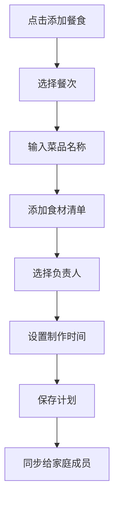
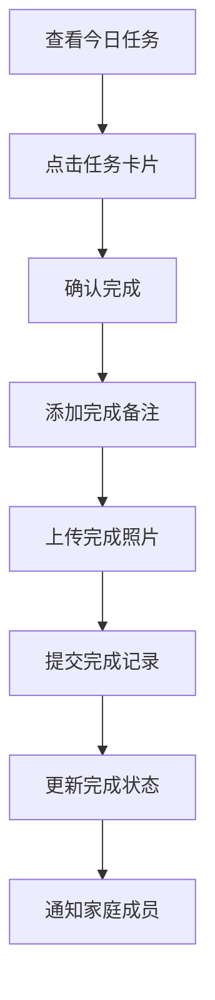
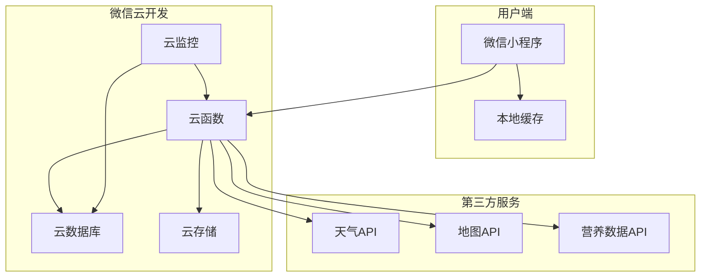
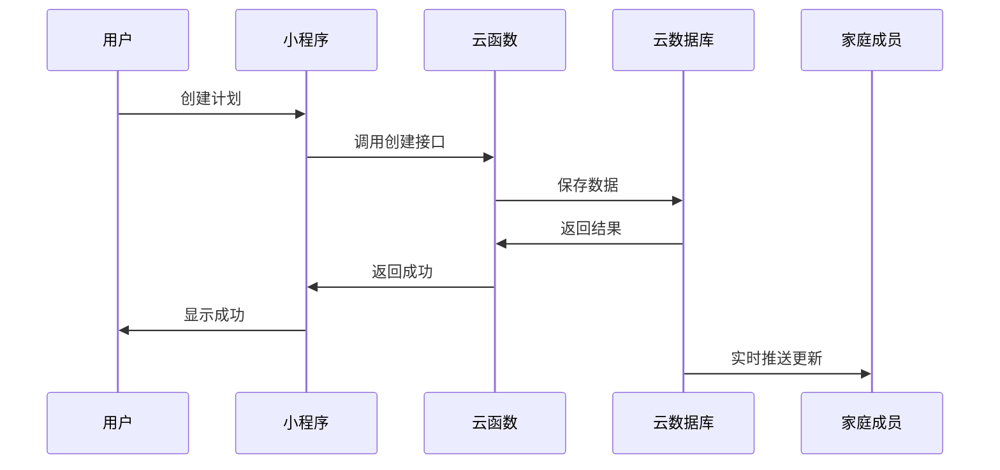

# 家庭生活管家小程序 PRD
## Product Requirements Document

---

**文档版本：** V1.0  
**创建日期：** 2024-12-26  
**产品经理：** AI Product Manager  
**最后更新：** 2024-12-26  

---

## 📋 目录

1. [产品概述](#1-产品概述)
2. [市场分析](#2-市场分析)
3. [用户分析](#3-用户分析)
4. [产品目标](#4-产品目标)
5. [功能需求](#5-功能需求)
6. [非功能需求](#6-非功能需求)
7. [技术需求](#7-技术需求)
8. [用户体验设计](#8-用户体验设计)
9. [数据需求](#9-数据需求)
10. [项目计划](#10-项目计划)
11. [风险评估](#11-风险评估)
12. [成功指标](#12-成功指标)

---

## 1. 产品概述

### 1.1 产品定义
**家庭生活管家**是一款专为家庭成员设计的生活协作管理小程序，帮助家庭成员共同规划和管理日常生活的各个方面，包括饮食安排、运动计划、穿搭选择等，提升家庭生活的品质和效率。

### 1.2 产品愿景
成为家庭生活的智能助手，让每个家庭都能享受有序、健康、高品质的生活方式。

### 1.3 产品定位
- **目标用户**：年轻夫妻、小家庭
- **产品类型**：家庭协作工具
- **平台**：微信小程序
- **商业模式**：免费使用（初期）

### 1.4 核心价值主张
- **协作性**：家庭成员共同参与生活规划
- **系统性**：全方位的生活管理解决方案
- **便捷性**：简单易用的操作体验
- **智能性**：基于数据的智能建议

---

## 2. 市场分析

### 2.1 市场背景
- 现代家庭生活节奏加快，生活规划需求增强
- 年轻夫妻对生活品质要求提升
- 移动互联网普及，小程序使用习惯成熟
- 疫情后家庭生活重要性凸显

### 2.2 竞品分析

| 产品名称 | 优势 | 劣势 | 差异化机会 |
|---------|------|------|-----------|
| 小日常 | 界面美观，功能丰富 | 个人使用为主，协作性弱 | 强化家庭协作功能 |
| 生活家 | 社区功能强 | 功能复杂，学习成本高 | 简化操作，聚焦核心需求 |
| 薄荷健康 | 专业的健康管理 | 专注健康，生活场景单一 | 全生活场景覆盖 |

### 2.3 市场机会
- **细分市场空白**：专注家庭协作的生活管理工具较少
- **用户痛点明确**：生活缺乏规划、夫妻沟通不同步
- **技术成熟**：小程序开发技术成熟，开发成本可控

---

## 3. 用户分析

### 3.1 目标用户画像

#### 主要用户：年轻夫妻
- **年龄**：25-35岁
- **收入**：中等收入水平
- **特征**：
  - 注重生活品质
  - 愿意尝试新工具
  - 有一定的时间管理意识
  - 重视夫妻关系和家庭和谐

#### 次要用户：小家庭
- **家庭结构**：夫妻+孩子
- **需求特点**：
  - 生活安排更复杂
  - 需要考虑孩子的需求
  - 时间管理要求更高

### 3.2 用户需求分析

#### 核心需求
1. **生活规划需求**：希望生活更有条理
2. **协作沟通需求**：夫妻间的任务分工和同步
3. **习惯养成需求**：培养健康的生活习惯
4. **效率提升需求**：减少决策时间，提高执行效率

#### 痛点分析
- **决策疲劳**：每天纠结吃什么、穿什么
- **沟通不畅**：夫妻间安排不同步，容易遗忘
- **缺乏坚持**：计划容易制定，难以坚持执行
- **数据分散**：各种计划分散在不同地方，难以统一管理

### 3.3 用户使用场景

#### 典型使用场景
1. **早晨起床**：查看今日安排，确认穿搭和早餐
2. **上班路上**：规划晚餐，添加购物清单
3. **下班回家**：查看运动计划，准备晚餐
4. **睡前时间**：回顾今日完成情况，规划明日安排

---

## 4. 产品目标

### 4.1 业务目标
- **短期目标（3个月）**：
  - 完成MVP版本开发
  - 获得100个活跃家庭用户
  - 用户日活跃率达到60%

- **中期目标（6个月）**：
  - 功能完善，用户体验优化
  - 获得500个活跃家庭用户
  - 用户留存率达到70%

- **长期目标（1年）**：
  - 成为细分领域的知名产品
  - 探索商业化模式
  - 考虑功能扩展和平台拓展

### 4.2 用户目标
- 帮助用户建立有序的生活习惯
- 提升家庭成员间的协作效率
- 减少生活决策的时间成本
- 提高生活品质和幸福感

---

## 5. 功能需求

### 5.1 功能架构图

```
家庭生活管家小程序
├── 用户系统
│   ├── 微信授权登录
│   ├── 家庭创建/加入
│   └── 个人信息管理
├── 饮食规划模块
│   ├── 餐食计划制定
│   ├── 食材购物清单
│   └── 营养建议推荐
├── 运动计划模块
│   ├── 运动安排规划
│   ├── 运动打卡记录
│   └── 健康数据统计
├── 穿搭管理模块
│   ├── 每日穿搭规划
│   ├── 天气关联推荐
│   └── 衣物清单管理
├── 协作功能模块
│   ├── 实时数据同步
│   ├── 任务分工标记
│   └── 完成状态共享
└── 数据统计模块
    ├── 完成率统计
    ├── 习惯分析报告
    └── 生活质量评估
```

### 5.2 详细功能需求

#### 5.2.1 用户系统

**US001 - 用户注册登录**
- **功能描述**：用户通过微信授权快速登录
- **验收标准**：
  - 支持微信一键授权登录
  - 自动获取用户基本信息（昵称、头像）
  - 登录状态保持7天
- **优先级**：P0

**US002 - 家庭创建**
- **功能描述**：用户可以创建家庭并邀请成员加入
- **验收标准**：
  - 支持创建家庭并生成邀请码
  - 支持通过邀请码加入家庭
  - 一个用户只能属于一个家庭
- **优先级**：P0

#### 5.2.2 饮食规划模块

**FD001 - 餐食计划制定**
- **功能描述**：用户可以规划每日三餐内容
- **验收标准**：
  - 支持按日期、餐次添加餐食计划
  - 支持指定负责人
  - 支持添加制作时间和难度
  - 支持从历史记录快速选择
- **优先级**：P0

**FD002 - 购物清单生成**
- **功能描述**：根据餐食计划自动生成购物清单
- **验收标准**：
  - 自动提取餐食计划中的食材
  - 支持手动添加其他购物项目
  - 支持按超市区域分类显示
  - 支持标记购买状态
- **优先级**：P1

#### 5.2.3 运动计划模块

**EX001 - 运动计划制定**
- **功能描述**：用户可以制定运动计划
- **验收标准**：
  - 支持选择运动类型和项目
  - 支持设定运动时间和强度
  - 支持选择运动地点
  - 支持标记参与人员
- **优先级**：P0

**EX002 - 运动打卡记录**
- **功能描述**：用户可以记录运动完成情况
- **验收标准**：
  - 支持简单打卡（完成/未完成）
  - 支持详细记录（时长、强度、感受）
  - 支持上传运动照片
  - 支持GPS轨迹记录（可选）
- **优先级**：P1

#### 5.2.4 穿搭管理模块

**OT001 - 穿搭计划制定**
- **功能描述**：用户可以规划每日穿搭
- **验收标准**：
  - 支持选择上装、下装、外套、鞋子
  - 自动获取天气信息并提供建议
  - 支持按场合推荐穿搭
  - 支持保存穿搭模板
- **优先级**：P1

#### 5.2.5 协作功能模块

**CO001 - 实时数据同步**
- **功能描述**：家庭成员间的数据实时同步
- **验收标准**：
  - 一方添加计划，另一方实时看到
  - 支持离线数据缓存
  - 数据冲突时提供解决方案
- **优先级**：P0

**CO002 - 任务分工**
- **功能描述**：支持任务分工和状态跟踪
- **验收标准**：
  - 可以指定任务负责人
  - 可以查看对方的任务完成情况
  - 支持任务提醒和催促
- **优先级**：P1

---

## 6. 非功能需求

### 6.1 性能需求
- **响应时间**：页面加载时间 < 2秒
- **并发用户**：支持1000个并发用户
- **数据同步**：数据同步延迟 < 3秒
- **离线支持**：支持基本功能的离线使用

### 6.2 可用性需求
- **易用性**：新用户5分钟内完成首次使用
- **可访问性**：支持无障碍访问
- **兼容性**：支持微信7.0以上版本
- **稳定性**：系统可用性 > 99.5%

### 6.3 安全需求
- **数据加密**：敏感数据传输加密
- **权限控制**：严格的数据访问权限
- **隐私保护**：符合个人信息保护法规
- **数据备份**：定期数据备份，防止数据丢失

---

## 7. 技术需求

### 7.1 技术架构
- **前端**：微信小程序原生开发
- **后端**：微信云开发（云函数 + 云数据库）
- **存储**：云数据库 + 云存储
- **第三方服务**：天气API、地图API

### 7.2 开发环境
- **开发工具**：微信开发者工具
- **版本控制**：Git
- **项目管理**：敏捷开发模式
- **测试**：单元测试 + 集成测试

### 7.3 部署需求
- **小程序发布**：微信小程序平台
- **云服务**：腾讯云（微信云开发）
- **监控**：云监控 + 错误日志收集
- **备份**：自动数据备份机制

---

## 8. 用户体验设计

### 8.1 设计原则
- **简洁性**：界面简洁，操作直观
- **一致性**：保持设计风格统一
- **反馈性**：及时的操作反馈
- **容错性**：允许用户犯错并提供恢复机制

### 8.2 界面设计要求
- **色彩搭配**：温馨的家庭色调
- **字体规范**：清晰易读的字体
- **图标设计**：统一的图标风格
- **布局结构**：合理的信息层次

### 8.3 交互设计要求
- **导航设计**：清晰的导航结构
- **操作流程**：简化的操作步骤
- **状态反馈**：明确的状态提示
- **错误处理**：友好的错误提示

---

## 9. 数据需求

### 9.1 数据模型
详见技术设计文档中的数据库设计部分

### 9.2 数据安全
- **数据加密**：敏感数据加密存储
- **访问控制**：基于角色的访问控制
- **数据备份**：定期自动备份
- **隐私保护**：最小化数据收集原则

### 9.3 数据分析
- **用户行为**：记录用户操作行为
- **功能使用**：统计功能使用频率
- **性能监控**：监控系统性能指标
- **错误日志**：收集和分析错误信息

---

## 10. 项目计划

### 10.1 开发阶段

#### 第一阶段：MVP开发（3周）
- **Week 1**：环境搭建、用户系统、基础框架
- **Week 2**：饮食规划功能、运动计划功能
- **Week 3**：协作功能、基础测试、发布准备

#### 第二阶段：功能完善（3周）
- **Week 4**：穿搭管理功能、界面优化
- **Week 5**：数据统计功能、性能优化
- **Week 6**：全面测试、bug修复

#### 第三阶段：优化迭代（持续）
- 用户反馈收集和分析
- 功能优化和新功能开发
- 性能监控和优化

### 10.2 里程碑
- **M1**：MVP版本完成（第3周）
- **M2**：功能完整版本完成（第6周）
- **M3**：正式版本发布（第8周）

---

## 11. 风险评估

### 11.1 技术风险
- **风险**：微信小程序政策变化
- **影响**：中等
- **应对**：关注政策动态，准备备选方案

### 11.2 市场风险
- **风险**：用户接受度不高
- **影响**：高
- **应对**：加强用户调研，快速迭代优化

### 11.3 竞争风险
- **风险**：大厂推出类似产品
- **影响**：高
- **应对**：专注细分市场，建立用户粘性

### 11.4 运营风险
- **风险**：用户增长缓慢
- **影响**：中等
- **应对**：制定详细的运营推广策略

---

## 12. 成功指标

### 12.1 用户指标
- **用户数量**：3个月内获得100个活跃家庭
- **用户活跃度**：日活跃率 > 60%
- **用户留存**：7日留存率 > 50%，30日留存率 > 30%
- **用户满意度**：用户评分 > 4.0/5.0

### 12.2 产品指标
- **功能使用率**：核心功能使用率 > 80%
- **任务完成率**：用户计划完成率 > 70%
- **系统稳定性**：系统可用性 > 99.5%
- **响应速度**：平均响应时间 < 2秒

### 12.3 业务指标
- **成本控制**：开发成本控制在预算内
- **时间进度**：按计划时间完成各阶段目标
- **质量标准**：bug数量 < 10个/版本

---

## 附录

### A. 详细用户故事列表

#### 饮食规划用户故事
- **US-FD-001**：作为家庭成员，我希望能够规划每日三餐，这样我们就能提前准备食材，避免每天纠结吃什么的问题
- **US-FD-002**：作为购物者，我希望能看到自动生成的购物清单，这样我就能一次性买齐所需食材，提高购物效率
- **US-FD-003**：作为营养关注者，我希望能看到营养搭配建议，这样我们的饮食更加健康均衡

#### 运动计划用户故事
- **US-EX-001**：作为健身爱好者，我希望能够制定每周运动计划，这样我们能够坚持运动习惯
- **US-EX-002**：作为运动伙伴，我希望能够看到对方的运动完成情况，这样我们能够相互监督和鼓励
- **US-EX-003**：作为健康管理者，我希望能够查看运动数据统计，这样我能了解我们的健康状况

#### 穿搭管理用户故事
- **US-OT-001**：作为时尚关注者，我希望能够规划每日穿搭，这样我能够提升个人形象
- **US-OT-002**：作为天气敏感者，我希望穿搭建议能够结合天气信息，这样我能够穿着合适的衣物
- **US-OT-003**：作为衣物管理者，我希望能够管理衣物清单，这样我能够合理搭配现有衣物

#### 协作功能用户故事
- **US-CO-001**：作为家庭成员，我希望能够实时看到对方的计划安排，这样我们能够协调一致
- **US-CO-002**：作为任务分工者，我希望能够明确任务责任人，这样我们能够避免重复或遗漏
- **US-CO-003**：作为进度关注者，我希望能够查看任务完成状态，这样我能够了解整体进展

### B. 界面原型设计

#### B.1 主要页面结构

**首页 - 今日概览**
```
┌─────────────────────────────────┐
│ 🏠 家庭生活管家    🔔 ⚙️        │
├─────────────────────────────────┤
│ 👫 张三 & 李四    📅 12月26日    │
│ 今日完成度: ████████░░ 80%      │
├─────────────────────────────────┤
│ 🍳 早餐: 小米粥 + 煎蛋           │
│    👤 张三负责  ✅ 已完成        │
├─────────────────────────────────┤
│ 🥗 午餐: 番茄鸡蛋面             │
│    👤 李四负责  ⏰ 进行中        │
├─────────────────────────────────┤
│ 🍖 晚餐: 红烧肉 + 米饭          │
│    👤 张三负责  ⭕ 未开始        │
├─────────────────────────────────┤
│ 🏃‍♂️ 运动: 跑步30分钟            │
│    👫 一起参与  ⭕ 未开始        │
├─────────────────────────────────┤
│ 👗 穿搭: 商务休闲               │
│    🌤️ 晴天 18°C  ✅ 已完成      │
└─────────────────────────────────┘
│ 📅今日 📋规划 📊记录 👤我的      │
└─────────────────────────────────┘
```

**规划页面**
```
┌─────────────────────────────────┐
│ ← 📋 规划安排                   │
├─────────────────────────────────┤
│ 📅 今天 明天 本周 下周          │
│     ▔▔                         │
├─────────────────────────────────┤
│ 🍽️ 饮食 🏃‍♂️ 运动 👗 穿搭        │
│     ▔▔                         │
├─────────────────────────────────┤
│ 🌅 早餐                        │
│ ┌─────────────────────────────┐ │
│ │ + 添加早餐计划               │ │
│ └─────────────────────────────┘ │
├─────────────────────────────────┤
│ 🌞 午餐                        │
│ ┌─────────────────────────────┐ │
│ │ 🍜 番茄鸡蛋面               │ │
│ │ 👤 李四负责 ⏰ 30分钟        │ │
│ │ 📝 编辑 🗑️ 删除              │ │
│ └─────────────────────────────┘ │
├─────────────────────────────────┤
│ 🌙 晚餐                        │
│ ┌─────────────────────────────┐ │
│ │ + 添加晚餐计划               │ │
│ └─────────────────────────────┘ │
├─────────────────────────────────┤
│ 🛒 购物清单 📋 使用模板          │
└─────────────────────────────────┘
```

#### B.2 关键交互流程

**添加餐食计划流程**


**任务完成流程**


### C. 技术架构详细设计

#### C.1 系统架构图


#### C.2 数据流架构


### D. 数据库设计详细说明

#### D.1 核心表关系

```mermaid
erDiagram
    USERS {
        string id PK
        string openid UK
        string nickname
        string avatar_url
        int gender
        timestamp created_at
    }

    FAMILIES {
        string id PK
        string name
        string invite_code UK
        string creator_id FK
        timestamp created_at
    }

    FAMILY_MEMBERS {
        string id PK
        string family_id FK
        string user_id FK
        enum role
        string nickname
        timestamp joined_at
    }

    MEAL_PLANS {
        string id PK
        string family_id FK
        date plan_date
        enum meal_type
        string dish_name
        int cooking_time
        string assignee_id FK
        timestamp created_at
    }

    USERS ||--o{ FAMILY_MEMBERS : belongs_to
    FAMILIES ||--o{ FAMILY_MEMBERS : has
    FAMILIES ||--o{ MEAL_PLANS : owns
    USERS ||--o{ MEAL_PLANS : assigned_to
```


#### D.2 数据字典

**用户表 (users)**
| 字段名 | 类型 | 长度 | 必填 | 说明 |
|--------|------|------|------|------|
| id | VARCHAR | 32 | 是 | 用户唯一标识 |
| openid | VARCHAR | 64 | 是 | 微信openid |
| nickname | VARCHAR | 50 | 否 | 用户昵称 |
| avatar_url | VARCHAR | 255 | 否 | 头像URL |
| gender | TINYINT | - | 否 | 性别：0未知,1男,2女 |
| phone | VARCHAR | 20 | 否 | 手机号 |
| created_at | TIMESTAMP | - | 是 | 创建时间 |

**家庭表 (families)**
| 字段名 | 类型 | 长度 | 必填 | 说明 |
|--------|------|------|------|------|
| id | VARCHAR | 32 | 是 | 家庭唯一标识 |
| name | VARCHAR | 50 | 是 | 家庭名称 |
| invite_code | VARCHAR | 10 | 是 | 邀请码 |
| creator_id | VARCHAR | 32 | 是 | 创建者ID |
| created_at | TIMESTAMP | - | 是 | 创建时间 |

### E. 开发任务分解

#### E.1 Sprint 1 任务列表（第1-2周）

**用户系统模块**
- [ ] 微信授权登录功能开发
- [ ] 用户信息获取和存储
- [ ] 家庭创建功能开发
- [ ] 邀请码生成和验证
- [ ] 家庭成员管理

**基础框架**
- [ ] 小程序项目初始化
- [ ] 云开发环境配置
- [ ] 基础组件库搭建
- [ ] 路由和导航配置
- [ ] 全局状态管理

**饮食规划模块（基础版）**
- [ ] 餐食计划添加功能
- [ ] 餐食计划列表展示
- [ ] 餐食计划编辑删除
- [ ] 负责人分配功能

#### E.2 Sprint 2 任务列表（第3-4周）

**运动计划模块**
- [ ] 运动计划创建功能
- [ ] 运动类型选择器
- [ ] 运动打卡功能
- [ ] 运动记录查看

**协作功能**
- [ ] 实时数据同步机制
- [ ] 任务状态更新
- [ ] 家庭成员状态显示
- [ ] 消息通知功能

**界面优化**
- [ ] 首页今日概览优化
- [ ] 规划页面交互优化
- [ ] 任务卡片组件完善
- [ ] 加载和错误状态处理

#### E.3 Sprint 3 任务列表（第5-6周）

**穿搭管理模块**
- [ ] 穿搭计划创建
- [ ] 天气API集成
- [ ] 穿搭推荐算法
- [ ] 衣物清单管理

**数据统计模块**
- [ ] 完成率统计功能
- [ ] 数据可视化图表
- [ ] 习惯分析报告
- [ ] 导出功能

**性能优化**
- [ ] 代码优化和重构
- [ ] 性能监控集成
- [ ] 缓存策略优化
- [ ] 错误日志收集

### F. 测试用例设计

#### F.1 功能测试用例

**用户登录测试**
| 用例ID | 测试场景 | 操作步骤 | 预期结果 |
|--------|----------|----------|----------|
| TC001 | 首次登录 | 1.打开小程序 2.点击微信授权 | 成功获取用户信息并进入主页 |
| TC002 | 重复登录 | 1.已登录用户再次打开 | 直接进入主页，无需重新授权 |

**家庭管理测试**
| 用例ID | 测试场景 | 操作步骤 | 预期结果 |
|--------|----------|----------|----------|
| TC003 | 创建家庭 | 1.点击创建家庭 2.输入家庭名称 3.确认创建 | 成功创建家庭并生成邀请码 |
| TC004 | 加入家庭 | 1.点击加入家庭 2.输入邀请码 3.确认加入 | 成功加入家庭并同步数据 |

**餐食规划测试**
| 用例ID | 测试场景 | 操作步骤 | 预期结果 |
|--------|----------|----------|----------|
| TC005 | 添加餐食计划 | 1.选择日期和餐次 2.输入菜品名称 3.选择负责人 4.保存 | 成功创建餐食计划并同步给家庭成员 |
| TC006 | 编辑餐食计划 | 1.点击已有计划 2.修改信息 3.保存 | 成功更新计划信息 |

#### F.2 性能测试用例

**响应时间测试**
- 页面加载时间 < 2秒
- API接口响应时间 < 1秒
- 数据同步延迟 < 3秒

**并发测试**
- 支持100个并发用户同时使用
- 数据一致性验证
- 系统稳定性测试

#### F.3 兼容性测试

**设备兼容性**
- iPhone 6s及以上设备
- Android 5.0及以上设备
- 不同屏幕尺寸适配

**微信版本兼容性**
- 微信7.0及以上版本
- 小程序基础库2.0及以上

### G. 运营推广策略

#### G.1 用户获取策略

**种子用户获取**
- 产品团队内部使用
- 邀请朋友和家人试用
- 社交媒体分享推广

**口碑传播**
- 用户推荐奖励机制
- 社交分享功能
- 用户案例展示

**渠道推广**
- 微信群推广
- 朋友圈广告
- 小程序搜索优化

#### G.2 用户留存策略

**产品留存**
- 持续优化用户体验
- 增加产品粘性功能
- 定期推出新功能

**运营留存**
- 定期用户调研
- 用户反馈快速响应
- 社区运营和互动

#### G.3 数据监控指标

**关键指标**
- DAU（日活跃用户数）
- WAU（周活跃用户数）
- 用户留存率
- 功能使用率
- 用户满意度

**监控工具**
- 微信小程序数据助手
- 自定义数据埋点
- 用户反馈收集

### H. 商业化规划

#### H.1 商业模式探索

**免费增值模式**
- 基础功能免费使用
- 高级功能付费解锁
- 会员订阅服务

**广告模式**
- 精准的生活服务广告
- 品牌合作推广
- 电商导购分成

#### H.2 盈利点分析

**短期盈利点**
- 高级功能订阅
- 个性化定制服务
- 数据分析报告

**长期盈利点**
- 生活服务平台
- 智能硬件集成
- 数据价值变现

---

## 版本更新记录

| 版本 | 日期 | 更新内容 | 更新人 |
|------|------|----------|--------|
| V1.0 | 2024-12-26 | 初始版本创建，包含完整的产品需求规格 | AI Product Manager |

---

## 联系信息

**产品团队**
- 产品经理：AI Product Manager
- 技术负责人：待定
- 设计负责人：待定

**文档维护**
- 文档负责人：AI Product Manager
- 更新频率：每周更新
- 反馈邮箱：product@example.com

---

**文档结束**

*本PRD文档是家庭生活管家小程序的完整产品需求规格说明，涵盖了从产品概念到技术实现的所有关键信息。文档将根据项目进展和用户反馈持续更新和完善。*

*如有任何疑问或建议，请及时联系产品团队。让我们一起打造一款真正有价值的家庭生活管理产品！*
