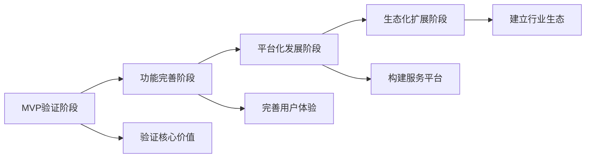
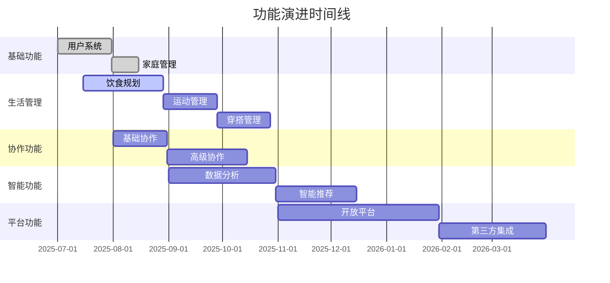

# 家庭生活管家小程序 - 产品路线图

## 文档信息
- **文档版本**: V1.0
- **创建日期**: 2025-06-27
- **创建人**: AI Product Manager
- **文档类型**: 产品规划文档

---

## 1. 产品发展阶段

### 1.1 整体发展路径

### 1.2 阶段目标概览

#### 第一阶段：MVP验证（0-6个月）
**目标**：验证核心价值假设，获得种子用户
- 完成核心功能开发
- 获得1000个种子用户
- 验证产品市场契合度
- 建立用户反馈机制

#### 第二阶段：功能完善（6-12个月）
**目标**：完善产品功能，提升用户体验
- 完善所有核心功能模块
- 用户规模达到10000个家庭
- 建立稳定的用户增长
- 探索商业化模式

#### 第三阶段：平台化发展（1-2年）
**目标**：构建生活服务平台，实现商业化
- 开放平台和API能力
- 接入第三方服务提供商
- 实现规模化盈利
- 扩展到更多平台

#### 第四阶段：生态化扩展（2-3年）
**目标**：建立完整生态，成为行业领导者
- 构建完整的生活服务生态
- 成为行业标准制定者
- 实现多元化业务发展
- 考虑国际化扩展

---

## 2. 详细版本规划

### 2.1 V1.0 - MVP版本（3个月）

#### 版本目标
- 验证核心产品概念
- 实现基础的家庭生活管理功能
- 获得用户初步反馈

#### 核心功能
- **用户系统**：微信授权登录、家庭创建/加入
- **饮食规划**：餐食计划制定、购物清单生成
- **运动管理**：运动计划制定、简单打卡记录
- **基础协作**：数据同步、简单任务分工

#### 技术实现
- 微信小程序基础框架
- 云开发后端服务
- MongoDB数据库
- 基础的实时同步

#### 成功指标
- 1000个种子用户注册
- 日活跃率>30%
- 7日留存率>25%
- 用户满意度>3.5/5.0

### 2.2 V2.0 - 功能完善版本（6个月）

#### 版本目标
- 完善所有核心功能模块
- 提升用户体验和产品稳定性
- 建立用户增长机制

#### 新增功能
- **穿搭管理**：穿搭规划、天气关联推荐
- **智能推荐**：基于偏好的个性化推荐
- **数据分析**：生活习惯统计、趋势分析
- **增强协作**：任务提醒、完成确认

#### 功能优化
- 界面设计优化
- 操作流程简化
- 性能和稳定性提升
- 错误处理完善

#### 成功指标
- 10000个活跃家庭用户
- 日活跃率>50%
- 30日留存率>25%
- 用户满意度>4.0/5.0

### 2.3 V3.0 - 平台化版本（12个月）

#### 版本目标
- 构建开放的生活服务平台
- 实现商业化变现
- 扩展产品边界

#### 平台功能
- **开放API**：第三方服务接入
- **服务市场**：生活服务提供商入驻
- **会员体系**：付费会员功能
- **企业版本**：团队和企业用户服务

#### 商业化功能
- 高级会员订阅
- 专业服务预约
- 电商导购分成
- 广告和品牌合作

#### 成功指标
- 50000个活跃用户
- 付费转化率>5%
- 月收入>50万元
- 合作伙伴>50家

---

## 3. 功能演进路线图

### 3.1 核心功能演进

### 3.2 技术架构演进

#### 阶段1：单体架构（V1.0）
- 微信小程序 + 云开发
- 简单的数据库设计
- 基础的API接口

#### 阶段2：微服务架构（V2.0-V3.0）
- 服务拆分和模块化
- 独立的推荐系统
- 数据分析平台

#### 阶段3：平台化架构（V4.0+）
- 开放平台和API网关
- 大数据处理能力
- 多端适配和同步

---

## 4. 市场策略路线图

### 4.1 用户增长策略

#### 第一阶段：种子用户（0-1000用户）
**策略**：精准获客，深度服务
- 团队内部使用和推广
- 朋友圈和微信群分享
- 产品体验优化

#### 第二阶段：早期采用者（1000-10000用户）
**策略**：口碑传播，功能完善
- 用户推荐奖励机制
- 社交媒体内容营销
- 产品功能持续优化

#### 第三阶段：早期大众（10000-100000用户）
**策略**：规模化推广，品牌建设
- 付费广告投放
- KOL和媒体合作
- 品牌形象建设

#### 第四阶段：主流市场（100000+用户）
**策略**：生态建设，行业领导
- 平台化发展
- 行业合作伙伴
- 标准制定参与

### 4.2 商业化路线图

#### 第一阶段：免费模式（0-6个月）
- 所有功能免费使用
- 专注用户体验和增长
- 验证商业化潜力

#### 第二阶段：增值服务（6-12个月）
- 推出高级会员功能
- 专业服务预约
- 个性化定制服务

#### 第三阶段：平台变现（12-24个月）
- 第三方服务分成
- 广告和品牌合作
- 数据服务变现

#### 第四阶段：生态变现（24个月+）
- 多元化收入来源
- 投资和并购收益
- 国际市场收入

---

## 5. 关键里程碑

### 5.1 重要时间节点

| 时间节点 | 里程碑 | 主要目标 | 成功标准 |
|---------|--------|----------|----------|
| 3个月 | MVP发布 | 验证核心价值 | 1000个种子用户 |
| 6个月 | V2.0发布 | 功能完善 | 10000个活跃用户 |
| 9个月 | 商业化启动 | 收入验证 | 月收入10万+ |
| 12个月 | 平台化转型 | 生态构建 | 50000个用户 |
| 18个月 | 规模化增长 | 市场扩张 | 200000个用户 |
| 24个月 | 行业领先 | 品牌确立 | 市场份额>30% |

### 5.2 风险控制节点
- **3个月**：用户验证节点，如果用户反馈不佳，调整产品方向
- **6个月**：留存验证节点，如果留存率低于预期，优化用户体验
- **12个月**：商业化验证节点，如果变现困难，调整商业模式

---

## 6. 成功指标跟踪

### 6.1 用户指标
- 用户注册数和活跃用户数
- 用户留存率和流失率
- 用户满意度和NPS值

### 6.2 产品指标
- 功能使用率和完成率
- 产品性能和稳定性
- 用户反馈和问题解决率

### 6.3 商业指标
- 收入规模和增长率
- 付费转化率和客单价
- 成本控制和盈利能力

---

## 7. 总结和展望

### 7.1 核心策略
1. **分阶段发展**：按阶段逐步实现产品目标
2. **用户导向**：始终以用户价值为核心
3. **技术驱动**：持续的技术创新和优化
4. **生态思维**：从产品向平台和生态发展

### 7.2 长期愿景
- 成为中国领先的家庭生活管理平台
- 服务1000万+家庭用户
- 构建完整的生活服务生态
- 推动行业标准和最佳实践

### 7.3 成功关键
1. **产品体验**：提供卓越的用户体验
2. **技术创新**：保持技术领先优势
3. **市场策略**：精准的市场定位和推广
4. **团队执行**：高效的团队执行能力
