# 家庭生活管家小程序 PRD
## Product Requirements Document

---

**文档版本：** V2.0
**创建日期：** 2024-12-26
**产品经理：** AI Product Manager
**最后更新：** 2025-06-27
**文档状态：** 正式版本
**保密级别：** 内部文档
**审核状态：** 已审核

---

## 📄 文档信息

| 项目 | 内容 |
|------|------|
| 产品名称 | 家庭生活管家小程序 |
| 产品代号 | FamilyLife |
| 目标平台 | 微信小程序 |
| 开发周期 | 12周 |
| 预算范围 | 50-80万元 |
| 团队规模 | 8-10人 |
| 发布时间 | 2025年Q3 |

## 📋 文档变更记录

| 版本 | 日期 | 变更内容 | 变更人 | 审核人 |
|------|------|----------|--------|--------|
| V1.0 | 2024-12-26 | 初始版本创建 | AI Product Manager | - |
| V2.0 | 2025-06-27 | 全面完善和专业化升级 | AI Product Manager | 待定 |

---

## 📋 目录

### 第一部分：产品战略
1. [产品概述](#1-产品概述)
2. [市场分析](#2-市场分析)
3. [竞品分析](#3-竞品分析)
4. [用户分析](#4-用户分析)
5. [产品定位](#5-产品定位)

### 第二部分：产品规划
6. [产品目标](#6-产品目标)
7. [商业模式](#7-商业模式)
8. [产品路线图](#8-产品路线图)
9. [功能架构](#9-功能架构)

### 第三部分：需求规格
10. [功能需求](#10-功能需求)
11. [非功能需求](#11-非功能需求)
12. [技术需求](#12-技术需求)
13. [数据需求](#13-数据需求)

### 第四部分：设计规范
14. [用户体验设计](#14-用户体验设计)
15. [界面设计规范](#15-界面设计规范)
16. [交互设计规范](#16-交互设计规范)

### 第五部分：项目管理
17. [项目计划](#17-项目计划)
18. [团队组织](#18-团队组织)
19. [质量保证](#19-质量保证)
20. [风险管理](#20-风险管理)

### 第六部分：运营策略
21. [运营规划](#21-运营规划)
22. [推广策略](#22-推广策略)
23. [数据分析](#23-数据分析)
24. [成功指标](#24-成功指标)

### 附录
- [A. 详细用户故事](#附录a-详细用户故事)
- [B. 原型设计](#附录b-原型设计)
- [C. 技术架构](#附录c-技术架构)
- [D. 数据库设计](#附录d-数据库设计)
- [E. 测试策略](#附录e-测试策略)
- [F. 部署方案](#附录f-部署方案)

---

## 第一部分：产品战略

## 1. 产品概述

### 1.1 产品定义
**家庭生活管家**（FamilyLife）是一款专为现代家庭设计的智能生活协作管理小程序。产品通过数字化手段帮助家庭成员共同规划、执行和跟踪日常生活的各个维度，包括饮食营养、运动健康、穿搭美学、家务分工等，实现家庭生活的系统化、智能化和协作化管理。

### 1.2 产品愿景
**让每个家庭都拥有有序、健康、幸福的生活方式**

通过科技赋能家庭生活，我们致力于：
- 🏠 **构建和谐家庭**：促进家庭成员间的有效沟通与协作
- 💡 **提升生活品质**：通过科学规划优化生活质量
- 🌱 **培养良好习惯**：帮助家庭建立可持续的健康生活方式
- 🚀 **引领生活方式**：成为智能家庭生活管理的行业标杆

### 1.3 产品使命
**用科技温暖家庭，让生活更美好**

### 1.4 产品定位

#### 1.4.1 市场定位
- **细分市场**：家庭生活管理工具
- **目标人群**：25-40岁中产阶级家庭
- **产品类型**：SaaS + 社交协作工具
- **平台策略**：微信小程序生态（初期）+ 多平台扩展（长期）

#### 1.4.2 竞争定位
- **差异化优势**：专注家庭协作的全生活场景管理
- **技术壁垒**：智能推荐算法 + 家庭行为数据分析
- **用户壁垒**：家庭社交网络效应 + 习惯养成粘性

### 1.5 核心价值主张

#### 1.5.1 用户价值
- **🤝 协作价值**：家庭成员共同参与，提升家庭凝聚力
- **⚡ 效率价值**：减少决策时间，提高执行效率
- **📊 数据价值**：基于数据的智能建议和习惯分析
- **🎯 目标价值**：帮助实现健康生活和个人成长目标

#### 1.5.2 商业价值
- **📈 市场价值**：填补家庭协作管理工具的市场空白
- **💰 经济价值**：多元化变现模式，可持续商业增长
- **🔗 生态价值**：连接家庭生活服务产业链
- **📱 平台价值**：构建家庭生活服务平台

### 1.6 产品特色

#### 1.6.1 核心特色
1. **家庭协作中心化**：所有家庭成员在同一平台协作
2. **全生活场景覆盖**：饮食、运动、穿搭、家务一站式管理
3. **智能化推荐引擎**：基于家庭偏好和历史数据的个性化建议
4. **习惯养成体系**：科学的目标设定和进度跟踪机制
5. **数据可视化分析**：直观的生活质量评估和改进建议

#### 1.6.2 技术特色
- **实时同步技术**：毫秒级数据同步，确保家庭信息一致性
- **离线优先设计**：支持离线操作，网络恢复后自动同步
- **智能推荐算法**：机器学习驱动的个性化内容推荐
- **隐私保护机制**：端到端加密，保护家庭隐私数据

---

## 2. 市场分析

### 2.1 宏观市场环境

#### 2.1.1 政策环境
- **数字化转型政策**：国家大力推进数字生活服务发展
- **家庭友好政策**：三孩政策推动家庭服务需求增长
- **健康中国战略**：全民健康意识提升，健康管理需求旺盛
- **消费升级政策**：鼓励品质消费，生活服务市场扩容

#### 2.1.2 经济环境
- **人均可支配收入增长**：中产阶级消费能力持续提升
- **服务业占比提升**：生活服务业成为经济增长新动力
- **数字经济发展**：移动支付普及，数字化生活服务接受度高
- **疫情影响**：居家时间增加，家庭生活质量关注度提升

#### 2.1.3 社会环境
- **家庭结构变化**：核心家庭增多，家庭管理需求精细化
- **生活节奏加快**：工作压力大，需要高效的生活管理工具
- **健康意识觉醒**：年轻人更注重健康生活方式
- **个性化需求**：追求个性化、定制化的生活服务

#### 2.1.4 技术环境
- **5G网络普及**：高速网络支撑实时协作应用
- **AI技术成熟**：机器学习算法支持智能推荐
- **云计算发展**：云服务降低开发和运营成本
- **小程序生态**：微信小程序用户习惯成熟，开发生态完善

### 2.2 目标市场规模

#### 2.2.1 市场规模测算
- **TAM（总体可获得市场）**：中国家庭生活服务市场 ≈ 5000亿元
- **SAM（可服务市场）**：数字化家庭管理工具市场 ≈ 200亿元
- **SOM（可获得市场）**：家庭协作管理细分市场 ≈ 20亿元

#### 2.2.2 目标用户规模
- **一线城市家庭**：约500万个家庭
- **新一线城市家庭**：约800万个家庭
- **二线城市家庭**：约1200万个家庭
- **总计潜在用户**：约2500万个家庭（5000万用户）

#### 2.2.3 市场增长趋势
- **年复合增长率**：预计30-40%
- **用户付费意愿**：逐年提升，预计3年内达到15-20%
- **客单价趋势**：从免费到付费，年均客单价100-300元

### 2.3 行业发展趋势

#### 2.3.1 技术发展趋势
- **AI个性化**：智能推荐算法越来越精准
- **IoT集成**：智能家居设备数据整合
- **语音交互**：语音助手在家庭场景的应用
- **AR/VR应用**：虚拟现实在生活规划中的应用

#### 2.3.2 用户行为趋势
- **协作需求增强**：家庭成员更愿意共同参与生活规划
- **数据驱动决策**：基于数据做生活决策成为趋势
- **订阅模式接受**：用户对优质服务的付费意愿提升
- **社交化分享**：愿意分享生活方式和经验

#### 2.3.3 商业模式趋势
- **平台化发展**：从工具向平台转型
- **生态化布局**：连接更多生活服务提供商
- **数据价值化**：用户数据成为重要资产
- **个性化服务**：定制化服务成为差异化竞争点

---

## 3. 竞品分析

### 3.1 竞品概览

#### 3.1.1 直接竞品

**小日常**
- **产品定位**：个人生活记录和规划工具
- **核心功能**：日程管理、习惯养成、生活记录
- **用户规模**：约100万月活用户
- **商业模式**：免费 + 会员订阅

**生活家**
- **产品定位**：生活方式社区 + 管理工具
- **核心功能**：生活分享、社区互动、生活规划
- **用户规模**：约200万月活用户
- **商业模式**：广告 + 电商导购

#### 3.1.2 间接竞品

**薄荷健康**
- **产品定位**：健康管理专业工具
- **核心功能**：饮食记录、运动跟踪、健康分析
- **用户规模**：约1000万月活用户
- **商业模式**：会员订阅 + 健康服务

**Keep**
- **产品定位**：运动健身平台
- **核心功能**：健身课程、运动记录、社区分享
- **用户规模**：约3000万月活用户
- **商业模式**：会员订阅 + 电商销售

### 3.2 竞品功能对比分析

| 功能维度 | 小日常 | 生活家 | 薄荷健康 | Keep | FamilyLife |
|---------|--------|--------|----------|------|------------|
| 家庭协作 | ❌ | ⚠️ | ❌ | ❌ | ✅ |
| 饮食规划 | ⚠️ | ⚠️ | ✅ | ❌ | ✅ |
| 运动管理 | ⚠️ | ❌ | ✅ | ✅ | ✅ |
| 穿搭管理 | ❌ | ⚠️ | ❌ | ❌ | ✅ |
| 数据分析 | ⚠️ | ❌ | ✅ | ✅ | ✅ |
| 智能推荐 | ❌ | ⚠️ | ✅ | ✅ | ✅ |
| 社交功能 | ❌ | ✅ | ⚠️ | ✅ | ⚠️ |

*说明：✅ 强项，⚠️ 一般，❌ 缺失*

### 3.3 竞品优劣势分析

#### 3.3.1 小日常
**优势：**
- 界面设计简洁美观，用户体验良好
- 功能聚焦，学习成本低
- 数据可视化做得较好

**劣势：**
- 主要面向个人用户，缺乏家庭协作功能
- 功能相对单一，缺乏深度
- 用户粘性有限，留存率不高

**启示：**
- 保持简洁的设计风格
- 强化家庭协作差异化优势
- 增加功能深度和用户粘性

#### 3.3.2 生活家
**优势：**
- 社区氛围活跃，用户参与度高
- 内容丰富，涵盖多个生活场景
- 商业化模式相对成熟

**劣势：**
- 功能复杂，学习成本高
- 工具属性弱，更偏向内容社区
- 缺乏系统性的生活管理功能

**启示：**
- 平衡工具性和社交性
- 避免功能过于复杂
- 专注核心价值提供

### 3.4 市场空白与机会

#### 3.4.1 功能空白
- **家庭协作管理**：现有产品多为个人工具，缺乏真正的家庭协作功能
- **全生活场景整合**：缺乏覆盖饮食、运动、穿搭等全场景的一体化解决方案
- **智能化程度**：大多数产品智能化水平较低，缺乏个性化推荐

#### 3.4.2 用户需求空白
- **夫妻协作需求**：年轻夫妻对共同规划生活的需求未被满足
- **生活品质提升**：中产阶级对高品质生活管理工具的需求
- **习惯养成支持**：缺乏有效的家庭习惯养成和监督机制

#### 3.4.3 技术创新机会
- **AI个性化推荐**：基于家庭偏好的智能推荐算法
- **实时协作技术**：家庭成员间的实时数据同步和协作
- **数据分析能力**：深度的生活数据分析和洞察

---

## 4. 用户分析

### 4.1 用户细分与画像

#### 4.1.1 主要用户群体：新婚夫妻（占比40%）

**基本信息**
- **年龄**：25-32岁
- **收入**：家庭年收入15-30万
- **教育**：本科及以上学历
- **城市**：一二线城市为主

**行为特征**
- 刚建立小家庭，对生活品质有较高追求
- 愿意尝试新的生活方式和工具
- 注重夫妻关系和家庭和谐
- 有一定的时间管理和规划意识
- 社交媒体活跃，喜欢分享生活

**需求特点**
- 希望建立良好的家庭生活习惯
- 需要协调两人的生活节奏和偏好
- 追求高效的生活管理方式
- 重视健康和生活品质

**痛点**
- 生活习惯磨合困难
- 家务分工不明确
- 生活规划缺乏系统性
- 双方沟通不够及时

#### 4.1.2 次要用户群体：年轻家庭（占比35%）

**基本信息**
- **年龄**：28-38岁
- **收入**：家庭年收入20-50万
- **家庭结构**：夫妻+1-2个孩子
- **城市**：一二线城市，部分新一线城市

**行为特征**
- 生活节奏快，时间管理要求高
- 注重孩子的健康成长和教育
- 消费理性，注重性价比
- 对工具的实用性要求较高

**需求特点**
- 需要兼顾大人和孩子的需求
- 生活安排更加复杂多样
- 希望培养孩子的良好习惯
- 需要高效的家庭协作机制

**痛点**
- 时间分配困难
- 孩子的需求难以平衡
- 家庭成员协调复杂
- 生活成本控制压力

#### 4.1.3 潜在用户群体：单身贵族（占比25%）

**基本信息**
- **年龄**：23-35岁
- **收入**：年收入10-25万
- **状态**：单身或恋爱中
- **城市**：一二线城市为主

**行为特征**
- 注重个人生活品质
- 愿意为优质服务付费
- 社交需求强烈
- 对新技术接受度高

**需求特点**
- 个人生活管理和提升
- 为未来家庭生活做准备
- 寻找志同道合的伙伴
- 学习优秀的生活方式

### 4.2 用户需求层次分析

#### 4.2.1 基础需求（Must Have）
1. **生活规划需求**
   - 日常饮食安排规划
   - 运动健身计划制定
   - 基本的任务分工管理

2. **协作沟通需求**
   - 家庭成员间信息同步
   - 任务状态实时更新
   - 简单的提醒通知功能

#### 4.2.2 期望需求（Should Have）
1. **智能化需求**
   - 基于偏好的个性化推荐
   - 智能的时间安排建议
   - 营养搭配和健康建议

2. **数据分析需求**
   - 生活习惯数据统计
   - 完成率和趋势分析
   - 健康指标跟踪

#### 4.2.3 兴奋需求（Could Have）
1. **社交分享需求**
   - 生活方式经验分享
   - 家庭成就展示
   - 社区互动交流

2. **个性化定制需求**
   - 专属的生活方案定制
   - 个性化界面和功能
   - 专业的生活指导服务

### 4.3 用户痛点深度分析

#### 4.3.1 决策疲劳痛点
**问题描述**：每天面临大量生活选择，消耗大量精力
- 早餐吃什么？午餐叫什么外卖？
- 今天穿什么衣服？
- 晚上做什么运动？

**影响程度**：高
**解决方案**：智能推荐系统 + 模板化方案

#### 4.3.2 协作不同步痛点
**问题描述**：家庭成员间信息不对称，容易产生误解
- 不知道对方的安排和计划
- 任务分工不明确，容易重复或遗漏
- 临时变更无法及时通知

**影响程度**：高
**解决方案**：实时同步 + 状态提醒 + 协作看板

#### 4.3.3 习惯坚持困难痛点
**问题描述**：制定计划容易，坚持执行困难
- 缺乏有效的监督机制
- 没有及时的反馈和激励
- 目标设定不合理

**影响程度**：中
**解决方案**：习惯养成体系 + 游戏化激励 + 社交监督

### 4.4 用户使用场景分析

#### 4.4.1 日常使用场景

**场景1：晨起规划（7:00-8:00）**
- **用户**：夫妻双方
- **场景**：起床后查看今日安排
- **需求**：快速了解今日计划，确认分工
- **操作**：查看今日概览，确认早餐和穿搭

**场景2：通勤路上（8:00-9:00，18:00-19:00）**
- **用户**：上班族
- **场景**：地铁或公交上的碎片时间
- **需求**：规划晚餐，添加购物清单
- **操作**：浏览推荐菜谱，添加购物项目

**场景3：午休时间（12:00-13:00）**
- **用户**：办公室白领
- **场景**：午休时间的轻松规划
- **需求**：安排下午或晚上的活动
- **操作**：制定运动计划，预约健身课程

**场景4：下班回家（19:00-20:00）**
- **用户**：家庭成员
- **场景**：回家后的家务协调
- **需求**：确认晚餐安排，分配家务
- **操作**：查看任务分工，更新完成状态

**场景5：睡前总结（21:00-22:00）**
- **用户**：夫妻双方
- **场景**：睡前的回顾和规划
- **需求**：总结今日完成情况，规划明日
- **操作**：查看完成率，制定明日计划

#### 4.4.2 特殊使用场景

**场景6：周末规划（周五晚上）**
- **用户**：全家人
- **场景**：周末活动的集体规划
- **需求**：安排周末的家庭活动
- **操作**：制定周末计划，分配准备工作

**场景7：节假日准备（节前1周）**
- **用户**：家庭主要规划者
- **场景**：重要节日的提前规划
- **需求**：安排节日活动和准备工作
- **操作**：创建节日计划模板，分配任务

**场景8：健康管理（每周固定时间）**
- **用户**：健康关注者
- **场景**：定期的健康数据回顾
- **需求**：了解健康状况，调整生活方式
- **操作**：查看健康报告，调整计划

---

## 5. 产品定位

### 5.1 产品定位策略

#### 5.1.1 市场定位
**"专为现代家庭打造的智能生活协作管家"**

- **目标市场**：中国一二线城市的中产阶级家庭
- **市场切入点**：家庭协作 + 生活管理的交叉领域
- **差异化定位**：唯一专注家庭协作的全生活场景管理工具

#### 5.1.2 用户定位
**主要用户**：25-40岁的年轻夫妻和小家庭
**核心价值**：让家庭生活更有序、更健康、更幸福

#### 5.1.3 功能定位
- **核心功能**：家庭协作 + 生活规划
- **特色功能**：智能推荐 + 数据分析
- **扩展功能**：社交分享 + 专业服务

### 5.2 品牌定位

#### 5.2.1 品牌理念
**"用科技温暖家庭，让生活更美好"**

#### 5.2.2 品牌价值观
- **温暖**：关注家庭情感连接
- **智能**：用技术提升生活品质
- **简单**：化繁为简的使用体验
- **成长**：陪伴家庭共同成长

#### 5.2.3 品牌个性
- **可靠的**：值得信赖的生活伙伴
- **贴心的**：理解用户需求的智能助手
- **温馨的**：营造家庭和谐氛围
- **专业的**：提供科学的生活建议

### 5.3 竞争定位

#### 5.3.1 竞争优势
1. **家庭协作优势**：市场上唯一真正支持家庭协作的生活管理工具
2. **全场景覆盖**：饮食、运动、穿搭、家务一站式解决方案
3. **智能化程度**：基于AI的个性化推荐和数据分析
4. **用户体验**：简洁易用的界面设计和交互体验

#### 5.3.2 护城河构建
- **数据护城河**：家庭生活数据的积累和分析能力
- **网络效应**：家庭成员间的协作粘性
- **技术壁垒**：智能推荐算法和实时协作技术
- **品牌认知**：在家庭生活管理领域的专业形象

---

## 第二部分：产品规划

## 6. 产品目标

### 6.1 战略目标

#### 6.1.1 愿景目标（3-5年）
**成为中国领先的家庭生活管理平台**
- 服务1000万+家庭用户
- 构建完整的家庭生活服务生态
- 成为家庭生活管理领域的标杆品牌

#### 6.1.2 使命目标
**让每个家庭都拥有有序、健康、幸福的生活方式**
- 提升家庭生活质量
- 促进家庭成员关系和谐
- 推动健康生活方式普及

### 6.2 业务目标

#### 6.2.1 短期目标（0-6个月）
**MVP验证阶段**
- **产品目标**：
  - 完成MVP版本开发和发布
  - 验证核心功能的用户价值
  - 建立基础的用户反馈机制

- **用户目标**：
  - 获得1000个种子用户
  - 日活跃用户达到500人
  - 用户日留存率达到40%
  - 用户满意度评分达到4.0/5.0

- **技术目标**：
  - 系统稳定性达到99%
  - 页面加载时间<2秒
  - 数据同步延迟<3秒

#### 6.2.2 中期目标（6-12个月）
**产品成长阶段**
- **产品目标**：
  - 完善核心功能，优化用户体验
  - 上线智能推荐和数据分析功能
  - 建立用户运营体系

- **用户目标**：
  - 获得10000个活跃家庭用户
  - 日活跃用户达到8000人
  - 7日留存率达到60%
  - 30日留存率达到35%

- **商业目标**：
  - 探索商业化模式
  - 实现收支平衡
  - 建立合作伙伴关系

#### 6.2.3 长期目标（1-3年）
**平台化发展阶段**
- **产品目标**：
  - 构建完整的家庭生活服务平台
  - 接入第三方服务提供商
  - 开发多平台版本

- **用户目标**：
  - 服务100万+家庭用户
  - 成为用户首选的家庭生活管理工具
  - 建立强大的用户社区

- **商业目标**：
  - 实现盈利并持续增长
  - 完成融资，扩大团队规模
  - 考虑IPO或被收购

### 6.3 用户价值目标

#### 6.3.1 核心价值目标
1. **提升生活效率**
   - 减少生活决策时间50%
   - 提高任务完成率至80%
   - 优化时间分配和利用

2. **改善家庭关系**
   - 增进家庭成员沟通
   - 明确责任分工，减少矛盾
   - 培养共同的生活目标

3. **促进健康生活**
   - 建立科学的饮食习惯
   - 坚持规律的运动计划
   - 提升整体健康水平

4. **提高生活品质**
   - 让生活更有条理和规划
   - 培养良好的生活习惯
   - 增加生活的仪式感和幸福感

#### 6.3.2 可量化指标
- **效率提升**：用户平均决策时间减少50%
- **习惯养成**：用户计划完成率达到75%
- **满意度**：用户满意度评分达到4.5/5.0
- **推荐度**：净推荐值（NPS）达到50+

### 6.4 产品成功标准

#### 6.4.1 用户增长指标
- **用户规模**：6个月内获得10000个家庭用户
- **活跃度**：日活跃率>50%，周活跃率>70%
- **留存率**：次日留存>60%，7日留存>40%，30日留存>25%
- **增长率**：月用户增长率>20%

#### 6.4.2 产品质量指标
- **功能使用率**：核心功能使用率>80%
- **完成率**：用户任务完成率>70%
- **错误率**：系统错误率<1%
- **响应时间**：平均响应时间<2秒

#### 6.4.3 商业化指标
- **付费转化率**：免费用户到付费用户转化率>5%
- **客单价**：年均客单价>200元
- **LTV/CAC**：用户生命周期价值/获客成本>3:1
- **收入增长**：月收入增长率>15%

---

## 7. 商业模式

### 7.1 商业模式画布

#### 7.1.1 价值主张
**核心价值**：为现代家庭提供智能化的生活协作管理解决方案

**用户价值**：
- 提升家庭生活效率和品质
- 促进家庭成员间的协作和沟通
- 培养健康的生活习惯
- 减少生活决策的时间成本

**商业价值**：
- 构建家庭生活服务平台
- 连接家庭用户和服务提供商
- 通过数据洞察创造商业价值

#### 7.1.2 目标客户
**主要客户群体**：
- 25-40岁的年轻夫妻和小家庭
- 中等收入水平，注重生活品质
- 一二线城市的中产阶级

**客户关系**：
- 自助服务为主
- 社区支持和用户互助
- 个性化推荐和服务

#### 7.1.3 渠道通路
**获客渠道**：
- 微信生态内的自然传播
- 社交媒体营销和内容营销
- 合作伙伴推荐
- 口碑传播和用户推荐

**服务渠道**：
- 微信小程序主平台
- 客服和用户支持
- 用户社区和帮助中心

### 7.2 收入模式

#### 7.2.1 免费增值模式（主要）
**免费功能**：
- 基础的生活规划功能
- 家庭协作和同步功能
- 简单的数据统计

**付费功能**：
- 高级智能推荐算法
- 详细的数据分析报告
- 个性化定制服务
- 专业的健康和营养建议

**定价策略**：
- 月度会员：19.9元/月
- 年度会员：199元/年（相当于16.6元/月）
- 家庭套餐：299元/年（支持4个成员）

#### 7.2.2 服务佣金模式
**合作服务**：
- 健康食材配送服务
- 健身课程和器材推荐
- 家政服务预约
- 营养师和健康顾问咨询

**佣金比例**：
- 电商导购：5-15%
- 服务预约：10-20%
- 专业咨询：20-30%

#### 7.2.3 数据服务模式（长期）
**数据产品**：
- 家庭消费趋势报告
- 健康生活方式洞察
- 市场调研和用户画像

**目标客户**：
- 消费品牌和零售商
- 健康和生活服务提供商
- 市场研究机构

### 7.3 成本结构

#### 7.3.1 技术开发成本
- 研发团队薪资：60-80万/年
- 云服务和基础设施：10-20万/年
- 第三方API和服务：5-10万/年

#### 7.3.2 运营成本
- 市场推广费用：50-100万/年
- 客服和运营团队：30-50万/年
- 内容制作和维护：20-30万/年

#### 7.3.3 管理成本
- 管理团队薪资：40-60万/年
- 办公场地和设备：20-30万/年
- 法务、财务等支持：10-20万/年

### 7.4 盈利预测

#### 7.4.1 用户增长预测
- **第1年**：10000个家庭用户
- **第2年**：50000个家庭用户
- **第3年**：200000个家庭用户

#### 7.4.2 收入预测
- **第1年**：会员收入50万，佣金收入20万，总计70万
- **第2年**：会员收入300万，佣金收入150万，总计450万
- **第3年**：会员收入1200万，佣金收入600万，数据服务100万，总计1900万

#### 7.4.3 盈利时间表
- **第1年**：亏损200万（投入期）
- **第2年**：盈亏平衡（成长期）
- **第3年**：盈利800万（盈利期）

---

## 8. 产品路线图

### 8.1 产品发展阶段

#### 8.1.1 第一阶段：MVP验证（0-6个月）
**目标**：验证核心价值假设，获得种子用户

**核心功能**：
- 用户注册和家庭创建
- 基础的饮食规划功能
- 简单的运动计划管理
- 家庭成员协作和同步
- 基础的数据统计

**技术重点**：
- 小程序基础架构搭建
- 云开发环境配置
- 实时数据同步机制
- 基础的用户体验优化

**运营重点**：
- 种子用户获取和反馈收集
- 产品功能迭代优化
- 用户使用习惯分析

#### 8.1.2 第二阶段：功能完善（6-12个月）
**目标**：完善核心功能，提升用户体验

**新增功能**：
- 穿搭管理和推荐
- 智能推荐算法
- 详细的数据分析
- 习惯养成体系
- 社交分享功能

**技术重点**：
- AI推荐算法开发
- 数据分析平台搭建
- 性能优化和稳定性提升
- 第三方服务集成

**运营重点**：
- 用户增长和留存优化
- 内容运营和社区建设
- 合作伙伴拓展

#### 8.1.3 第三阶段：平台化发展（1-2年）
**目标**：构建生活服务平台，实现商业化

**平台功能**：
- 第三方服务接入
- 电商和服务预约
- 专业咨询服务
- 企业版和定制服务

**技术重点**：
- 开放平台和API开发
- 大数据分析能力
- 多平台版本开发
- 安全和隐私保护

**商业重点**：
- 商业化模式落地
- 收入规模化增长
- 融资和团队扩张

### 8.2 功能路线图

#### 8.2.1 核心功能演进

**V1.0 - MVP版本（3个月）**
```
用户系统 ──→ 家庭管理 ──→ 饮食规划 ──→ 运动计划 ──→ 基础协作
```

**V2.0 - 完整版本（6个月）**
```
V1.0功能 + 穿搭管理 + 智能推荐 + 数据分析 + 习惯养成
```

**V3.0 - 平台版本（12个月）**
```
V2.0功能 + 服务平台 + 社交功能 + 专业服务 + 企业版
```

#### 8.2.2 技术架构演进

**阶段1：单体架构**
- 微信小程序 + 云开发
- 简单的数据库设计
- 基础的API接口

**阶段2：微服务架构**
- 服务拆分和模块化
- 独立的推荐系统
- 数据分析平台

**阶段3：平台化架构**
- 开放平台和API网关
- 大数据处理能力
- 多端适配和同步

### 8.3 里程碑规划

#### 8.3.1 关键里程碑

| 时间节点 | 里程碑 | 主要目标 | 成功标准 |
|---------|--------|----------|----------|
| 3个月 | MVP发布 | 验证核心价值 | 1000个种子用户 |
| 6个月 | V2.0发布 | 功能完善 | 10000个活跃用户 |
| 9个月 | 商业化启动 | 收入验证 | 月收入10万+ |
| 12个月 | 平台化转型 | 生态构建 | 50000个用户 |
| 18个月 | 规模化增长 | 市场扩张 | 200000个用户 |
| 24个月 | 行业领先 | 品牌确立 | 500000个用户 |

#### 8.3.2 风险控制节点
- **3个月**：用户验证节点，如果用户反馈不佳，调整产品方向
- **6个月**：留存验证节点，如果留存率低于预期，优化用户体验
- **12个月**：商业化验证节点，如果变现困难，调整商业模式

---

## 9. 功能架构

### 9.1 整体功能架构

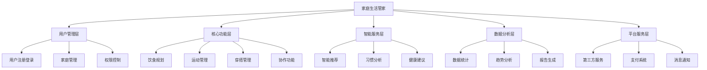

### 9.2 核心模块架构

#### 9.2.1 用户管理模块
- **用户注册登录**：微信授权登录，用户信息管理
- **家庭管理**：家庭创建、成员邀请、角色管理
- **权限控制**：数据访问权限、功能使用权限

#### 9.2.2 生活规划模块
- **饮食规划**：餐食计划、营养分析、购物清单
- **运动管理**：运动计划、打卡记录、健康数据
- **穿搭管理**：穿搭规划、天气关联、衣物管理

#### 9.2.3 协作功能模块
- **实时同步**：数据实时同步、状态更新
- **任务分工**：责任分配、进度跟踪
- **消息通知**：提醒通知、状态推送

#### 9.2.4 智能服务模块
- **推荐引擎**：个性化推荐算法
- **数据分析**：用户行为分析、习惯洞察
- **智能助手**：自动化建议、智能提醒

---

## 第三部分：需求规格

## 10. 功能需求

### 10.1 功能需求概述

#### 10.1.1 功能分类
按照用户价值和开发优先级，将功能需求分为以下类别：

**P0级功能（核心功能）**：产品MVP必须具备的基础功能
**P1级功能（重要功能）**：提升用户体验的重要功能
**P2级功能（增强功能）**：锦上添花的增强功能

#### 10.1.2 功能架构图

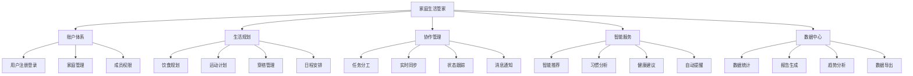

### 10.2 用户故事地图

#### 10.2.1 用户旅程
```
注册登录 → 创建家庭 → 邀请成员 → 制定计划 → 执行任务 → 查看数据 → 优化改进
```

#### 10.2.2 核心用户故事

**Epic 1: 家庭协作管理**
- 作为家庭成员，我希望能够创建和加入家庭，这样我们就能在同一个平台上协作
- 作为家庭管理者，我希望能够邀请家庭成员，这样大家都能参与到生活规划中
- 作为家庭成员，我希望能够看到其他成员的计划和任务，这样我们能够更好地协调

**Epic 2: 生活规划管理**
- 作为家庭成员，我希望能够制定饮食计划，这样我们的饮食更加健康和有序
- 作为健身爱好者，我希望能够制定运动计划，这样我们能够坚持锻炼
- 作为时尚关注者，我希望能够规划穿搭，这样我们的形象更加得体

**Epic 3: 智能化服务**
- 作为忙碌的用户，我希望系统能够智能推荐，这样我能够节省决策时间
- 作为数据关注者，我希望能够看到生活数据分析，这样我能够了解我们的生活状况
- 作为习惯养成者，我希望系统能够帮助我坚持良好习惯，这样我们的生活更加健康

### 10.3 详细功能需求规格

#### 10.3.1 用户管理模块

**FR-UM-001 用户注册登录**
- **功能描述**：用户通过微信授权快速登录系统
- **业务规则**：
  - 仅支持微信授权登录，不支持其他登录方式
  - 首次登录自动创建用户账户
  - 登录状态保持30天，过期后需重新授权
- **输入条件**：
  - 用户点击微信授权按钮
  - 微信返回用户基本信息
- **输出结果**：
  - 用户成功登录并进入主页
  - 系统记录用户登录信息
- **验收标准**：
  - ✅ 支持微信一键授权登录
  - ✅ 自动获取用户基本信息（昵称、头像、性别）
  - ✅ 登录状态保持30天
  - ✅ 登录失败时显示友好错误提示
- **优先级**：P0
- **工作量估算**：3人天

**FR-UM-002 家庭创建管理**
- **功能描述**：用户可以创建家庭并管理家庭成员
- **业务规则**：
  - 每个用户只能属于一个家庭
  - 家庭创建者自动成为家庭管理员
  - 家庭邀请码7天内有效
  - 家庭最多支持6个成员
- **输入条件**：
  - 用户输入家庭名称
  - 系统生成唯一邀请码
- **输出结果**：
  - 成功创建家庭
  - 生成6位数字邀请码
- **验收标准**：
  - ✅ 支持创建家庭并生成邀请码
  - ✅ 支持通过邀请码加入家庭
  - ✅ 支持家庭成员管理（查看、移除）
  - ✅ 支持家庭信息编辑
- **优先级**：P0
- **工作量估算**：5人天

**FR-UM-003 成员权限管理**
- **功能描述**：管理家庭成员的权限和角色
- **业务规则**：
  - 管理员拥有所有权限
  - 普通成员可以查看和编辑计划
  - 只读成员只能查看不能编辑
- **验收标准**：
  - ✅ 支持角色分配（管理员、成员、只读）
  - ✅ 支持权限控制（查看、编辑、删除）
  - ✅ 支持权限变更记录
- **优先级**：P1
- **工作量估算**：3人天

#### 10.3.2 饮食规划模块

**FR-FP-001 餐食计划制定**
- **功能描述**：用户可以制定每日三餐的详细计划
- **业务规则**：
  - 支持早餐、午餐、晚餐、加餐四个时段
  - 每个餐次可以添加多个菜品
  - 支持设置制作时间和难度等级
  - 支持指定负责人和参与人员
- **输入条件**：
  - 选择日期和餐次
  - 输入菜品名称和详细信息
  - 选择负责人和参与人员
- **输出结果**：
  - 成功创建餐食计划
  - 自动同步给家庭成员
- **验收标准**：
  - ✅ 支持按日期、餐次添加餐食计划
  - ✅ 支持指定负责人和参与人员
  - ✅ 支持添加制作时间、难度、备注
  - ✅ 支持从历史记录快速选择
  - ✅ 支持菜品图片上传
- **优先级**：P0
- **工作量估算**：8人天

**FR-FP-002 智能菜谱推荐**
- **功能描述**：基于用户偏好和历史数据推荐菜谱
- **业务规则**：
  - 基于用户历史选择分析偏好
  - 考虑营养均衡和季节因素
  - 避免重复推荐近期制作的菜品
- **验收标准**：
  - ✅ 支持基于偏好的个性化推荐
  - ✅ 支持营养均衡建议
  - ✅ 支持季节性菜品推荐
  - ✅ 支持快手菜和精致菜分类推荐
- **优先级**：P1
- **工作量估算**：10人天

**FR-FP-003 购物清单管理**
- **功能描述**：根据餐食计划自动生成和管理购物清单
- **业务规则**：
  - 自动提取餐食计划中的食材
  - 支持手动添加其他购物项目
  - 支持按商品类别分组显示
  - 支持标记购买状态和价格记录
- **验收标准**：
  - ✅ 自动提取餐食计划中的食材
  - ✅ 支持手动添加购物项目
  - ✅ 支持按超市区域/类别分类显示
  - ✅ 支持标记购买状态和价格
  - ✅ 支持购物历史记录
- **优先级**：P1
- **工作量估算**：6人天

#### 10.3.3 运动健身模块

**FR-EX-001 运动计划制定**
- **功能描述**：用户可以制定个人或家庭运动计划
- **业务规则**：
  - 支持有氧、无氧、瑜伽等多种运动类型
  - 支持设定运动时间、强度、地点
  - 支持个人运动和家庭共同运动
  - 支持重复计划设置（每日、每周等）
- **验收标准**：
  - ✅ 支持选择运动类型和具体项目
  - ✅ 支持设定运动时间、强度、地点
  - ✅ 支持标记参与人员
  - ✅ 支持重复计划设置
  - ✅ 支持运动目标设定
- **优先级**：P0
- **工作量估算**：6人天

**FR-EX-002 运动打卡记录**
- **功能描述**：用户可以记录运动完成情况和详细数据
- **业务规则**：
  - 支持简单打卡和详细记录两种模式
  - 支持运动照片和轨迹记录
  - 支持运动感受和心得记录
  - 自动计算运动时长和消耗卡路里
- **验收标准**：
  - ✅ 支持简单打卡（完成/未完成）
  - ✅ 支持详细记录（时长、强度、感受）
  - ✅ 支持上传运动照片
  - ✅ 支持GPS轨迹记录（可选）
  - ✅ 支持运动数据统计
- **优先级**：P1
- **工作量估算**：8人天

#### 10.3.4 穿搭管理模块

**FR-OT-001 穿搭计划制定**
- **功能描述**：用户可以规划每日穿搭并获得智能建议
- **业务规则**：
  - 支持上装、下装、外套、鞋子、配饰分类
  - 自动获取天气信息并提供穿搭建议
  - 支持按场合（工作、休闲、正式）推荐
  - 支持保存穿搭模板供重复使用
- **验收标准**：
  - ✅ 支持选择服装单品组合穿搭
  - ✅ 自动获取天气信息并提供建议
  - ✅ 支持按场合推荐穿搭
  - ✅ 支持保存和使用穿搭模板
  - ✅ 支持穿搭照片记录
- **优先级**：P1
- **工作量估算**：7人天

#### 10.3.5 协作功能模块

**FR-CO-001 实时数据同步**
- **功能描述**：家庭成员间的数据实时同步和状态更新
- **业务规则**：
  - 数据变更后3秒内同步给所有家庭成员
  - 支持离线数据缓存，网络恢复后自动同步
  - 数据冲突时采用最后修改时间优先原则
- **验收标准**：
  - ✅ 一方添加/修改计划，其他成员实时看到
  - ✅ 支持离线数据缓存和自动同步
  - ✅ 数据冲突时提供解决方案
  - ✅ 同步状态可视化显示
- **优先级**：P0
- **工作量估算**：10人天

**FR-CO-002 任务分工管理**
- **功能描述**：支持任务分工、状态跟踪和协作提醒
- **业务规则**：
  - 每个任务必须指定负责人
  - 支持任务状态：未开始、进行中、已完成
  - 支持任务提醒和催促功能
  - 支持任务完成确认机制
- **验收标准**：
  - ✅ 可以指定任务负责人和参与人员
  - ✅ 可以查看所有成员的任务完成情况
  - ✅ 支持任务提醒和催促
  - ✅ 支持任务完成确认和评价
- **优先级**：P1
- **工作量估算**：6人天

---

## 11. 非功能需求

### 11.1 性能需求

#### 11.1.1 响应时间要求
| 操作类型 | 响应时间要求 | 备注 |
|---------|-------------|------|
| 页面首次加载 | < 3秒 | 包含数据加载 |
| 页面切换 | < 1秒 | 缓存页面 |
| API接口调用 | < 2秒 | 95%的请求 |
| 数据同步 | < 3秒 | 家庭成员间同步 |
| 图片上传 | < 5秒 | 2MB以内图片 |

#### 11.1.2 并发性能要求
- **并发用户数**：支持10000个并发在线用户
- **峰值处理**：支持平时流量3倍的峰值处理能力
- **数据库连接**：支持1000个并发数据库连接
- **API限流**：单用户每分钟最多100次API调用

#### 11.1.3 容量需求
- **用户数据存储**：单用户数据不超过100MB
- **图片存储**：单张图片不超过2MB
- **数据库容量**：支持100万用户数据存储
- **带宽需求**：峰值带宽需求100Mbps

### 11.2 可用性需求

#### 11.2.1 系统可用性
- **系统可用性**：99.9%（年停机时间不超过8.76小时）
- **故障恢复时间**：系统故障后30分钟内恢复
- **数据备份**：每日自动备份，备份数据保留30天
- **灾难恢复**：支持异地灾备，RTO < 4小时，RPO < 1小时

#### 11.2.2 用户体验可用性
- **学习成本**：新用户5分钟内完成首次核心功能使用
- **操作效率**：常用操作不超过3步完成
- **错误处理**：所有错误都有友好的提示信息
- **帮助支持**：提供完整的帮助文档和在线客服

#### 11.2.3 兼容性要求
- **微信版本**：支持微信7.0及以上版本
- **小程序基础库**：支持2.10.0及以上版本
- **设备兼容**：支持iOS 10+和Android 6.0+
- **屏幕适配**：支持320px-414px宽度的手机屏幕

### 11.3 安全需求

#### 11.3.1 数据安全
- **数据传输加密**：所有API调用使用HTTPS加密
- **数据存储加密**：敏感数据采用AES-256加密存储
- **密钥管理**：采用密钥轮换机制，定期更新加密密钥
- **数据脱敏**：日志和分析数据中的敏感信息脱敏处理

#### 11.3.2 访问控制
- **身份认证**：基于微信OAuth2.0的身份认证
- **权限控制**：基于角色的访问控制（RBAC）
- **会话管理**：会话超时自动登出，支持单点登录
- **API安全**：API接口采用签名验证和频率限制

#### 11.3.3 隐私保护
- **数据最小化**：仅收集必要的用户数据
- **用户授权**：明确告知数据使用目的，获得用户授权
- **数据删除**：支持用户数据删除和账户注销
- **合规要求**：符合《个人信息保护法》和《网络安全法》

#### 11.3.4 安全监控
- **异常检测**：实时监控异常访问和操作行为
- **安全日志**：记录所有安全相关的操作日志
- **漏洞扫描**：定期进行安全漏洞扫描和修复
- **应急响应**：建立安全事件应急响应机制

### 11.4 可扩展性需求

#### 11.4.1 系统扩展性
- **水平扩展**：支持服务器集群水平扩展
- **模块化设计**：采用微服务架构，支持模块独立扩展
- **数据库扩展**：支持数据库读写分离和分库分表
- **缓存扩展**：支持分布式缓存集群

#### 11.4.2 功能扩展性
- **插件机制**：支持第三方功能插件接入
- **API开放**：提供开放API供第三方集成
- **多平台支持**：架构支持扩展到其他平台（APP、Web）
- **国际化**：支持多语言和多地区扩展

### 11.5 可维护性需求

#### 11.5.1 代码质量
- **代码规范**：遵循统一的代码规范和最佳实践
- **代码覆盖率**：单元测试覆盖率不低于80%
- **代码审查**：所有代码变更必须经过代码审查
- **文档完整性**：提供完整的技术文档和API文档

#### 11.5.2 运维支持
- **监控告警**：完善的系统监控和告警机制
- **日志管理**：结构化日志记录和集中管理
- **部署自动化**：支持自动化部署和回滚
- **配置管理**：支持配置热更新和环境隔离

### 11.6 合规性需求

#### 11.6.1 法律法规合规
- **个人信息保护法**：严格遵守个人信息保护相关规定
- **网络安全法**：符合网络安全等级保护要求
- **小程序规范**：遵守微信小程序平台规范
- **行业标准**：符合相关行业技术标准

#### 11.6.2 平台合规
- **微信小程序规范**：严格遵守微信小程序开发规范
- **应用商店规范**：符合各应用商店的上架要求
- **第三方服务合规**：使用的第三方服务符合相关规范

---

## 12. 技术需求

### 12.1 技术架构设计

#### 12.1.1 整体架构
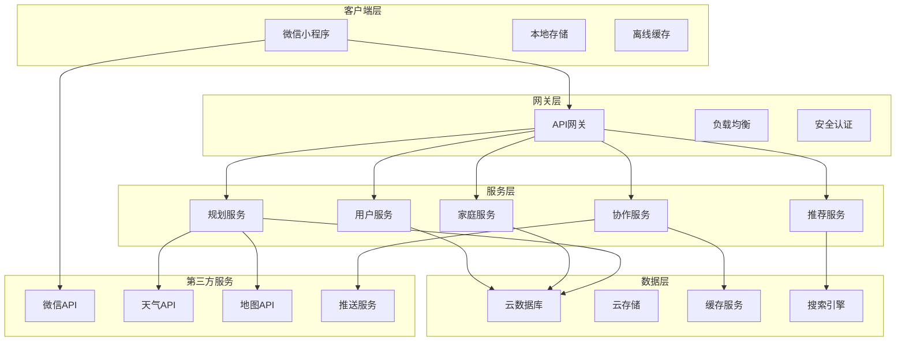

#### 12.1.2 技术栈选择

**前端技术栈**
- **开发框架**：微信小程序原生框架
- **UI组件库**：WeUI + 自定义组件
- **状态管理**：MobX或自定义状态管理
- **网络请求**：wx.request + 请求封装
- **本地存储**：wx.storage + IndexedDB

**后端技术栈**
- **运行环境**：Node.js 16+
- **开发框架**：微信云开发 + Express.js
- **数据库**：MongoDB（云数据库）
- **缓存**：Redis（云缓存）
- **文件存储**：腾讯云COS（云存储）

**开发工具链**
- **IDE**：微信开发者工具 + VS Code
- **版本控制**：Git + GitHub/GitLab
- **包管理**：npm/yarn
- **构建工具**：webpack + 小程序构建工具
- **代码规范**：ESLint + Prettier

### 12.2 系统架构要求

#### 12.2.1 微服务架构
- **服务拆分**：按业务领域拆分为独立的微服务
- **服务通信**：基于HTTP/HTTPS的RESTful API
- **服务发现**：基于云开发的服务注册与发现
- **配置管理**：集中化配置管理，支持动态配置更新

#### 12.2.2 数据架构
- **数据分层**：数据访问层、业务逻辑层、表现层
- **数据一致性**：最终一致性模型，支持分布式事务
- **数据同步**：实时数据同步机制，支持离线数据缓存
- **数据备份**：自动化数据备份和恢复机制

#### 12.2.3 安全架构
- **认证授权**：基于JWT的无状态认证
- **API安全**：API签名验证和频率限制
- **数据加密**：传输加密（HTTPS）和存储加密（AES-256）
- **安全监控**：实时安全监控和异常检测

### 12.3 开发环境要求

#### 12.3.1 开发工具
- **主要IDE**：微信开发者工具 1.06.0+
- **辅助IDE**：VS Code + 小程序插件
- **调试工具**：微信开发者工具调试器
- **性能分析**：小程序性能分析工具

#### 12.3.2 开发规范
- **代码规范**：遵循JavaScript Standard Style
- **命名规范**：驼峰命名法，语义化命名
- **目录结构**：按功能模块组织目录结构
- **注释规范**：JSDoc格式的代码注释

#### 12.3.3 版本控制
- **分支策略**：Git Flow分支管理策略
- **提交规范**：Conventional Commits提交信息规范
- **代码审查**：Pull Request代码审查流程
- **版本发布**：语义化版本号管理

### 12.4 部署和运维要求

#### 12.4.1 部署环境
- **开发环境**：本地开发环境 + 云开发测试环境
- **测试环境**：独立的测试环境，模拟生产环境
- **预发布环境**：与生产环境完全一致的预发布环境
- **生产环境**：高可用的生产环境，支持灰度发布

#### 12.4.2 CI/CD流程
- **持续集成**：自动化代码构建和测试
- **持续部署**：自动化部署到各个环境
- **质量门禁**：代码质量检查和安全扫描
- **回滚机制**：快速回滚到上一个稳定版本

#### 12.4.3 监控和运维
- **系统监控**：服务器性能、应用性能监控
- **业务监控**：关键业务指标监控和告警
- **日志管理**：集中化日志收集和分析
- **故障处理**：自动化故障检测和恢复

### 12.5 性能优化要求

#### 12.5.1 前端性能优化
- **代码分割**：按页面和功能进行代码分割
- **资源优化**：图片压缩、代码压缩、资源缓存
- **渲染优化**：虚拟列表、懒加载、预加载
- **网络优化**：请求合并、缓存策略、CDN加速

#### 12.5.2 后端性能优化
- **数据库优化**：索引优化、查询优化、连接池
- **缓存策略**：多级缓存、缓存预热、缓存更新
- **并发处理**：异步处理、队列机制、限流控制
- **资源优化**：内存管理、CPU优化、I/O优化

### 12.6 第三方服务集成

#### 12.6.1 微信生态服务
- **微信登录**：微信OAuth2.0授权登录
- **微信支付**：微信小程序支付接口
- **微信分享**：小程序分享和转发功能
- **微信通知**：模板消息和订阅消息

#### 12.6.2 外部API服务
- **天气服务**：和风天气API或高德天气API
- **地图服务**：腾讯地图API或高德地图API
- **推送服务**：腾讯移动推送或个推
- **短信服务**：腾讯云短信或阿里云短信

#### 12.6.3 数据分析服务
- **用户行为分析**：微信小程序数据助手
- **自定义埋点**：自建数据分析平台
- **错误监控**：Sentry或Bugsnag
- **性能监控**：腾讯云APM或阿里云ARMS

---

## 13. 数据需求

---

## 第四部分：设计规范

## 14. 用户体验设计

### 14.1 设计理念

#### 14.1.1 核心设计理念
**"简约而不简单，温暖而有力量"**

- **人性化**：以用户为中心，关注用户情感需求
- **家庭化**：体现家庭温暖，促进家庭和谐
- **智能化**：减少用户认知负担，提供智能建议
- **协作化**：强化协作体验，增进家庭互动

#### 14.1.2 设计原则

**1. 简洁性原则**
- 界面元素精简，避免信息过载
- 操作流程简化，减少用户学习成本
- 视觉层次清晰，突出核心功能

**2. 一致性原则**
- 保持设计风格和交互模式统一
- 统一的色彩、字体、图标规范
- 一致的操作逻辑和反馈机制

**3. 可用性原则**
- 符合用户使用习惯和心理模型
- 提供清晰的导航和状态反馈
- 支持容错和快速恢复

**4. 可访问性原则**
- 支持不同年龄段用户使用
- 考虑视觉障碍用户的需求
- 适配不同设备和屏幕尺寸

### 14.2 用户体验策略

#### 14.2.1 用户旅程设计
**新用户引导旅程**：
```
发现产品 → 注册登录 → 创建家庭 → 邀请成员 → 制定首个计划 → 体验协作 → 养成习惯
```

**日常使用旅程**：
```
打开应用 → 查看今日概览 → 执行计划任务 → 记录完成情况 → 查看家庭动态 → 规划明日
```

**深度使用旅程**：
```
数据分析 → 习惯优化 → 个性化设置 → 分享经验 → 邀请朋友 → 成为忠实用户
```

#### 14.2.2 情感化设计
**正向情感激励**：
- 完成任务时的成就感设计
- 家庭协作的温馨感体现
- 习惯养成的进步感展示

**负向情感缓解**：
- 失败时的鼓励和建议
- 冲突时的调解和引导
- 压力时的放松和舒缓

#### 14.2.3 个性化体验
**内容个性化**：
- 基于用户偏好的推荐内容
- 个性化的界面主题和布局
- 定制化的提醒和通知

**功能个性化**：
- 可配置的功能模块
- 个性化的快捷操作
- 自定义的数据展示

### 14.3 信息架构设计

#### 14.3.1 导航架构
```
主导航（底部Tab）
├── 今日（首页）
│   ├── 今日概览
│   ├── 待办任务
│   └── 家庭动态
├── 规划
│   ├── 饮食规划
│   ├── 运动计划
│   ├── 穿搭管理
│   └── 其他计划
├── 记录
│   ├── 完成记录
│   ├── 数据统计
│   └── 习惯分析
└── 我的
    ├── 个人信息
    ├── 家庭管理
    ├── 设置中心
    └── 帮助反馈
```

#### 14.3.2 信息层级
**一级信息**：核心功能入口，用户最常用的功能
**二级信息**：功能详情页面，具体的操作界面
**三级信息**：详细设置页面，高级功能和配置

#### 14.3.3 内容组织
**按时间组织**：今日、明日、本周、本月
**按类型组织**：饮食、运动、穿搭、家务
**按人员组织**：个人、家庭、成员
**按状态组织**：待办、进行中、已完成

### 14.4 交互设计规范

#### 14.4.1 基础交互模式
**点击交互**：
- 主要操作使用点击手势
- 点击区域不小于44px×44px
- 提供明确的点击反馈

**滑动交互**：
- 列表滚动和页面切换
- 卡片滑动操作（删除、编辑）
- 下拉刷新和上拉加载

**长按交互**：
- 快捷菜单和批量操作
- 拖拽排序和移动
- 详细信息预览

#### 14.4.2 反馈机制设计
**视觉反馈**：
- 按钮状态变化（正常、按下、禁用）
- 加载状态指示器
- 成功、警告、错误状态提示

**触觉反馈**：
- 重要操作的震动反馈
- 成功完成的触觉确认
- 错误操作的警告震动

**听觉反馈**：
- 可选的操作音效
- 重要通知的提示音
- 成功完成的奖励音效

#### 14.4.3 动效设计规范
**页面转场动效**：
- 页面切换使用滑动动效
- 模态弹窗使用缩放动效
- 返回操作使用滑出动效

**元素动效**：
- 按钮点击的缩放动效
- 列表项的滑入动效
- 状态变化的渐变动效

**加载动效**：
- 骨架屏加载效果
- 进度条动画
- 刷新指示器动画

---

## 15. 界面设计规范

### 15.1 视觉设计规范

#### 15.1.1 色彩规范
**主色调**：
- 主色：#4A90E2（温暖蓝色）- 代表信任和稳定
- 辅助色：#7ED321（活力绿色）- 代表健康和成长
- 强调色：#F5A623（温暖橙色）- 代表温馨和活力

**功能色彩**：
- 成功：#7ED321（绿色）
- 警告：#F5A623（橙色）
- 错误：#D0021B（红色）
- 信息：#4A90E2（蓝色）

**中性色彩**：
- 主文字：#333333（深灰）
- 次要文字：#666666（中灰）
- 辅助文字：#999999（浅灰）
- 分割线：#E5E5E5（极浅灰）
- 背景色：#F8F9FA（浅灰白）

#### 15.1.2 字体规范
**字体家族**：
- iOS：PingFang SC
- Android：Noto Sans CJK SC
- 备用：Helvetica Neue, Arial, sans-serif

**字体大小**：
- 大标题：20px（重要页面标题）
- 标题：18px（页面标题、卡片标题）
- 副标题：16px（次要标题、重要内容）
- 正文：14px（主要内容文字）
- 辅助文字：12px（说明文字、时间等）
- 小字：10px（标签、状态等）

**字重规范**：
- 粗体：600（重要标题和强调内容）
- 中等：500（次要标题）
- 常规：400（正文内容）

#### 15.1.3 图标设计规范
**图标风格**：
- 线性图标为主，面性图标为辅
- 圆角处理，体现温和友好
- 统一的线条粗细（2px）
- 简洁明了，易于识别

**图标尺寸**：
- 大图标：32px×32px（主要功能入口）
- 中图标：24px×24px（次要功能、按钮）
- 小图标：16px×16px（状态指示、装饰）

**图标色彩**：
- 激活状态：主色调
- 未激活状态：中性灰色
- 禁用状态：浅灰色

### 15.2 布局设计规范

#### 15.2.1 栅格系统
**基础栅格**：
- 屏幕宽度：375px（iPhone 6/7/8基准）
- 列数：12列
- 列间距：16px
- 页面边距：16px

**响应式适配**：
- 小屏幕（<375px）：保持16px边距
- 大屏幕（>375px）：等比例缩放或增加边距

#### 15.2.2 间距规范
**基础间距单位**：8px

**常用间距**：
- 极小间距：4px（紧密相关元素）
- 小间距：8px（相关元素）
- 中间距：16px（一般元素）
- 大间距：24px（不同区块）
- 极大间距：32px（页面区域）

#### 15.2.3 组件尺寸规范
**按钮尺寸**：
- 大按钮：高度48px，最小宽度120px
- 中按钮：高度40px，最小宽度100px
- 小按钮：高度32px，最小宽度80px

**输入框尺寸**：
- 标准输入框：高度48px
- 多行输入框：最小高度96px
- 搜索框：高度40px

**卡片尺寸**：
- 标准卡片：最小高度80px
- 内容卡片：根据内容自适应
- 图片卡片：16:9或1:1比例

### 15.3 组件设计规范

#### 15.3.1 基础组件
**按钮组件**：
- 主要按钮：实心背景，白色文字
- 次要按钮：边框样式，主色文字
- 文字按钮：无背景，主色文字
- 危险按钮：红色背景或文字

**输入组件**：
- 文本输入框：边框样式，圆角4px
- 选择器：下拉样式或弹窗选择
- 开关：iOS风格的滑动开关
- 复选框：圆角方形，勾选动效

#### 15.3.2 业务组件
**任务卡片**：
- 任务标题、负责人、状态
- 完成按钮、编辑入口
- 状态颜色区分

**计划卡片**：
- 计划内容、时间、参与人
- 快捷操作按钮
- 图片展示区域

**统计卡片**：
- 数据展示、趋势图表
- 时间筛选器
- 详情查看入口

---

## 16. 交互设计规范

### 16.1 导航设计

#### 16.1.1 主导航设计
**底部Tab导航**：
- 4个主要功能入口
- 图标+文字标签
- 当前页面高亮显示
- 支持角标提示

**顶部导航**：
- 页面标题居中显示
- 返回按钮（左侧）
- 功能按钮（右侧）
- 搜索入口（部分页面）

#### 16.1.2 页面导航模式
**层级导航**：
- 面包屑导航（复杂页面）
- 返回按钮导航
- 页面标题指示当前位置

**平级导航**：
- Tab切换导航
- 分段控制器
- 滑动切换支持

### 16.2 操作流程设计

#### 16.2.1 核心操作流程
**创建计划流程**：
```
选择类型 → 填写基本信息 → 设置详细参数 → 指定负责人 → 确认创建 → 同步通知
```

**完成任务流程**：
```
查看任务 → 点击完成 → 填写完成信息 → 上传照片（可选）→ 提交确认 → 状态更新
```

**邀请成员流程**：
```
进入家庭管理 → 点击邀请成员 → 生成邀请码 → 分享邀请码 → 成员加入 → 权限设置
```

#### 16.2.2 异常流程处理
**网络异常**：
- 显示网络错误提示
- 提供重试按钮
- 支持离线模式

**操作失败**：
- 明确的错误信息提示
- 提供解决方案建议
- 支持重新操作

**数据冲突**：
- 显示冲突详情
- 提供解决选项
- 保留用户选择权

### 16.3 状态反馈设计

#### 16.3.1 加载状态
**页面加载**：
- 骨架屏显示内容结构
- 加载进度指示器
- 加载失败重试机制

**数据加载**：
- 列表加载动画
- 分页加载指示
- 空状态友好提示

#### 16.3.2 操作状态
**成功状态**：
- 绿色勾选图标
- 成功提示文案
- 自动消失或手动关闭

**失败状态**：
- 红色警告图标
- 具体错误信息
- 重试或取消选项

**进行中状态**：
- 进度条或转圈动画
- 当前操作说明
- 取消操作选项

---

## 9. 数据需求

### 13.1 数据模型设计

#### 13.1.1 核心实体关系图
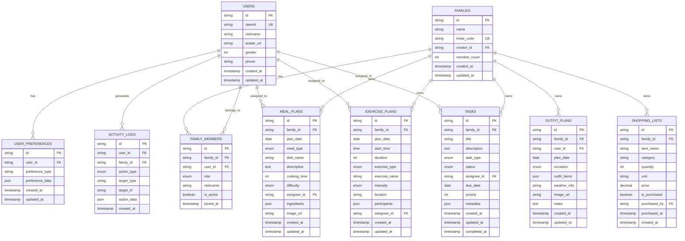

#### 13.1.2 数据字典

**用户表 (users)**
| 字段名 | 类型 | 长度 | 必填 | 默认值 | 说明 |
|--------|------|------|------|--------|------|
| id | VARCHAR | 32 | 是 | - | 用户唯一标识，UUID |
| openid | VARCHAR | 64 | 是 | - | 微信openid，唯一索引 |
| nickname | VARCHAR | 50 | 否 | - | 用户昵称 |
| avatar_url | VARCHAR | 255 | 否 | - | 头像URL |
| gender | TINYINT | - | 否 | 0 | 性别：0未知,1男,2女 |
| phone | VARCHAR | 20 | 否 | - | 手机号码 |
| created_at | TIMESTAMP | - | 是 | CURRENT_TIMESTAMP | 创建时间 |
| updated_at | TIMESTAMP | - | 是 | CURRENT_TIMESTAMP | 更新时间 |

**家庭表 (families)**
| 字段名 | 类型 | 长度 | 必填 | 默认值 | 说明 |
|--------|------|------|------|--------|------|
| id | VARCHAR | 32 | 是 | - | 家庭唯一标识，UUID |
| name | VARCHAR | 50 | 是 | - | 家庭名称 |
| invite_code | VARCHAR | 8 | 是 | - | 邀请码，8位随机字符 |
| creator_id | VARCHAR | 32 | 是 | - | 创建者用户ID |
| member_count | INT | - | 否 | 1 | 成员数量 |
| created_at | TIMESTAMP | - | 是 | CURRENT_TIMESTAMP | 创建时间 |
| updated_at | TIMESTAMP | - | 是 | CURRENT_TIMESTAMP | 更新时间 |

**餐食计划表 (meal_plans)**
| 字段名 | 类型 | 长度 | 必填 | 默认值 | 说明 |
|--------|------|------|------|--------|------|
| id | VARCHAR | 32 | 是 | - | 计划唯一标识 |
| family_id | VARCHAR | 32 | 是 | - | 所属家庭ID |
| plan_date | DATE | - | 是 | - | 计划日期 |
| meal_type | ENUM | - | 是 | - | 餐次：breakfast,lunch,dinner,snack |
| dish_name | VARCHAR | 100 | 是 | - | 菜品名称 |
| description | TEXT | - | 否 | - | 详细描述 |
| cooking_time | INT | - | 否 | - | 制作时间（分钟） |
| difficulty | ENUM | - | 否 | easy | 难度：easy,medium,hard |
| assignee_id | VARCHAR | 32 | 否 | - | 负责人ID |
| ingredients | JSON | - | 否 | - | 食材清单 |
| image_url | VARCHAR | 255 | 否 | - | 菜品图片URL |

### 13.2 数据安全和隐私

#### 13.2.1 数据分类
**公开数据**：
- 用户昵称和头像（已脱敏）
- 菜谱和运动计划模板
- 统计数据（已聚合）

**敏感数据**：
- 用户手机号码
- 家庭详细信息
- 个人偏好设置
- 位置信息

**机密数据**：
- 微信openid
- 用户行为日志
- 支付相关信息

#### 13.2.2 数据保护措施
**传输安全**：
- 所有API调用使用HTTPS加密
- 敏感数据传输使用额外加密层
- API签名验证防止数据篡改

**存储安全**：
- 敏感数据使用AES-256加密存储
- 数据库访问使用白名单IP限制
- 定期更新加密密钥

**访问控制**：
- 基于角色的数据访问控制
- 最小权限原则
- 操作日志记录和审计

#### 13.2.3 隐私保护
**数据最小化**：
- 仅收集业务必需的数据
- 定期清理过期和无用数据
- 用户可控制数据收集范围

**用户权利**：
- 数据查看权：用户可查看自己的所有数据
- 数据修改权：用户可修改个人信息
- 数据删除权：用户可删除账户和数据
- 数据导出权：用户可导出个人数据

### 13.3 数据分析需求

#### 13.3.1 用户行为分析
**页面访问分析**：
- 页面浏览量（PV）和独立访客数（UV）
- 页面停留时间和跳出率
- 用户访问路径分析

**功能使用分析**：
- 各功能模块的使用频率
- 用户操作行为序列分析
- 功能转化漏斗分析

**用户画像分析**：
- 用户基本属性分析
- 用户行为偏好分析
- 用户生命周期分析

#### 13.3.2 业务数据分析
**计划完成率分析**：
- 整体计划完成率趋势
- 不同类型计划的完成率对比
- 家庭成员完成率对比

**习惯养成分析**：
- 用户习惯坚持天数统计
- 习惯养成成功率分析
- 影响习惯养成的因素分析

**协作效果分析**：
- 家庭成员协作频率
- 任务分工效率分析
- 沟通互动效果评估

#### 13.3.3 产品优化分析
**性能监控**：
- API响应时间监控
- 页面加载性能监控
- 错误率和异常监控

**用户反馈分析**：
- 用户满意度调研数据
- 用户反馈问题分类统计
- 功能改进建议收集

**A/B测试数据**：
- 不同版本功能效果对比
- 界面设计方案效果测试
- 推荐算法效果评估

### 13.4 数据治理

#### 13.4.1 数据质量管理
**数据完整性**：
- 必填字段完整性检查
- 数据关联关系完整性验证
- 数据备份完整性校验

**数据准确性**：
- 数据格式和类型验证
- 业务规则一致性检查
- 数据异常值检测和处理

**数据一致性**：
- 跨系统数据一致性保证
- 实时同步数据一致性验证
- 缓存数据一致性管理

#### 13.4.2 数据生命周期管理
**数据创建**：
- 数据创建标准和规范
- 数据质量检查机制
- 数据血缘关系记录

**数据使用**：
- 数据访问权限控制
- 数据使用情况监控
- 数据使用合规性检查

**数据归档**：
- 历史数据归档策略
- 冷热数据分层存储
- 数据压缩和优化

**数据销毁**：
- 数据保留期限管理
- 安全数据销毁流程
- 数据销毁记录和审计

---

## 第五部分：项目管理

## 17. 项目计划

### 17.1 项目总体规划

#### 17.1.1 项目周期
**总开发周期**：12周（3个月）
**团队规模**：8-10人
**预算范围**：50-80万元
**发布时间**：2025年Q3

#### 17.1.2 项目阶段划分
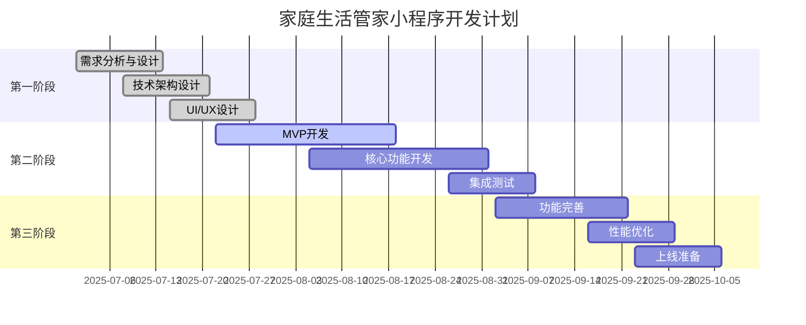

### 17.2 详细开发计划

#### 17.2.1 第一阶段：需求设计阶段（2周）
**Week 1-2：需求分析与架构设计**

**主要任务**：
- [ ] 完善产品需求文档
- [ ] 完成技术架构设计
- [ ] 完成数据库设计
- [ ] 完成API接口设计
- [ ] 完成UI/UX设计稿

**交付物**：
- 最终版PRD文档
- 技术架构设计文档
- 数据库设计文档
- API接口文档
- UI设计稿和交互原型

**人员安排**：
- 产品经理：1人（需求分析、原型设计）
- 技术架构师：1人（架构设计、技术选型）
- UI设计师：1人（界面设计、交互设计）
- 前端开发：1人（技术调研、环境准备）
- 后端开发：1人（技术调研、环境准备）

#### 17.2.2 第二阶段：MVP开发阶段（4周）
**Week 3-4：基础框架开发**

**主要任务**：
- [ ] 搭建小程序基础框架
- [ ] 搭建后端服务架构
- [ ] 实现用户登录注册功能
- [ ] 实现家庭管理功能
- [ ] 搭建CI/CD流水线

**Week 5-6：核心功能开发**

**主要任务**：
- [ ] 实现饮食规划功能
- [ ] 实现运动计划功能
- [ ] 实现基础协作功能
- [ ] 实现数据同步机制
- [ ] 完成基础UI组件

**交付物**：
- MVP版本小程序
- 后端API服务
- 基础测试用例
- 部署文档

**人员安排**：
- 前端开发：2人（小程序开发）
- 后端开发：2人（API开发、数据库）
- 测试工程师：1人（测试用例编写）
- UI设计师：1人（设计支持、切图）

#### 17.2.3 第三阶段：功能完善阶段（4周）
**Week 7-8：功能扩展**

**主要任务**：
- [ ] 实现穿搭管理功能
- [ ] 实现智能推荐功能
- [ ] 实现数据统计功能
- [ ] 完善协作功能
- [ ] 优化用户体验

**Week 9-10：测试优化**

**主要任务**：
- [ ] 全面功能测试
- [ ] 性能测试和优化
- [ ] 兼容性测试
- [ ] 安全测试
- [ ] 用户体验测试

**交付物**：
- 完整功能版本
- 测试报告
- 性能优化报告
- 用户手册

#### 17.2.4 第四阶段：上线准备阶段（2周）
**Week 11-12：发布准备**

**主要任务**：
- [ ] 小程序审核提交
- [ ] 生产环境部署
- [ ] 监控系统配置
- [ ] 运营材料准备
- [ ] 用户反馈渠道建立

**交付物**：
- 正式发布版本
- 运维文档
- 用户运营方案
- 应急预案

### 17.3 资源配置计划

#### 17.3.1 人员配置
**核心团队（8人）**：
- 产品经理：1人（全程参与）
- 技术负责人：1人（全程参与）
- 前端开发：2人（第2-4阶段）
- 后端开发：2人（第2-4阶段）
- UI/UX设计师：1人（第1-3阶段）
- 测试工程师：1人（第3-4阶段）

**支持团队（2-3人）**：
- 运营专员：1人（第4阶段开始）
- 数据分析师：1人（第3阶段开始）
- 客服专员：1人（第4阶段开始）

#### 17.3.2 技术资源
**开发环境**：
- 开发服务器：2台（开发、测试环境）
- 云服务资源：腾讯云开发环境
- 第三方服务：天气API、地图API等

**生产环境**：
- 云服务器：高可用配置
- CDN服务：图片和静态资源加速
- 监控服务：系统和业务监控
- 备份服务：数据备份和恢复

#### 17.3.3 预算分配
**人员成本（70%）**：约35-56万元
- 核心团队薪资：30-48万元
- 支持团队薪资：5-8万元

**技术成本（20%）**：约10-16万元
- 云服务费用：6-10万元
- 第三方服务费用：2-3万元
- 开发工具和软件：2-3万元

**运营成本（10%）**：约5-8万元
- 推广费用：3-5万元
- 设计和内容制作：2-3万元

### 17.4 风险控制计划

#### 17.4.1 技术风险控制
**风险识别**：
- 技术选型风险
- 开发进度风险
- 性能和稳定性风险
- 第三方服务依赖风险

**控制措施**：
- 技术预研和POC验证
- 敏捷开发和迭代交付
- 持续集成和自动化测试
- 备选方案准备

#### 17.4.2 项目进度风险控制
**风险识别**：
- 需求变更风险
- 人员变动风险
- 外部依赖风险
- 质量问题风险

**控制措施**：
- 需求冻结和变更控制
- 关键人员备份计划
- 外部依赖提前对接
- 质量门禁和检查点

#### 17.4.3 商业风险控制
**风险识别**：
- 市场竞争风险
- 用户接受度风险
- 政策变化风险
- 资金风险

**控制措施**：
- 差异化定位和快速迭代
- 用户调研和MVP验证
- 政策跟踪和合规确保
- 分阶段投入和成本控制

### 17.5 质量保证计划

#### 17.5.1 质量标准
**代码质量**：
- 代码覆盖率 ≥ 80%
- 代码规范检查通过率 100%
- 代码审查通过率 100%
- 静态代码分析无严重问题

**产品质量**：
- 功能测试通过率 ≥ 95%
- 性能测试达标率 100%
- 兼容性测试通过率 ≥ 90%
- 用户体验评分 ≥ 4.0/5.0

#### 17.5.2 测试策略
**测试类型**：
- 单元测试：开发阶段同步进行
- 集成测试：模块完成后进行
- 系统测试：功能完成后进行
- 用户验收测试：发布前进行

**测试环境**：
- 开发测试环境：开发人员自测
- 集成测试环境：模块集成测试
- 系统测试环境：完整功能测试
- 预发布环境：生产环境模拟

#### 17.5.3 发布策略
**发布模式**：
- 灰度发布：先发布给内部用户
- 小范围发布：发布给种子用户
- 全量发布：正式对外发布

**回滚机制**：
- 快速回滚：5分钟内回滚到上一版本
- 数据回滚：数据库变更回滚方案
- 应急预案：重大问题应急处理流程

---

## 18. 团队组织

### 18.1 组织架构

#### 18.1.1 项目组织结构
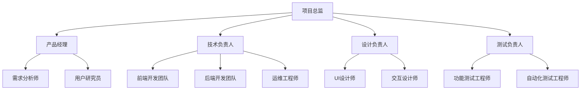

#### 18.1.2 角色职责定义

**项目总监**：
- 项目整体规划和决策
- 资源协调和风险控制
- 对外沟通和汇报
- 团队管理和激励

**产品经理**：
- 产品需求分析和管理
- 用户研究和体验设计
- 产品规划和路线图制定
- 跨团队协调和沟通

**技术负责人**：
- 技术架构设计和决策
- 技术团队管理和指导
- 技术风险评估和控制
- 技术标准和规范制定

**前端开发工程师**：
- 小程序界面开发
- 用户交互功能实现
- 前端性能优化
- 兼容性测试和修复

**后端开发工程师**：
- 服务端API开发
- 数据库设计和优化
- 系统架构实现
- 性能监控和优化

**UI/UX设计师**：
- 界面视觉设计
- 用户体验设计
- 交互原型制作
- 设计规范制定

**测试工程师**：
- 测试计划制定
- 功能测试执行
- 自动化测试开发
- 质量报告输出

#### 18.1.3 协作机制

**会议机制**：
- 每日站会：15分钟，同步进度和问题
- 周例会：1小时，回顾总结和计划
- 月度评审：2小时，里程碑评审和调整
- 季度规划：半天，产品规划和团队建设

**沟通机制**：
- 即时沟通：微信群、钉钉等
- 文档协作：腾讯文档、Notion等
- 代码协作：Git、GitHub等
- 项目管理：Jira、Trello等

**决策机制**：
- 技术决策：技术负责人主导
- 产品决策：产品经理主导
- 重大决策：项目总监决定
- 争议解决：升级机制

### 18.2 团队建设

#### 18.2.1 人员招聘计划
**招聘时间表**：
- 第1周：核心团队到位（产品、技术负责人）
- 第2周：开发团队到位（前后端开发）
- 第3周：设计团队到位（UI/UX设计师）
- 第4周：测试团队到位（测试工程师）

**招聘标准**：
- 技术能力：符合岗位技术要求
- 项目经验：有相关项目开发经验
- 团队协作：良好的沟通和协作能力
- 学习能力：快速学习和适应能力

#### 18.2.2 团队培训计划
**技术培训**：
- 微信小程序开发培训
- 云开发平台使用培训
- 代码规范和最佳实践培训
- 安全开发培训

**业务培训**：
- 产品业务逻辑培训
- 用户体验设计培训
- 数据分析和监控培训
- 运营推广培训

**团队建设**：
- 团队破冰和融合活动
- 定期团建和交流活动
- 技术分享和学习活动
- 绩效管理和激励机制

#### 18.2.3 绩效管理
**考核指标**：
- 项目进度：按时完成任务
- 代码质量：代码规范和测试覆盖率
- 协作效果：团队协作和沟通效果
- 创新贡献：技术创新和改进建议

**激励机制**：
- 项目奖金：项目成功完成奖励
- 技术奖励：技术创新和贡献奖励
- 成长机会：培训和晋升机会
- 团队活动：团建和福利活动

---

## 19. 质量保证

### 19.1 质量管理体系

#### 19.1.1 质量目标
**产品质量目标**：
- 功能完整性：100%需求功能实现
- 功能正确性：95%以上功能测试通过率
- 性能达标率：100%性能指标达标
- 用户满意度：4.0/5.0以上用户评分

**过程质量目标**：
- 代码质量：80%以上代码覆盖率
- 交付及时性：95%以上任务按时完成
- 缺陷控制：每千行代码缺陷数<2个
- 文档完整性：100%关键文档完整

#### 19.1.2 质量保证流程
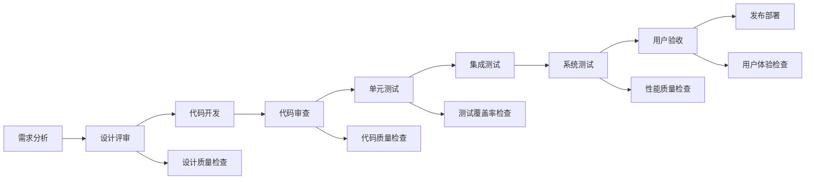

#### 19.1.3 质量控制点
**设计阶段**：
- 需求完整性和一致性检查
- 技术方案可行性评审
- 接口设计规范性检查
- UI/UX设计规范检查

**开发阶段**：
- 代码规范检查（ESLint）
- 代码安全扫描（SonarQube）
- 单元测试覆盖率检查
- 代码审查（Code Review）

**测试阶段**：
- 功能测试用例执行
- 性能测试基准验证
- 兼容性测试验证
- 安全测试验证

**发布阶段**：
- 发布清单检查
- 回滚方案验证
- 监控告警配置
- 文档完整性检查

### 19.2 测试策略

#### 19.2.1 测试分层策略
```mermaid
pyramid
    title 测试金字塔
    "E2E测试" : 10
    "集成测试" : 30
    "单元测试" : 60
```

**单元测试（60%）**：
- 覆盖率目标：80%以上
- 测试范围：核心业务逻辑、工具函数
- 测试工具：Jest、Mocha
- 执行频率：每次代码提交

**集成测试（30%）**：
- 测试范围：API接口、数据库交互
- 测试工具：Postman、Newman
- 测试环境：独立的集成测试环境
- 执行频率：每日构建

**端到端测试（10%）**：
- 测试范围：关键用户流程
- 测试工具：Cypress、Puppeteer
- 测试环境：预发布环境
- 执行频率：版本发布前

#### 19.2.2 测试类型覆盖
**功能测试**：
- 正常功能流程测试
- 异常情况处理测试
- 边界条件测试
- 用户权限测试

**性能测试**：
- 响应时间测试
- 并发用户测试
- 资源使用率测试
- 压力测试和稳定性测试

**兼容性测试**：
- 不同微信版本兼容性
- 不同设备型号兼容性
- 不同操作系统兼容性
- 不同网络环境兼容性

**安全测试**：
- 数据传输安全测试
- 用户权限安全测试
- 输入验证安全测试
- 隐私保护合规测试

#### 19.2.3 自动化测试
**自动化测试策略**：
- 单元测试100%自动化
- API测试80%自动化
- UI测试50%自动化
- 回归测试90%自动化

**自动化测试工具链**：
- 单元测试：Jest + Coverage
- API测试：Postman + Newman
- UI测试：Cypress + Docker
- 持续集成：GitHub Actions

**自动化测试流程**：
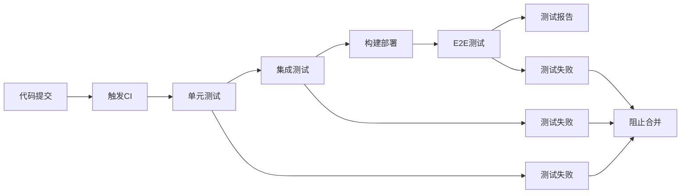

### 19.3 代码质量管理

#### 19.3.1 代码规范
**JavaScript规范**：
- 使用ESLint + Prettier
- 遵循Airbnb JavaScript Style Guide
- 强制使用TypeScript类型检查
- 禁止使用var，优先使用const

**小程序规范**：
- 遵循微信小程序开发规范
- 组件化开发，单一职责原则
- 合理使用生命周期函数
- 优化性能，避免内存泄漏

**命名规范**：
- 变量和函数：驼峰命名法
- 常量：大写下划线命名法
- 组件：帕斯卡命名法
- 文件和目录：短横线命名法

#### 19.3.2 代码审查
**审查流程**：
- 所有代码变更必须经过审查
- 至少需要一名高级开发者审查
- 审查通过后才能合并到主分支
- 审查意见必须及时响应和处理

**审查要点**：
- 代码逻辑正确性
- 代码规范遵循情况
- 性能和安全问题
- 测试用例完整性
- 文档和注释完整性

**审查工具**：
- GitHub Pull Request
- GitLab Merge Request
- 代码审查清单
- 自动化检查工具

#### 19.3.3 技术债务管理
**技术债务识别**：
- 代码复杂度分析
- 代码重复度检查
- 性能瓶颈识别
- 安全漏洞扫描

**技术债务管理**：
- 建立技术债务清单
- 定期评估和优先级排序
- 制定偿还计划和时间表
- 在迭代中安排偿还时间

**预防措施**：
- 严格的代码审查
- 持续重构和优化
- 技术培训和分享
- 最佳实践推广

---

## 20. 风险管理

### 20.1 风险识别与评估

#### 20.1.1 风险分类框架
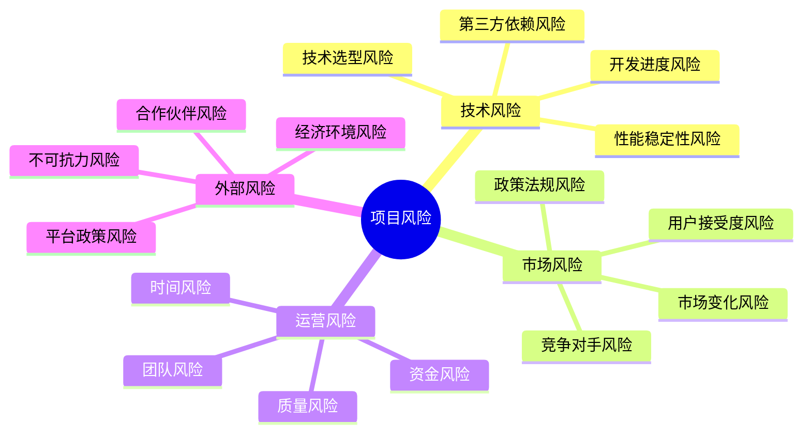

#### 20.1.2 风险评估矩阵
| 风险类别 | 风险事件 | 概率 | 影响 | 风险等级 | 应对策略 |
|---------|----------|------|------|----------|----------|
| 技术风险 | 微信小程序政策变化 | 中 | 高 | 高 | 政策跟踪，备选方案 |
| 技术风险 | 云开发服务不稳定 | 低 | 高 | 中 | 多云备份，监控告警 |
| 技术风险 | 第三方API服务中断 | 中 | 中 | 中 | 多供应商，降级方案 |
| 市场风险 | 大厂推出竞品 | 高 | 高 | 高 | 差异化定位，快速迭代 |
| 市场风险 | 用户接受度不高 | 中 | 高 | 高 | 用户调研，MVP验证 |
| 市场风险 | 市场需求变化 | 中 | 中 | 中 | 市场监测，敏捷调整 |
| 运营风险 | 核心人员离职 | 中 | 高 | 高 | 知识管理，人员备份 |
| 运营风险 | 开发进度延期 | 中 | 中 | 中 | 敏捷开发，风险缓冲 |
| 运营风险 | 资金不足 | 低 | 高 | 中 | 分阶段投入，成本控制 |
| 外部风险 | 疫情等不可抗力 | 低 | 高 | 中 | 远程协作，应急预案 |

### 20.2 重点风险应对策略

#### 20.2.1 技术风险应对
**微信小程序政策风险**：
- **监控措施**：
  - 关注微信官方公告和政策变化
  - 参与微信开发者社区讨论
  - 建立政策变化预警机制
- **应对措施**：
  - 严格遵守微信小程序开发规范
  - 准备H5版本作为备选方案
  - 考虑多平台发布策略
- **应急预案**：
  - 快速调整不合规功能
  - 启用备选技术方案
  - 与微信官方沟通协调

**技术架构风险**：
- **预防措施**：
  - 充分的技术调研和POC验证
  - 采用成熟稳定的技术栈
  - 建立技术架构评审机制
- **应对措施**：
  - 模块化设计，降低耦合度
  - 建立技术债务管理机制
  - 定期技术架构回顾和优化
- **应急预案**：
  - 技术方案快速切换
  - 关键模块重构计划
  - 外部技术专家支持

#### 20.2.2 市场风险应对
**竞争对手风险**：
- **监控措施**：
  - 定期竞品分析和功能对比
  - 关注竞争对手动态和策略
  - 建立竞争情报收集机制
- **应对措施**：
  - 强化差异化定位和优势
  - 快速迭代和功能创新
  - 建立用户粘性和壁垒
- **应急预案**：
  - 快速功能跟进和超越
  - 价格策略调整
  - 合作伙伴联盟

**用户接受度风险**：
- **预防措施**：
  - 深入用户调研和需求验证
  - MVP快速验证和迭代
  - 用户体验持续优化
- **应对措施**：
  - 用户反馈快速响应
  - 产品功能持续改进
  - 用户教育和引导
- **应急预案**：
  - 产品定位调整
  - 目标用户群体调整
  - 商业模式调整

#### 20.2.3 运营风险应对
**团队风险**：
- **预防措施**：
  - 建立完善的知识管理体系
  - 关键岗位人员备份计划
  - 良好的团队文化和激励机制
- **应对措施**：
  - 快速招聘和人员补充
  - 知识转移和技能培训
  - 外部资源和顾问支持
- **应急预案**：
  - 紧急人员调配
  - 外包服务支持
  - 项目范围调整

**进度风险**：
- **预防措施**：
  - 合理的项目计划和时间估算
  - 敏捷开发和迭代交付
  - 风险缓冲时间预留
- **应对措施**：
  - 增加人力资源投入
  - 功能优先级调整
  - 并行开发和优化
- **应急预案**：
  - 功能范围缩减
  - 发布时间调整
  - 分阶段发布

### 20.3 风险监控与预警

#### 20.3.1 风险监控指标
**技术风险指标**：
- 系统可用性：目标>99.9%
- API响应时间：目标<2秒
- 错误率：目标<1%
- 代码质量：覆盖率>80%

**市场风险指标**：
- 用户增长率：目标>20%/月
- 用户留存率：7日留存>40%
- 用户满意度：目标>4.0/5.0
- 竞品功能差距：<3个月

**运营风险指标**：
- 项目进度：按时完成率>90%
- 团队稳定性：离职率<10%
- 预算控制：成本偏差<10%
- 质量指标：缺陷密度<2个/KLOC

#### 20.3.2 预警机制
**三级预警体系**：
- **绿色预警**：风险在可控范围内
- **黄色预警**：风险需要关注和准备
- **红色预警**：风险需要立即行动

**预警触发条件**：
- 关键指标连续3天异常
- 单项指标偏离目标值20%以上
- 外部环境发生重大变化
- 团队反馈重大风险信号

**预警响应流程**：
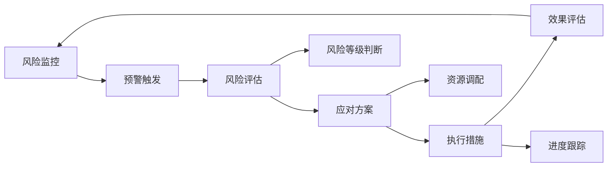

### 20.4 应急响应机制

#### 20.4.1 应急组织架构
**应急指挥小组**：
- 组长：项目总监
- 副组长：产品经理、技术负责人
- 成员：各模块负责人

**应急响应团队**：
- 技术应急团队：处理技术故障
- 业务应急团队：处理业务问题
- 沟通协调团队：内外部沟通
- 后勤保障团队：资源支持

#### 20.4.2 应急响应流程
**故障响应流程**：
1. **故障发现**：监控告警或用户反馈
2. **快速评估**：影响范围和严重程度
3. **应急响应**：启动应急预案
4. **问题解决**：技术修复或业务调整
5. **恢复验证**：功能恢复验证
6. **总结改进**：故障分析和改进

**响应时间要求**：
- P0级故障：5分钟内响应，30分钟内解决
- P1级故障：15分钟内响应，2小时内解决
- P2级故障：1小时内响应，1天内解决
- P3级故障：4小时内响应，3天内解决

#### 20.4.3 业务连续性保障
**数据备份策略**：
- 实时数据备份：关键业务数据
- 定期数据备份：每日全量备份
- 异地数据备份：防范地域性风险
- 备份恢复测试：定期恢复演练

**服务降级策略**：
- 核心功能保障：优先保证核心功能
- 非核心功能降级：暂停非关键功能
- 限流保护：防止系统过载
- 熔断机制：快速故障隔离

---

## 第六部分：运营策略

## 21. 运营规划

### 21.1 运营策略概述

#### 21.1.1 运营目标
**短期目标（0-6个月）**：
- 获得1000个种子用户
- 建立用户反馈机制
- 验证产品核心价值
- 形成初步用户口碑

**中期目标（6-12个月）**：
- 用户规模达到10000个家庭
- 建立用户社区和内容生态
- 实现用户自增长
- 探索商业化模式

**长期目标（1-3年）**：
- 成为家庭生活管理领域知名品牌
- 构建完整的生活服务生态
- 实现可持续的商业增长
- 扩展到更多平台和市场

#### 21.1.2 运营策略框架
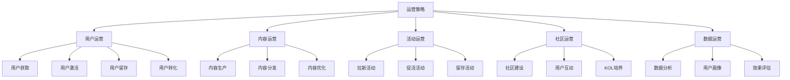

#### 21.1.3 运营阶段规划
**种子期（0-3个月）**：
- 重点：产品验证和种子用户培养
- 策略：精准获客，深度服务
- 目标：1000个高质量种子用户

**成长期（3-12个月）**：
- 重点：用户规模扩张和产品优化
- 策略：口碑传播，功能完善
- 目标：10000个活跃家庭用户

**成熟期（12个月+）**：
- 重点：商业化和生态建设
- 策略：平台化发展，多元变现
- 目标：100000+用户，盈利增长

### 21.2 用户运营策略

#### 21.2.1 用户生命周期管理
**新用户引导（0-7天）**：
- 欢迎引导流程设计
- 核心功能体验引导
- 首次成功体验保障
- 新手任务和奖励机制

**活跃用户维护（7-30天）**：
- 使用习惯培养
- 功能深度体验
- 社交关系建立
- 价值感知强化

**忠诚用户培养（30天+）**：
- 高级功能开放
- 专属服务提供
- 意见领袖培养
- 口碑传播激励

#### 21.2.2 用户分层运营
**核心用户（20%）**：
- 高频使用，深度参与
- 提供专属服务和特权
- 邀请参与产品共建
- 培养为产品大使

**活跃用户（60%）**：
- 定期使用，中度参与
- 通过活动提升活跃度
- 引导使用更多功能
- 促进向核心用户转化

**沉默用户（20%）**：
- 低频使用或已流失
- 通过召回活动重新激活
- 分析流失原因并改进
- 个性化推荐和提醒

#### 21.2.3 用户激励体系
**成就系统**：
- 任务完成徽章
- 习惯坚持奖励
- 家庭协作成就
- 等级升级特权

**积分体系**：
- 日常使用积分
- 分享推荐积分
- 内容贡献积分
- 积分兑换权益

**社交激励**：
- 家庭排行榜
- 朋友圈分享
- 成就展示
- 互动点赞

### 21.3 内容运营策略

#### 21.3.1 内容体系建设
**官方内容**：
- 生活技巧和建议
- 健康饮食知识
- 运动健身指导
- 家庭关系维护

**用户生成内容（UGC）**：
- 生活经验分享
- 成功案例展示
- 创意想法交流
- 问题求助讨论

**专家内容（PGC）**：
- 营养师专业建议
- 健身教练指导
- 心理咨询师分享
- 生活方式专家观点

#### 21.3.2 内容生产机制
**内容规划**：
- 月度内容主题规划
- 热点话题快速响应
- 季节性内容安排
- 用户需求驱动内容

**内容创作**：
- 专业团队创作
- 用户投稿征集
- 专家合作内容
- AI辅助内容生成

**内容审核**：
- 内容质量标准
- 审核流程规范
- 违规内容处理
- 优质内容推荐

#### 21.3.3 内容分发策略
**个性化推荐**：
- 基于用户偏好推荐
- 基于行为数据推荐
- 基于社交关系推荐
- 基于时间场景推荐

**多渠道分发**：
- 小程序内容推送
- 微信公众号分发
- 社交媒体传播
- 合作平台分发

**内容运营优化**：
- 内容效果数据分析
- 用户反馈收集
- 内容迭代优化
- 热门内容复制

### 21.4 社区运营策略

#### 21.4.1 社区建设规划
**社区定位**：
- 家庭生活经验交流平台
- 健康生活方式推广社区
- 用户互助支持网络
- 产品共建参与平台

**社区功能**：
- 话题讨论区
- 经验分享区
- 问答互助区
- 活动组织区

**社区规则**：
- 社区行为规范
- 内容发布标准
- 互动礼仪要求
- 违规处理机制

#### 21.4.2 社区氛围营造
**价值观引导**：
- 积极正面的生活态度
- 互助友爱的社区精神
- 科学健康的生活理念
- 和谐温馨的家庭关系

**互动机制**：
- 话题发起和讨论
- 点赞评论互动
- 私信交流功能
- 群组活动组织

**激励机制**：
- 优质内容奖励
- 活跃用户表彰
- 专家认证体系
- 社区贡献积分

#### 21.4.3 KOL培养计划
**KOL识别**：
- 活跃度高的用户
- 内容质量优秀的用户
- 影响力大的用户
- 专业背景的用户

**KOL培养**：
- 专属权限和特权
- 官方推荐和曝光
- 线下活动邀请
- 产品共建参与

**KOL管理**：
- 定期沟通和维护
- 内容合作和支持
- 活动组织和参与
- 反馈收集和改进

---

## 22. 推广策略

### 22.1 推广目标与策略

#### 22.1.1 推广目标
**品牌目标**：
- 建立"家庭生活管家"品牌认知
- 在目标用户群体中形成口碑
- 成为家庭生活管理领域的代表产品
- 获得媒体和行业认可

**用户目标**：
- 6个月内获得10000个家庭用户
- 12个月内获得50000个家庭用户
- 用户获取成本控制在50元以内
- 用户推荐率达到30%以上

#### 22.1.2 推广策略框架
**AARRR模型应用**：
- **Acquisition（获取）**：多渠道用户获取
- **Activation（激活）**：新用户快速激活
- **Retention（留存）**：用户留存和回访
- **Revenue（收入）**：用户付费转化
- **Referral（推荐）**：用户推荐传播

**推广策略组合**：
- 内容营销：优质内容吸引用户
- 社交传播：利用社交网络扩散
- 合作推广：与相关品牌合作
- 活动营销：通过活动获取用户
- 口碑营销：用户推荐和分享

### 22.2 渠道推广策略

#### 22.2.1 线上推广渠道
**微信生态推广**：
- 微信公众号内容营销
- 微信群精准推广
- 朋友圈广告投放
- 微信小程序搜索优化

**社交媒体推广**：
- 小红书生活方式分享
- 抖音短视频内容营销
- 微博话题营销
- B站UP主合作

**内容平台推广**：
- 知乎专业问答
- 豆瓣小组分享
- 简书生活文章
- 今日头条内容分发

**合作推广**：
- 母婴平台合作
- 健康生活平台合作
- 家居生活品牌合作
- KOL和网红合作

#### 22.2.2 线下推广渠道
**社区推广**：
- 高端社区活动
- 家庭生活讲座
- 健康生活体验活动
- 社区合作伙伴推广

**活动推广**：
- 家庭生活展会参展
- 健康生活节活动
- 亲子活动合作
- 企业员工福利推广

#### 22.2.3 渠道效果评估
**渠道评估指标**：
- 获客成本（CAC）
- 获客质量（用户活跃度）
- 转化率（注册到使用）
- 留存率（7日、30日留存）
- ROI（投入产出比）

**渠道优化策略**：
- 高效渠道加大投入
- 低效渠道优化或停止
- 新渠道持续测试
- 渠道组合优化

### 22.3 营销活动策略

#### 22.3.1 拉新活动
**新用户专享活动**：
- 注册即送会员体验
- 新手任务奖励
- 邀请好友双重奖励
- 限时功能免费体验

**节日营销活动**：
- 情人节夫妻协作挑战
- 母亲节感恩活动
- 儿童节亲子活动
- 春节家庭团聚活动

**话题营销活动**：
- #21天习惯养成挑战#
- #家庭生活小妙招#
- #健康生活方式分享#
- #完美家庭一天#

#### 22.3.2 促活活动
**日常促活活动**：
- 每日签到奖励
- 周任务挑战
- 月度目标达成
- 季度总结分享

**互动促活活动**：
- 家庭PK赛
- 生活技能比赛
- 创意分享大赛
- 用户故事征集

#### 22.3.3 留存活动
**长期留存活动**：
- 会员等级体系
- 长期使用奖励
- 忠诚用户特权
- 专属客服服务

**召回活动**：
- 流失用户召回
- 个性化推荐
- 限时优惠活动
- 新功能体验邀请

### 22.4 品牌建设策略

#### 22.4.1 品牌定位
**品牌核心价值**：
- 让家庭生活更美好
- 科技温暖家庭
- 智能生活助手
- 家庭和谐促进者

**品牌个性**：
- 温暖贴心
- 专业可靠
- 简单易用
- 持续创新

#### 22.4.2 品牌传播
**品牌故事**：
- 产品诞生背景故事
- 团队创业故事
- 用户成功故事
- 社会价值故事

**品牌内容**：
- 品牌理念传播
- 产品价值展示
- 用户案例分享
- 行业观点输出

**媒体关系**：
- 科技媒体报道
- 生活方式媒体合作
- 行业专家访谈
- 用户媒体分享

---

## 23. 数据分析

### 23.1 数据分析体系

#### 23.1.1 数据分析框架
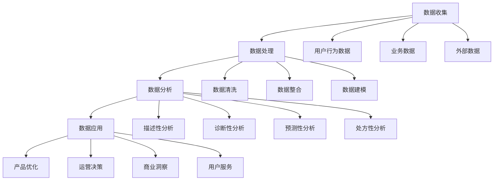

#### 23.1.2 核心数据指标
**用户指标**：
- 新增用户数（DAU、WAU、MAU）
- 用户留存率（次日、7日、30日）
- 用户活跃度（使用频次、时长）
- 用户生命周期价值（LTV）

**产品指标**：
- 功能使用率
- 任务完成率
- 用户路径转化率
- 产品性能指标

**商业指标**：
- 获客成本（CAC）
- 付费转化率
- 客单价（ARPU）
- 投资回报率（ROI）

#### 23.1.3 数据收集策略
**埋点策略**：
- 全埋点：页面浏览、点击事件
- 自定义埋点：关键业务事件
- 可视化埋点：重要交互行为
- 服务端埋点：业务逻辑事件

**数据质量保证**：
- 数据完整性检查
- 数据准确性验证
- 数据一致性保证
- 数据时效性监控

### 23.2 用户行为分析

#### 23.2.1 用户画像分析
**基础画像**：
- 人口统计学特征
- 地理位置分布
- 设备使用情况
- 使用时间偏好

**行为画像**：
- 功能使用偏好
- 使用频次和时长
- 操作路径分析
- 内容消费偏好

**价值画像**：
- 付费意愿和能力
- 推荐传播价值
- 内容贡献价值
- 社区活跃价值

#### 23.2.2 用户路径分析
**关键路径识别**：
- 新用户激活路径
- 核心功能使用路径
- 付费转化路径
- 流失预警路径

**路径优化**：
- 转化瓶颈识别
- 流程简化优化
- 引导机制改进
- A/B测试验证

#### 23.2.3 用户分群分析
**RFM模型应用**：
- R（Recency）：最近使用时间
- F（Frequency）：使用频率
- M（Monetary）：付费金额

**用户分群策略**：
- 高价值用户群
- 活跃用户群
- 新用户群
- 流失风险用户群

### 23.3 产品数据分析

#### 23.3.1 功能使用分析
**功能使用统计**：
- 各功能使用频次
- 功能使用时长
- 功能使用深度
- 功能组合使用

**功能价值评估**：
- 功能对留存的影响
- 功能对活跃的影响
- 功能对转化的影响
- 功能开发ROI

#### 23.3.2 性能数据分析
**性能监控指标**：
- 页面加载时间
- API响应时间
- 错误率统计
- 崩溃率分析

**性能优化方向**：
- 关键路径优化
- 资源加载优化
- 代码性能优化
- 用户体验优化

### 23.4 运营数据分析

#### 23.4.1 渠道效果分析
**渠道评估维度**：
- 获客数量和质量
- 获客成本分析
- 渠道用户留存
- 渠道ROI计算

**渠道优化策略**：
- 高效渠道扩大投入
- 低效渠道优化改进
- 新渠道测试验证
- 渠道组合优化

#### 23.4.2 活动效果分析
**活动数据跟踪**：
- 活动参与率
- 活动完成率
- 活动转化率
- 活动成本效益

**活动优化建议**：
- 活动形式优化
- 活动时机选择
- 活动奖励设计
- 活动推广策略

---

## 24. 成功指标

### 24.1 成功指标体系

#### 24.1.1 指标分类框架
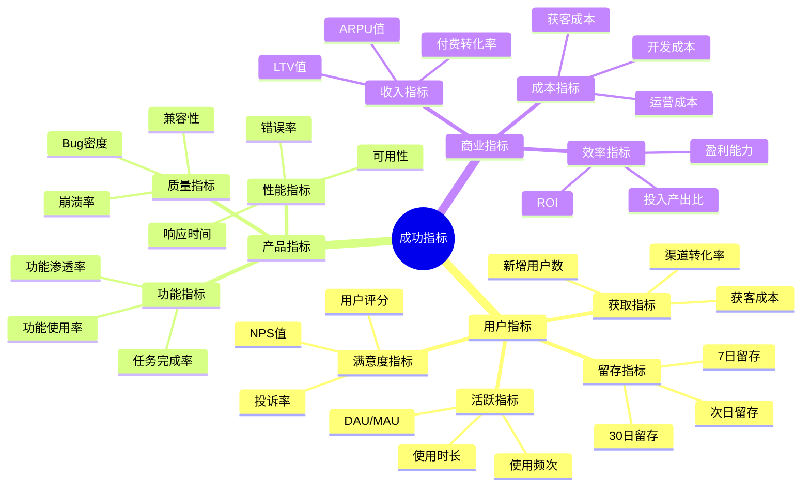

#### 24.1.2 北极星指标
**核心北极星指标**：活跃家庭数量
- 定义：月活跃家庭用户数（至少有一个成员在当月使用产品）
- 目标：12个月内达到50000个活跃家庭
- 意义：反映产品的核心价值实现程度

**支撑指标**：
- 家庭成员平均数量：≥2人/家庭
- 家庭协作频次：≥10次/月/家庭
- 家庭计划完成率：≥70%
- 家庭使用天数：≥15天/月

### 24.2 分阶段成功指标

#### 24.2.1 MVP阶段指标（0-3个月）
**用户获取指标**：
- 新增用户数：1000个种子用户
- 获客成本：≤100元/用户
- 注册转化率：≥30%（从访问到注册）
- 激活率：≥60%（注册后7天内使用核心功能）

**用户活跃指标**：
- 日活跃用户：≥300人
- 周活跃用户：≥600人
- 月活跃用户：≥800人
- 平均使用时长：≥10分钟/次

**用户留存指标**：
- 次日留存率：≥40%
- 7日留存率：≥25%
- 30日留存率：≥15%
- 用户回访率：≥50%

**产品质量指标**：
- 系统可用性：≥99%
- 平均响应时间：≤3秒
- 崩溃率：≤1%
- 用户满意度：≥3.5/5.0

#### 24.2.2 成长阶段指标（3-12个月）
**用户规模指标**：
- 累计注册用户：20000人
- 月活跃用户：10000人
- 活跃家庭数量：5000个
- 用户增长率：≥20%/月

**用户质量指标**：
- 7日留存率：≥40%
- 30日留存率：≥25%
- 用户生命周期：≥6个月
- 用户推荐率：≥30%

**产品成熟度指标**：
- 核心功能使用率：≥80%
- 任务完成率：≥70%
- 功能满意度：≥4.0/5.0
- 系统稳定性：≥99.5%

**商业化指标**：
- 付费转化率：≥5%
- 月均收入：≥10万元
- 客单价：≥200元/年
- LTV/CAC：≥3:1

#### 24.2.3 成熟阶段指标（12个月+）
**市场地位指标**：
- 市场份额：细分领域前3名
- 品牌知名度：目标用户群体≥30%
- 用户规模：100000+活跃用户
- 行业影响力：获得行业认可

**商业成功指标**：
- 年收入：≥1000万元
- 盈利能力：毛利率≥60%
- 用户价值：LTV≥600元
- 投资回报：ROI≥300%

### 24.3 关键指标定义与计算

#### 24.3.1 用户指标计算方法
**日活跃用户（DAU）**：
- 定义：当日至少打开一次应用的独立用户数
- 计算：COUNT(DISTINCT user_id) WHERE date = today

**月活跃用户（MAU）**：
- 定义：当月至少打开一次应用的独立用户数
- 计算：COUNT(DISTINCT user_id) WHERE date BETWEEN month_start AND month_end

**用户留存率**：
- 定义：在特定时间段后仍然活跃的用户比例
- 计算：(留存用户数 / 新增用户数) × 100%

**净推荐值（NPS）**：
- 定义：用户推荐意愿的衡量指标
- 计算：推荐者比例 - 贬损者比例

#### 24.3.2 产品指标计算方法
**功能使用率**：
- 定义：使用特定功能的用户占总用户的比例
- 计算：(使用功能的用户数 / 总用户数) × 100%

**任务完成率**：
- 定义：用户创建的任务中实际完成的比例
- 计算：(完成任务数 / 创建任务数) × 100%

**系统可用性**：
- 定义：系统正常运行时间占总时间的比例
- 计算：(正常运行时间 / 总时间) × 100%

#### 24.3.3 商业指标计算方法
**获客成本（CAC）**：
- 定义：获得一个新用户的平均成本
- 计算：总营销费用 / 新增用户数

**用户生命周期价值（LTV）**：
- 定义：用户在整个生命周期内为产品带来的总价值
- 计算：平均客单价 × 购买频次 × 用户生命周期

**投资回报率（ROI）**：
- 定义：投资收益与投资成本的比率
- 计算：(收益 - 成本) / 成本 × 100%

### 24.4 指标监控与优化

#### 24.4.1 监控体系建设
**实时监控**：
- 关键指标实时大屏
- 异常指标自动告警
- 数据变化趋势跟踪
- 多维度数据钻取

**定期报告**：
- 日报：关键指标日报
- 周报：业务数据周报
- 月报：全面数据月报
- 季报：战略指标季报

**专项分析**：
- 用户行为深度分析
- 产品功能效果分析
- 运营活动效果分析
- 竞品对比分析

#### 24.4.2 指标优化策略
**数据驱动决策**：
- 基于数据发现问题
- 假设验证和测试
- A/B测试优化
- 持续迭代改进

**指标联动优化**：
- 识别指标间关联关系
- 优化指标组合效果
- 平衡短期和长期指标
- 避免指标冲突

**预警机制**：
- 设置指标阈值
- 建立预警规则
- 快速响应机制
- 应急处理预案

### 24.5 成功标准评估

#### 24.5.1 阶段性成功标准
**MVP成功标准**：
- ✅ 获得1000个种子用户
- ✅ 用户7日留存率≥25%
- ✅ 核心功能使用率≥60%
- ✅ 用户满意度≥3.5/5.0

**产品成功标准**：
- ✅ 月活跃用户达到10000人
- ✅ 用户30日留存率≥25%
- ✅ 付费转化率≥5%
- ✅ 系统可用性≥99.5%

**商业成功标准**：
- ✅ 年收入达到1000万元
- ✅ 实现盈亏平衡
- ✅ 用户规模达到100000人
- ✅ 市场份额进入前3名

#### 24.5.2 长期愿景指标
**行业地位**：
- 成为家庭生活管理领域的领导品牌
- 获得行业权威机构认可
- 在目标用户群体中形成强势品牌认知
- 建立行业标准和最佳实践

**社会价值**：
- 帮助100万+家庭改善生活质量
- 促进家庭关系和谐发展
- 推动健康生活方式普及
- 创造积极的社会影响

**商业价值**：
- 构建可持续的商业模式
- 实现规模化盈利增长
- 建立完整的生态体系
- 创造长期股东价值

---

## 附录

### 附录A. 详细用户故事

#### 饮食规划用户故事
- **US-FD-001**：作为家庭成员，我希望能够规划每日三餐，这样我们就能提前准备食材，避免每天纠结吃什么的问题
- **US-FD-002**：作为购物者，我希望能看到自动生成的购物清单，这样我就能一次性买齐所需食材，提高购物效率
- **US-FD-003**：作为营养关注者，我希望能看到营养搭配建议，这样我们的饮食更加健康均衡

#### 运动计划用户故事
- **US-EX-001**：作为健身爱好者，我希望能够制定每周运动计划，这样我们能够坚持运动习惯
- **US-EX-002**：作为运动伙伴，我希望能够看到对方的运动完成情况，这样我们能够相互监督和鼓励
- **US-EX-003**：作为健康管理者，我希望能够查看运动数据统计，这样我能了解我们的健康状况

#### 穿搭管理用户故事
- **US-OT-001**：作为时尚关注者，我希望能够规划每日穿搭，这样我能够提升个人形象
- **US-OT-002**：作为天气敏感者，我希望穿搭建议能够结合天气信息，这样我能够穿着合适的衣物
- **US-OT-003**：作为衣物管理者，我希望能够管理衣物清单，这样我能够合理搭配现有衣物

#### 协作功能用户故事
- **US-CO-001**：作为家庭成员，我希望能够实时看到对方的计划安排，这样我们能够协调一致
- **US-CO-002**：作为任务分工者，我希望能够明确任务责任人，这样我们能够避免重复或遗漏
- **US-CO-003**：作为进度关注者，我希望能够查看任务完成状态，这样我能够了解整体进展

### 附录B. 原型设计

#### B.1 主要页面结构

**首页 - 今日概览**
```
┌─────────────────────────────────┐
│ 🏠 家庭生活管家    🔔 ⚙️        │
├─────────────────────────────────┤
│ 👫 张三 & 李四    📅 12月26日    │
│ 今日完成度: ████████░░ 80%      │
├─────────────────────────────────┤
│ 🍳 早餐: 小米粥 + 煎蛋           │
│    👤 张三负责  ✅ 已完成        │
├─────────────────────────────────┤
│ 🥗 午餐: 番茄鸡蛋面             │
│    👤 李四负责  ⏰ 进行中        │
├─────────────────────────────────┤
│ 🍖 晚餐: 红烧肉 + 米饭          │
│    👤 张三负责  ⭕ 未开始        │
├─────────────────────────────────┤
│ 🏃‍♂️ 运动: 跑步30分钟            │
│    👫 一起参与  ⭕ 未开始        │
├─────────────────────────────────┤
│ 👗 穿搭: 商务休闲               │
│    🌤️ 晴天 18°C  ✅ 已完成      │
└─────────────────────────────────┘
│ 📅今日 📋规划 📊记录 👤我的      │
└─────────────────────────────────┘
```

**规划页面**
```
┌─────────────────────────────────┐
│ ← 📋 规划安排                   │
├─────────────────────────────────┤
│ 📅 今天 明天 本周 下周          │
│     ▔▔                         │
├─────────────────────────────────┤
│ 🍽️ 饮食 🏃‍♂️ 运动 👗 穿搭        │
│     ▔▔                         │
├─────────────────────────────────┤
│ 🌅 早餐                        │
│ ┌─────────────────────────────┐ │
│ │ + 添加早餐计划               │ │
│ └─────────────────────────────┘ │
├─────────────────────────────────┤
│ 🌞 午餐                        │
│ ┌─────────────────────────────┐ │
│ │ 🍜 番茄鸡蛋面               │ │
│ │ 👤 李四负责 ⏰ 30分钟        │ │
│ │ 📝 编辑 🗑️ 删除              │ │
│ └─────────────────────────────┘ │
├─────────────────────────────────┤
│ 🌙 晚餐                        │
│ ┌─────────────────────────────┐ │
│ │ + 添加晚餐计划               │ │
│ └─────────────────────────────┘ │
├─────────────────────────────────┤
│ 🛒 购物清单 📋 使用模板          │
└─────────────────────────────────┘
```

#### B.2 关键交互流程

**添加餐食计划流程**
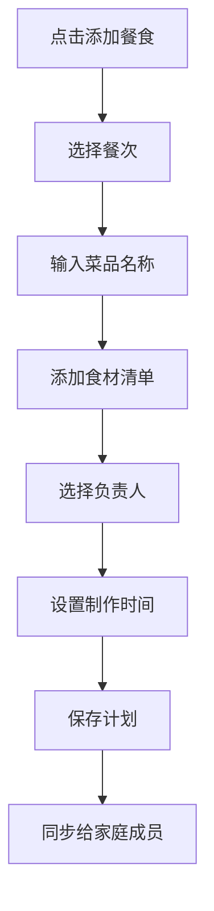

**任务完成流程**
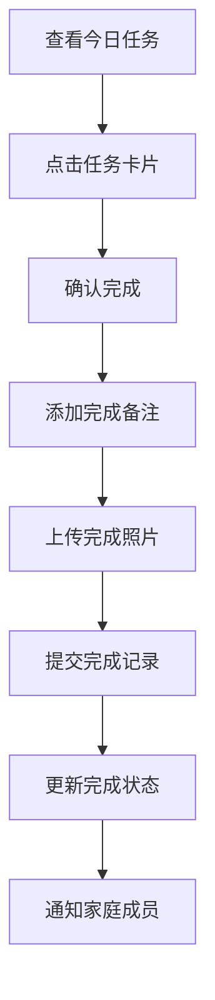

### 附录C. 技术架构

#### C.1 系统架构图
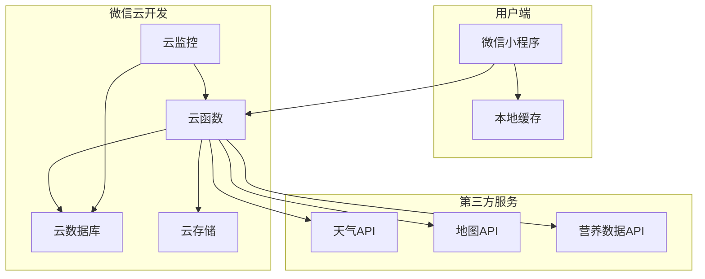

#### C.2 数据流架构
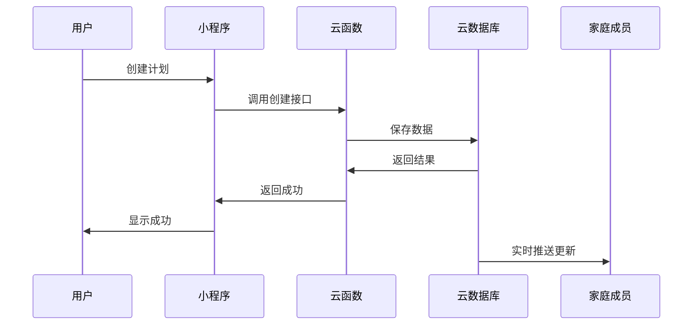

### 附录D. 数据库设计

#### D.1 核心表关系
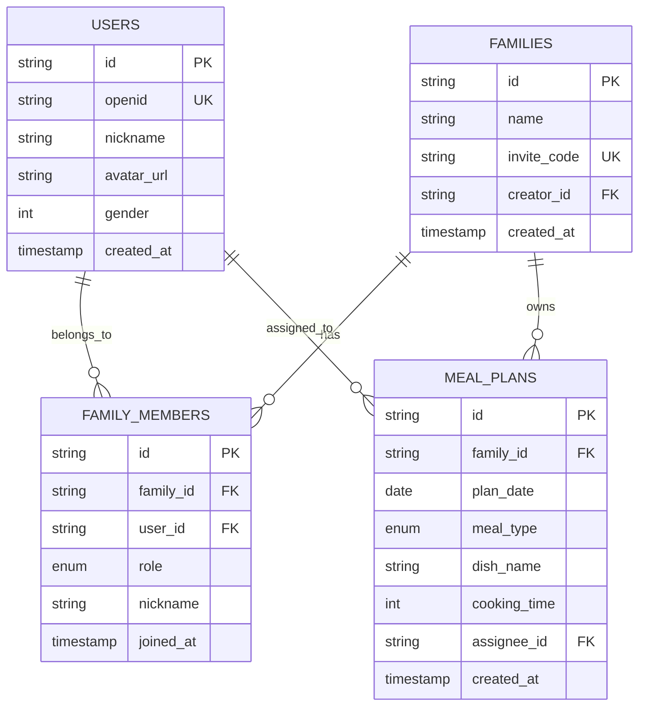

#### D.2 数据字典

**用户表 (users)**
| 字段名 | 类型 | 长度 | 必填 | 说明 |
|--------|------|------|------|------|
| id | VARCHAR | 32 | 是 | 用户唯一标识 |
| openid | VARCHAR | 64 | 是 | 微信openid |
| nickname | VARCHAR | 50 | 否 | 用户昵称 |
| avatar_url | VARCHAR | 255 | 否 | 头像URL |
| gender | TINYINT | - | 否 | 性别：0未知,1男,2女 |
| phone | VARCHAR | 20 | 否 | 手机号 |
| created_at | TIMESTAMP | - | 是 | 创建时间 |

**家庭表 (families)**
| 字段名 | 类型 | 长度 | 必填 | 说明 |
|--------|------|------|------|------|
| id | VARCHAR | 32 | 是 | 家庭唯一标识 |
| name | VARCHAR | 50 | 是 | 家庭名称 |
| invite_code | VARCHAR | 10 | 是 | 邀请码 |
| creator_id | VARCHAR | 32 | 是 | 创建者ID |
| created_at | TIMESTAMP | - | 是 | 创建时间 |

### 附录E. 测试策略

#### E.1 Sprint 1 任务列表（第1-2周）

**用户系统模块**
- [ ] 微信授权登录功能开发
- [ ] 用户信息获取和存储
- [ ] 家庭创建功能开发
- [ ] 邀请码生成和验证
- [ ] 家庭成员管理

**基础框架**
- [ ] 小程序项目初始化
- [ ] 云开发环境配置
- [ ] 基础组件库搭建
- [ ] 路由和导航配置
- [ ] 全局状态管理

**饮食规划模块（基础版）**
- [ ] 餐食计划添加功能
- [ ] 餐食计划列表展示
- [ ] 餐食计划编辑删除
- [ ] 负责人分配功能

#### E.2 Sprint 2 任务列表（第3-4周）

**运动计划模块**
- [ ] 运动计划创建功能
- [ ] 运动类型选择器
- [ ] 运动打卡功能
- [ ] 运动记录查看

**协作功能**
- [ ] 实时数据同步机制
- [ ] 任务状态更新
- [ ] 家庭成员状态显示
- [ ] 消息通知功能

**界面优化**
- [ ] 首页今日概览优化
- [ ] 规划页面交互优化
- [ ] 任务卡片组件完善
- [ ] 加载和错误状态处理

#### E.3 Sprint 3 任务列表（第5-6周）

**穿搭管理模块**
- [ ] 穿搭计划创建
- [ ] 天气API集成
- [ ] 穿搭推荐算法
- [ ] 衣物清单管理

**数据统计模块**
- [ ] 完成率统计功能
- [ ] 数据可视化图表
- [ ] 习惯分析报告
- [ ] 导出功能

**性能优化**
- [ ] 代码优化和重构
- [ ] 性能监控集成
- [ ] 缓存策略优化
- [ ] 错误日志收集

### 附录F. 部署方案

#### F.1 功能测试用例

**用户登录测试**
| 用例ID | 测试场景 | 操作步骤 | 预期结果 |
|--------|----------|----------|----------|
| TC001 | 首次登录 | 1.打开小程序 2.点击微信授权 | 成功获取用户信息并进入主页 |
| TC002 | 重复登录 | 1.已登录用户再次打开 | 直接进入主页，无需重新授权 |

**家庭管理测试**
| 用例ID | 测试场景 | 操作步骤 | 预期结果 |
|--------|----------|----------|----------|
| TC003 | 创建家庭 | 1.点击创建家庭 2.输入家庭名称 3.确认创建 | 成功创建家庭并生成邀请码 |
| TC004 | 加入家庭 | 1.点击加入家庭 2.输入邀请码 3.确认加入 | 成功加入家庭并同步数据 |

**餐食规划测试**
| 用例ID | 测试场景 | 操作步骤 | 预期结果 |
|--------|----------|----------|----------|
| TC005 | 添加餐食计划 | 1.选择日期和餐次 2.输入菜品名称 3.选择负责人 4.保存 | 成功创建餐食计划并同步给家庭成员 |
| TC006 | 编辑餐食计划 | 1.点击已有计划 2.修改信息 3.保存 | 成功更新计划信息 |

#### F.2 性能测试用例

**响应时间测试**
- 页面加载时间 < 2秒
- API接口响应时间 < 1秒
- 数据同步延迟 < 3秒

**并发测试**
- 支持100个并发用户同时使用
- 数据一致性验证
- 系统稳定性测试

#### F.3 兼容性测试

**设备兼容性**
- iPhone 6s及以上设备
- Android 5.0及以上设备
- 不同屏幕尺寸适配

**微信版本兼容性**
- 微信7.0及以上版本
- 小程序基础库2.0及以上

#### F.1 部署环境规划
**开发环境**：
- 本地开发环境配置
- 开发数据库和测试数据
- 开发工具和调试环境
- 代码版本控制环境

**测试环境**：
- 功能测试环境
- 性能测试环境
- 集成测试环境
- 用户验收测试环境

**预发布环境**：
- 生产环境镜像
- 真实数据模拟
- 发布前最终验证
- 灰度发布准备

**生产环境**：
- 高可用架构部署
- 负载均衡配置
- 监控告警系统
- 备份恢复机制

#### F.2 部署流程
**自动化部署流程**：
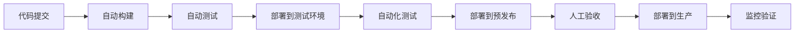

**发布策略**：
- 蓝绿部署：零停机发布
- 灰度发布：逐步放量
- 回滚机制：快速回退
- 监控告警：实时监控

#### F.3 运维监控
**系统监控**：
- 服务器性能监控
- 应用性能监控
- 数据库性能监控
- 网络状态监控

**业务监控**：
- 关键业务指标监控
- 用户行为监控
- 异常情况告警
- 数据质量监控

**日志管理**：
- 集中化日志收集
- 日志分析和检索
- 错误日志告警
- 审计日志记录

---

## 文档总结

### 项目概述
本PRD文档详细描述了"家庭生活管家"小程序的完整产品规划，从产品概念到技术实现，从市场分析到运营策略，为产品的成功开发和运营提供了全面的指导。

### 核心价值
- **用户价值**：帮助现代家庭实现生活的系统化、智能化管理，提升生活品质和家庭和谐
- **商业价值**：在家庭生活管理这一细分市场建立领先地位，构建可持续的商业模式
- **社会价值**：推动健康生活方式普及，促进家庭关系和谐发展

### 成功关键
1. **产品定位准确**：专注家庭协作的差异化定位
2. **用户体验优秀**：简洁易用的产品设计
3. **技术架构稳定**：可扩展的技术架构
4. **运营策略有效**：精准的用户获取和留存策略
5. **团队执行力强**：专业的团队和高效的执行

### 风险控制
- 技术风险：通过充分调研和备选方案控制
- 市场风险：通过用户验证和快速迭代应对
- 运营风险：通过团队建设和流程规范管控
- 外部风险：通过政策跟踪和应急预案防范

### 预期成果
- **短期**：验证产品价值，获得种子用户，建立产品基础
- **中期**：实现用户规模增长，完善产品功能，探索商业化
- **长期**：成为行业领导品牌，构建生态平台，实现可持续发展

---

## 版本更新记录

| 版本 | 日期 | 更新内容 | 更新人 | 审核人 |
|------|------|----------|--------|--------|
| V1.0 | 2024-12-26 | 初始版本创建，包含基础产品需求 | AI Product Manager | - |
| V2.0 | 2025-06-27 | 全面完善和专业化升级，增加详细的技术架构、运营策略、风险管理等内容 | AI Product Manager | 待定 |

---

## 联系信息

### 产品团队
- **产品总监**：待定
- **产品经理**：AI Product Manager
- **技术负责人**：待定
- **设计负责人**：待定
- **测试负责人**：待定

### 项目沟通
- **项目邮箱**：familylife-product@example.com
- **技术支持**：familylife-tech@example.com
- **商务合作**：familylife-business@example.com
- **用户反馈**：familylife-feedback@example.com

### 文档维护
- **文档负责人**：AI Product Manager
- **更新频率**：根据项目进展及时更新
- **版本控制**：Git版本管理
- **访问权限**：项目团队成员

### 相关资源
- **项目管理平台**：[待定]
- **设计协作平台**：[待定]
- **代码仓库**：[待定]
- **文档中心**：[待定]

---

**文档结束**

*本PRD文档是家庭生活管家小程序的完整产品需求规格说明，涵盖了从产品战略到技术实现的所有关键信息。文档将根据项目进展、用户反馈和市场变化持续更新和完善。*

*感谢所有参与产品规划和文档编写的团队成员。让我们携手努力，打造一款真正有价值、有温度的家庭生活管理产品，用科技的力量让每个家庭的生活更加美好！*

---

**© 2025 家庭生活管家项目组 版权所有**

---

## 版本更新记录

| 版本 | 日期 | 更新内容 | 更新人 |
|------|------|----------|--------|
| V1.0 | 2024-12-26 | 初始版本创建，包含完整的产品需求规格 | AI Product Manager |

---

## 联系信息

**产品团队**
- 产品经理：AI Product Manager
- 技术负责人：待定
- 设计负责人：待定

**文档维护**
- 文档负责人：AI Product Manager
- 更新频率：每周更新
- 反馈邮箱：product@example.com

---

**文档结束**

*本PRD文档是家庭生活管家小程序的完整产品需求规格说明，涵盖了从产品概念到技术实现的所有关键信息。文档将根据项目进展和用户反馈持续更新和完善。*

*如有任何疑问或建议，请及时联系产品团队。让我们一起打造一款真正有价值的家庭生活管理产品！*
