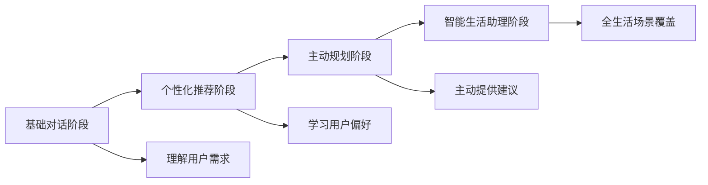
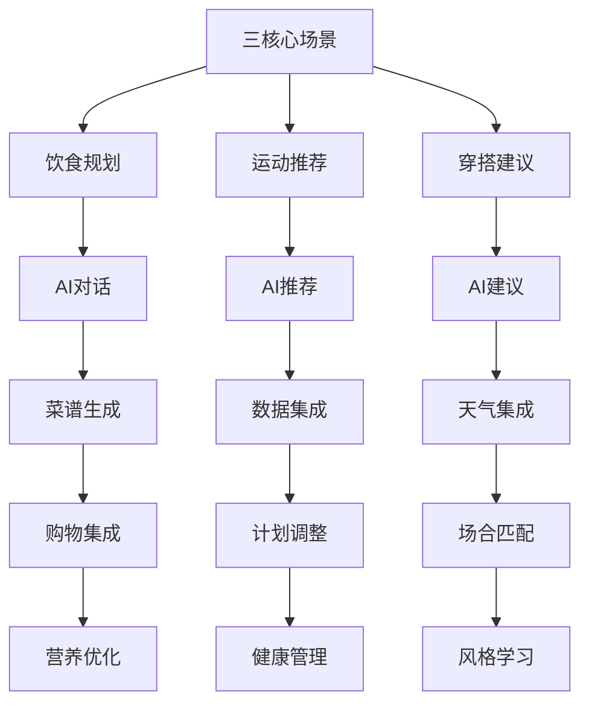
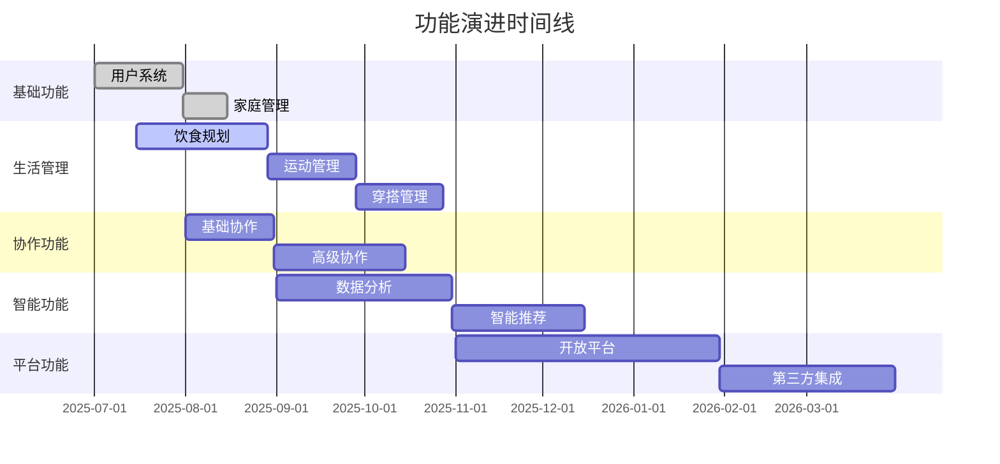

# 家庭生活AI助手 - 产品路线图

## 文档信息
- **文档版本**: V2.0
- **创建日期**: 2025-06-27
- **更新日期**: 2025-06-27
- **创建人**: AI Product Manager
- **文档类型**: AI产品规划文档
- **产品定位**: AI驱动的家庭生活规划助手

---

## 1. AI能力演进路径

### 1.1 AI发展四阶段

### 1.2 三场景演进路径

### 1.3 阶段目标概览

#### 第一阶段：MVP验证（0-6个月）
**核心目标**：验证AI驱动的三场景产品模式
- 完成基础AI对话功能
- 实现三场景基础规划能力
- 获得1000个种子家庭验证
- 验证AI服务质量和用户满意度

#### 第二阶段：AI能力提升（6-18个月）
**核心目标**：完善AI能力，扩大用户规模
- 提升AI个性化推荐能力
- 完善MCP生态集成
- 用户规模达到1万活跃家庭
- 建立可持续的商业模式

#### 第三阶段：生态平台化（18-36个月）
**核心目标**：建设AI生态，实现规模化盈利
- 开放AI能力平台
- 建立MCP服务生态
- 用户规模达到5万活跃家庭
- 实现年收入500万元

#### 第四阶段：智能生活助理（36个月+）
**核心目标**：成为家庭AI生活助手的行业标准
- 全生活场景AI覆盖
- 智能家居设备集成
- 用户规模达到20万活跃家庭
- 建立行业领导地位

---

## 2. 详细阶段规划

### 2.1 第一阶段：MVP验证（0-6个月）

#### 2.1.1 技术里程碑
**月度1-2：AI基础能力建设**
- ✅ 大模型API集成（GPT-4）
- ✅ 基础对话管理系统
- ✅ 三场景Prompt模板设计
- ✅ 微信小程序基础框架

**月度3-4：核心功能开发**
- ✅ AI饮食规划对话功能
- ✅ AI菜谱生成功能
- ✅ AI运动推荐功能
- ✅ AI穿搭建议功能
- ✅ 家庭成员管理功能

**月度5-6：集成和优化**
- ✅ 第一个MCP服务集成（购物平台）
- ✅ 数据同步功能
- ✅ 用户体验优化
- ✅ 内测和反馈收集

#### 2.1.2 产品里程碑
**功能完成度**：
- AI对话基础功能：100%
- 三场景规划功能：80%
- 家庭协作功能：60%
- MCP集成功能：20%

**质量指标**：
- AI对话响应时间：<3秒
- 用户满意度：>4.0/5.0
- 系统可用性：>99%
- 功能使用率：>70%

#### 2.1.3 用户里程碑
**用户规模**：
- 种子用户：100个家庭（月度3）
- 内测用户：500个家庭（月度5）
- 公测用户：1000个家庭（月度6）

**用户行为**：
- 日活跃率：>30%
- 平均使用时长：>10分钟
- 功能使用分布：饮食40%，运动35%，穿搭25%

### 2.2 第二阶段：AI能力提升（6-18个月）

#### 2.2.1 AI能力演进
**月度7-9：个性化学习**
- 🔄 用户偏好学习算法
- 🔄 个性化推荐引擎
- 🔄 多轮对话优化
- 🔄 上下文记忆增强

**月度10-12：多模型集成**
- 🔄 多大模型支持（Claude、文心一言）
- 🔄 智能模型路由
- 🔄 成本优化算法
- 🔄 质量监控体系

**月度13-18：高级AI功能**
- 🔄 主动规划建议
- 🔄 跨场景智能联动
- 🔄 预测性推荐
- 🔄 AI学习反馈循环

#### 2.2.2 MCP生态建设
**月度7-9：健康数据集成**
- 🔄 微信运动数据接入
- 🔄 Apple Health集成
- 🔄 华为健康数据同步
- 🔄 运动数据分析算法

**月度10-12：天气服务集成**
- 🔄 实时天气数据获取
- 🔄 天气预报集成
- 🔄 穿搭天气匹配算法
- 🔄 空气质量指数集成

**月度13-18：更多服务集成**
- 🔄 更多购物平台接入
- 🔄 营养数据库集成
- 🔄 运动视频内容集成
- 🔄 时尚趋势数据集成

#### 2.2.3 商业化探索
**月度7-12：会员体系建设**
- 🔄 基础版/高级版功能划分
- 🔄 订阅支付系统
- 🔄 会员权益设计
- 🔄 付费转化优化

**月度13-18：增值服务**
- 🔄 个性化定制服务
- 🔄 专家咨询服务
- 🔄 生态服务分成
- 🔄 企业级服务

### 2.3 第三阶段：生态平台化（18-36个月）

#### 2.3.1 AI能力开放
**月度19-24：AI API平台**
- 🔮 AI对话能力API化
- 🔮 规划算法开放接口
- 🔮 开发者平台建设
- 🔮 API文档和SDK

**月度25-30：智能化升级**
- 🔮 AI主动规划能力
- 🔮 全场景智能联动
- 🔮 预测性生活建议
- 🔮 AI个人助理升级

**月度31-36：平台生态**
- 🔮 第三方开发者生态
- 🔮 AI能力市场
- 🔮 合作伙伴平台
- 🔮 生态收益分成

#### 2.3.2 MCP服务生态
**月度19-24：服务平台化**
- 🔮 MCP服务注册平台
- 🔮 服务质量监控
- 🔮 服务推荐算法
- 🔮 服务评价体系

**月度25-30：生态扩展**
- 🔮 智能家居设备集成
- 🔮 本地生活服务接入
- 🔮 教育培训服务集成
- 🔮 医疗健康服务接入

**月度31-36：生态优化**
- 🔮 服务智能匹配
- 🔮 生态数据分析
- 🔮 合作伙伴赋能
- 🔮 收益优化算法

### 2.4 第四阶段：智能生活助理（36个月+）

#### 2.4.1 全场景覆盖
**年度4：场景扩展**
- 🌟 家务管理场景
- 🌟 育儿教育场景
- 🌟 理财规划场景
- 🌟 旅行规划场景

**年度5：深度智能化**
- 🌟 AI生活管家
- 🌟 预测性服务
- 🌟 主动生活优化
- 🌟 全自动化规划

#### 2.4.2 技术前沿探索
**AI技术前沿**：
- 🌟 多模态AI集成
- 🌟 边缘AI计算
- 🌟 联邦学习应用
- 🌟 AI伦理和安全

**新兴技术集成**：
- 🌟 AR/VR穿搭体验
- 🌟 IoT设备深度集成
- 🌟 区块链数据确权
- 🌟 Web3生态接入

---

## 3. 关键成功因素

### 3.1 技术成功因素
1. **AI服务质量**：确保AI对话和推荐的准确性和实用性
2. **系统稳定性**：保证7×24小时稳定服务
3. **数据安全**：用户数据和隐私保护
4. **成本控制**：AI服务成本的有效管理

### 3.2 产品成功因素
1. **用户体验**：极简交互和流畅体验
2. **功能实用性**：AI建议的实际价值
3. **家庭协作**：多人使用的便利性
4. **生态集成**：第三方服务的丰富性

### 3.3 商业成功因素
1. **用户增长**：持续的用户获取和留存
2. **付费转化**：有效的商业模式验证
3. **成本效益**：健康的单位经济模型
4. **竞争优势**：差异化的市场定位

### 3.4 风险控制因素
1. **技术风险**：AI服务的稳定性和成本控制
2. **市场风险**：用户接受度和竞争压力
3. **政策风险**：AI相关法规的合规性
4. **资金风险**：充足的资金支持产品发展

---

## 4. 资源配置计划

### 4.1 团队配置演进
**MVP阶段（10-12人）**：
- 产品经理：2人
- AI工程师：3人
- 前端工程师：2人
- 后端工程师：2人
- UI/UX设计师：2人
- 测试工程师：1人

**成长阶段（15-18人）**：
- 增加：AI算法工程师2人
- 增加：数据工程师1人
- 增加：运营专员2人
- 增加：商务拓展1人

**扩展阶段（25-30人）**：
- 增加：平台架构师2人
- 增加：生态合作经理3人
- 增加：数据分析师2人
- 增加：客服团队3人
- 增加：市场推广团队3人

### 4.2 技术投入规划
**基础设施投入**：
- 云服务费用：第一年30万，第二年80万，第三年200万
- AI API费用：第一年50万，第二年150万，第三年400万
- 第三方服务费用：第一年20万，第二年60万，第三年150万

**研发投入**：
- 人员成本：第一年800万，第二年1500万，第三年2500万
- 技术工具：第一年50万，第二年100万，第三年200万
- 研发设备：第一年30万，第二年50万，第三年80万

### 4.3 市场投入规划
**用户获取**：
- 线上推广：第一年100万，第二年300万，第三年800万
- 渠道合作：第一年50万，第二年200万，第三年500万
- 品牌建设：第一年30万，第二年100万，第三年300万

**运营投入**：
- 内容运营：第一年50万，第二年150万，第三年300万
- 用户运营：第一年30万，第二年100万，第三年200万
- 客服支持：第一年40万，第二年120万，第三年250万

---

*文档结束*

**最后更新**：2025-06-27
**版本**：V2.0 AI驱动重构版
**下次更新**：根据产品发展进度和市场反馈定期更新
- 构建完整的生活服务生态
- 成为行业标准制定者
- 实现多元化业务发展
- 考虑国际化扩展

---

## 2. 详细版本规划

### 2.1 V1.0 - MVP版本（3个月）

#### 版本目标
- 验证核心产品概念
- 实现基础的家庭生活管理功能
- 获得用户初步反馈

#### 核心功能
- **用户系统**：微信授权登录、家庭创建/加入
- **饮食规划**：餐食计划制定、购物清单生成
- **运动管理**：运动计划制定、简单打卡记录
- **基础协作**：数据同步、简单任务分工

#### 技术实现
- 微信小程序基础框架
- 云开发后端服务
- MongoDB数据库
- 基础的实时同步

#### 成功指标
- 1000个种子用户注册
- 日活跃率>30%
- 7日留存率>25%
- 用户满意度>3.5/5.0

### 2.2 V2.0 - 功能完善版本（6个月）

#### 版本目标
- 完善所有核心功能模块
- 提升用户体验和产品稳定性
- 建立用户增长机制

#### 新增功能
- **穿搭管理**：穿搭规划、天气关联推荐
- **智能推荐**：基于偏好的个性化推荐
- **数据分析**：生活习惯统计、趋势分析
- **增强协作**：任务提醒、完成确认

#### 功能优化
- 界面设计优化
- 操作流程简化
- 性能和稳定性提升
- 错误处理完善

#### 成功指标
- 10000个活跃家庭用户
- 日活跃率>50%
- 30日留存率>25%
- 用户满意度>4.0/5.0

### 2.3 V3.0 - 平台化版本（12个月）

#### 版本目标
- 构建开放的生活服务平台
- 实现商业化变现
- 扩展产品边界

#### 平台功能
- **开放API**：第三方服务接入
- **服务市场**：生活服务提供商入驻
- **会员体系**：付费会员功能
- **企业版本**：团队和企业用户服务

#### 商业化功能
- 高级会员订阅
- 专业服务预约
- 电商导购分成
- 广告和品牌合作

#### 成功指标
- 50000个活跃用户
- 付费转化率>5%
- 月收入>50万元
- 合作伙伴>50家

---

## 3. 功能演进路线图

### 3.1 核心功能演进

### 3.2 技术架构演进

#### 阶段1：单体架构（V1.0）
- 微信小程序 + 云开发
- 简单的数据库设计
- 基础的API接口

#### 阶段2：微服务架构（V2.0-V3.0）
- 服务拆分和模块化
- 独立的推荐系统
- 数据分析平台

#### 阶段3：平台化架构（V4.0+）
- 开放平台和API网关
- 大数据处理能力
- 多端适配和同步

---

## 4. 市场策略路线图

### 4.1 用户增长策略

#### 第一阶段：种子用户（0-1000用户）
**策略**：精准获客，深度服务
- 团队内部使用和推广
- 朋友圈和微信群分享
- 产品体验优化

#### 第二阶段：早期采用者（1000-10000用户）
**策略**：口碑传播，功能完善
- 用户推荐奖励机制
- 社交媒体内容营销
- 产品功能持续优化

#### 第三阶段：早期大众（10000-100000用户）
**策略**：规模化推广，品牌建设
- 付费广告投放
- KOL和媒体合作
- 品牌形象建设

#### 第四阶段：主流市场（100000+用户）
**策略**：生态建设，行业领导
- 平台化发展
- 行业合作伙伴
- 标准制定参与

### 4.2 商业化路线图

#### 第一阶段：免费模式（0-6个月）
- 所有功能免费使用
- 专注用户体验和增长
- 验证商业化潜力

#### 第二阶段：增值服务（6-12个月）
- 推出高级会员功能
- 专业服务预约
- 个性化定制服务

#### 第三阶段：平台变现（12-24个月）
- 第三方服务分成
- 广告和品牌合作
- 数据服务变现

#### 第四阶段：生态变现（24个月+）
- 多元化收入来源
- 投资和并购收益
- 国际市场收入

---

## 5. 关键里程碑

### 5.1 重要时间节点

| 时间节点 | 里程碑 | 主要目标 | 成功标准 |
|---------|--------|----------|----------|
| 3个月 | MVP发布 | 验证核心价值 | 1000个种子用户 |
| 6个月 | V2.0发布 | 功能完善 | 10000个活跃用户 |
| 9个月 | 商业化启动 | 收入验证 | 月收入10万+ |
| 12个月 | 平台化转型 | 生态构建 | 50000个用户 |
| 18个月 | 规模化增长 | 市场扩张 | 200000个用户 |
| 24个月 | 行业领先 | 品牌确立 | 市场份额>30% |

### 5.2 风险控制节点
- **3个月**：用户验证节点，如果用户反馈不佳，调整产品方向
- **6个月**：留存验证节点，如果留存率低于预期，优化用户体验
- **12个月**：商业化验证节点，如果变现困难，调整商业模式

---

## 6. 成功指标跟踪

### 6.1 用户指标
- 用户注册数和活跃用户数
- 用户留存率和流失率
- 用户满意度和NPS值

### 6.2 产品指标
- 功能使用率和完成率
- 产品性能和稳定性
- 用户反馈和问题解决率

### 6.3 商业指标
- 收入规模和增长率
- 付费转化率和客单价
- 成本控制和盈利能力

---

## 7. 总结和展望

### 7.1 核心策略
1. **分阶段发展**：按阶段逐步实现产品目标
2. **用户导向**：始终以用户价值为核心
3. **技术驱动**：持续的技术创新和优化
4. **生态思维**：从产品向平台和生态发展

### 7.2 长期愿景
- 成为中国领先的家庭生活管理平台
- 服务1000万+家庭用户
- 构建完整的生活服务生态
- 推动行业标准和最佳实践

### 7.3 成功关键
1. **产品体验**：提供卓越的用户体验
2. **技术创新**：保持技术领先优势
3. **市场策略**：精准的市场定位和推广
4. **团队执行**：高效的团队执行能力
