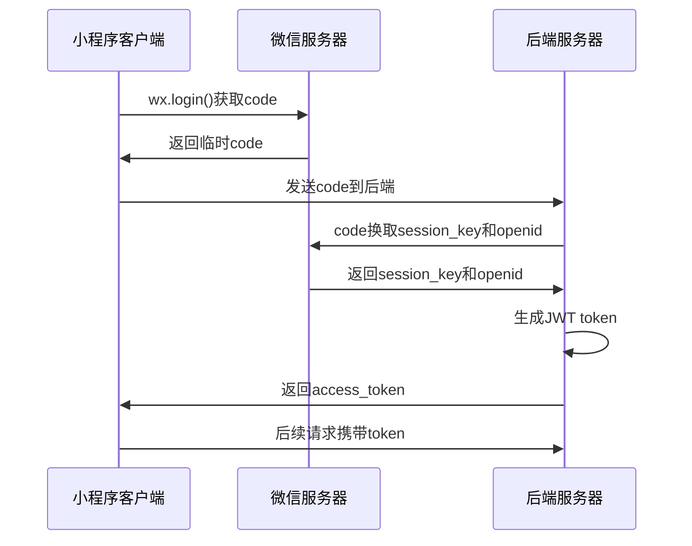

# 家庭生活管家小程序 - API接口设计规范

## 文档信息
- **文档版本**: V1.0
- **创建日期**: 2025-06-27
- **创建人**: AI Backend Architect
- **文档类型**: API设计规范文档

---

## 1. API设计原则

### 1.1 RESTful设计原则
- **资源导向**: URL表示资源，HTTP方法表示操作
- **无状态**: 每个请求包含处理所需的所有信息
- **统一接口**: 使用标准的HTTP方法和状态码
- **分层系统**: 支持缓存、负载均衡等中间层

### 1.2 命名规范
- **URL路径**: 使用小写字母，单词间用连字符分隔
- **资源名称**: 使用复数形式表示集合资源
- **参数名称**: 使用驼峰命名法
- **响应字段**: 使用驼峰命名法

### 1.3 版本控制
- **URL版本**: `/api/v1/users`
- **向后兼容**: 新版本保持向后兼容
- **废弃策略**: 提前通知，逐步废弃旧版本

---

## 2. 通用规范

### 2.1 请求格式

#### 请求头
```http
Content-Type: application/json
Authorization: Bearer {access_token}
X-Request-ID: {unique_request_id}
X-Client-Version: {client_version}
```

#### 请求体
```json
{
  "data": {
    // 业务数据
  },
  "meta": {
    "requestId": "req_123456789",
    "timestamp": 1640995200000,
    "clientVersion": "1.0.0"
  }
}
```

### 2.2 响应格式

#### 成功响应
```json
{
  "code": 200,
  "message": "success",
  "data": {
    // 业务数据
  },
  "meta": {
    "requestId": "req_123456789",
    "timestamp": 1640995200000,
    "serverVersion": "1.0.0"
  }
}
```

#### 错误响应
```json
{
  "code": 400,
  "message": "参数错误",
  "error": {
    "type": "VALIDATION_ERROR",
    "details": [
      {
        "field": "email",
        "message": "邮箱格式不正确"
      }
    ]
  },
  "meta": {
    "requestId": "req_123456789",
    "timestamp": 1640995200000
  }
}
```

### 2.3 状态码规范

#### 成功状态码
- **200 OK**: 请求成功
- **201 Created**: 资源创建成功
- **204 No Content**: 请求成功，无返回内容

#### 客户端错误
- **400 Bad Request**: 请求参数错误
- **401 Unauthorized**: 未授权
- **403 Forbidden**: 禁止访问
- **404 Not Found**: 资源不存在
- **409 Conflict**: 资源冲突

#### 服务端错误
- **500 Internal Server Error**: 服务器内部错误
- **502 Bad Gateway**: 网关错误
- **503 Service Unavailable**: 服务不可用

---

## 3. 认证和授权

### 3.1 微信授权流程


### 3.2 Token管理
- **Token类型**: JWT (JSON Web Token)
- **过期时间**: 7天
- **刷新机制**: 自动刷新，无感知更新
- **安全存储**: 小程序安全存储

### 3.3 权限控制
- **家庭管理员**: 创建/删除家庭，管理成员
- **家庭成员**: 查看/编辑家庭数据
- **访客**: 仅查看权限

---

## 4. 分页和过滤

### 4.1 分页参数
```http
GET /api/v1/meals?page=1&pageSize=20&sortBy=createdAt&sortOrder=desc
```

### 4.2 分页响应
```json
{
  "code": 200,
  "data": {
    "items": [...],
    "pagination": {
      "page": 1,
      "pageSize": 20,
      "total": 100,
      "totalPages": 5,
      "hasNext": true,
      "hasPrev": false
    }
  }
}
```

### 4.3 过滤和搜索
```http
GET /api/v1/meals?category=breakfast&keyword=鸡蛋&startDate=2025-01-01&endDate=2025-01-31
```

---

## 5. 错误处理

### 5.1 错误码定义
```javascript
const ERROR_CODES = {
  // 通用错误 (1000-1999)
  INVALID_PARAMETER: 1001,
  MISSING_PARAMETER: 1002,
  UNAUTHORIZED: 1003,
  FORBIDDEN: 1004,
  
  // 用户相关 (2000-2999)
  USER_NOT_FOUND: 2001,
  USER_ALREADY_EXISTS: 2002,
  
  // 家庭相关 (3000-3999)
  FAMILY_NOT_FOUND: 3001,
  FAMILY_MEMBER_LIMIT: 3002,
  INVALID_INVITE_CODE: 3003,
  
  // 业务相关 (4000-4999)
  MEAL_NOT_FOUND: 4001,
  EXERCISE_NOT_FOUND: 4002
};
```

### 5.2 错误处理最佳实践
- **明确的错误信息**: 提供清晰的错误描述
- **错误码标准化**: 使用统一的错误码体系
- **日志记录**: 记录详细的错误日志
- **用户友好**: 向用户展示友好的错误提示

---

## 6. 性能优化

### 6.1 缓存策略
- **Redis缓存**: 热点数据缓存
- **CDN缓存**: 静态资源缓存
- **浏览器缓存**: 合理设置缓存头

### 6.2 数据压缩
- **Gzip压缩**: 响应数据压缩
- **图片压缩**: 图片自动压缩和格式转换
- **分页加载**: 大数据集分页返回

### 6.3 并发控制
- **限流**: API调用频率限制
- **熔断**: 服务异常时的熔断保护
- **降级**: 服务降级策略

---

## 7. 安全规范

### 7.1 数据验证
- **输入验证**: 严格验证所有输入参数
- **SQL注入防护**: 使用参数化查询
- **XSS防护**: 输出数据转义

### 7.2 敏感数据处理
- **数据脱敏**: 敏感信息脱敏处理
- **加密存储**: 敏感数据加密存储
- **HTTPS**: 强制使用HTTPS传输

### 7.3 访问控制
- **权限验证**: 每个接口验证用户权限
- **资源隔离**: 用户数据严格隔离
- **审计日志**: 记录关键操作日志

---

## 8. 监控和日志

### 8.1 接口监控
- **响应时间**: 监控API响应时间
- **成功率**: 监控API成功率
- **错误率**: 监控API错误率
- **并发量**: 监控API并发请求量

### 8.2 日志规范
```json
{
  "timestamp": "2025-06-27T10:30:00Z",
  "level": "INFO",
  "requestId": "req_123456789",
  "userId": "user_123",
  "method": "POST",
  "url": "/api/v1/meals",
  "statusCode": 200,
  "responseTime": 150,
  "userAgent": "MiniProgram/1.0.0"
}
```

### 8.3 告警机制
- **错误率告警**: 错误率超过阈值时告警
- **响应时间告警**: 响应时间过长时告警
- **服务可用性告警**: 服务不可用时告警

---

## 9. 文档规范

### 9.1 接口文档格式
```yaml
/api/v1/meals:
  post:
    summary: 创建餐食计划
    description: 为家庭创建新的餐食计划
    parameters:
      - name: Authorization
        in: header
        required: true
        type: string
    requestBody:
      required: true
      content:
        application/json:
          schema:
            $ref: '#/components/schemas/MealRequest'
    responses:
      200:
        description: 创建成功
        content:
          application/json:
            schema:
              $ref: '#/components/schemas/MealResponse'
```

### 9.2 文档维护
- **自动生成**: 使用工具自动生成API文档
- **版本同步**: 文档与代码版本保持同步
- **示例完整**: 提供完整的请求/响应示例
- **定期更新**: 定期审查和更新文档

---

## 10. 测试规范

### 10.1 接口测试
- **单元测试**: 每个接口的单元测试
- **集成测试**: 接口间的集成测试
- **性能测试**: 接口性能测试
- **安全测试**: 接口安全测试

### 10.2 测试数据
- **测试环境**: 独立的测试环境
- **测试数据**: 标准化的测试数据集
- **数据清理**: 测试后的数据清理
- **Mock服务**: 外部依赖的Mock服务

---

## 11. 部署和运维

### 11.1 部署规范
- **容器化**: 使用Docker容器化部署
- **自动化**: CI/CD自动化部署
- **灰度发布**: 支持灰度发布策略
- **回滚机制**: 快速回滚机制

### 11.2 运维监控
- **健康检查**: 服务健康检查接口
- **性能监控**: 实时性能监控
- **日志收集**: 集中化日志收集
- **告警通知**: 及时的告警通知

---

## 12. 总结

### 12.1 设计要点
1. **一致性**: 保持API设计的一致性
2. **可扩展性**: 考虑未来的扩展需求
3. **安全性**: 确保API的安全性
4. **性能**: 优化API的性能表现

### 12.2 最佳实践
1. **文档先行**: 先设计文档再开发
2. **版本管理**: 合理的版本管理策略
3. **测试覆盖**: 完整的测试覆盖
4. **持续优化**: 基于监控数据持续优化
