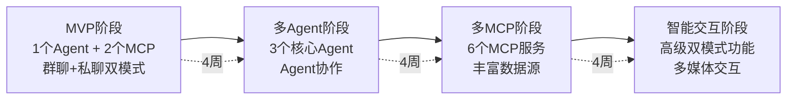
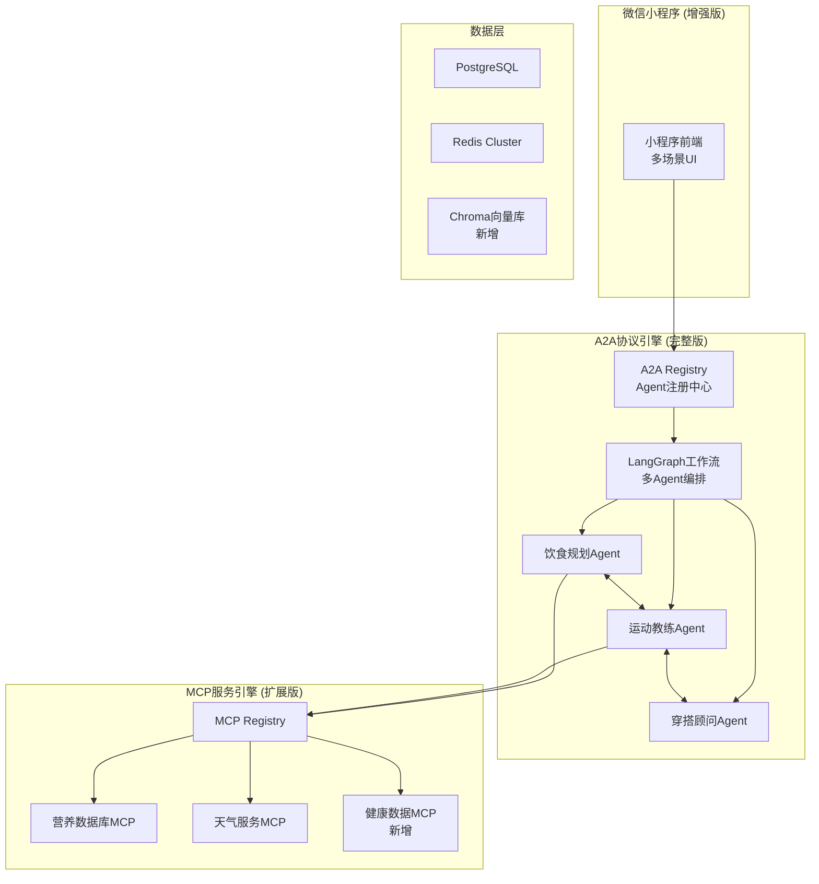
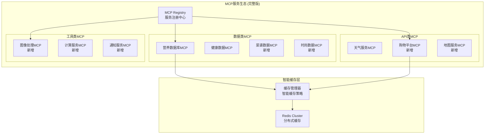
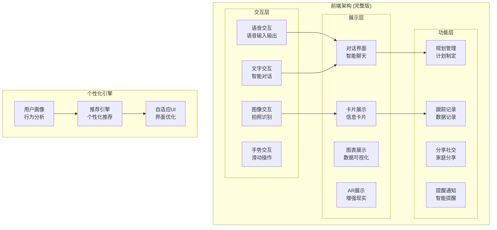

# 家庭生活AI助手 - 迭代开发模块拆解方案 v6.0

## 📋 文档信息
- **版本**: v6.0 (A2A + MCP双引擎迭代开发)
- **更新日期**: 2025-06-28
- **开发模式**: MVP → 多Agent → 多MCP → UI/UE丰富
- **核心技术**: A2A + MCP双引擎 + LangGraph 0.2 + Claude 3.5/4 Sonnet
- **架构特点**: 双引擎架构，协议互补，优势融合，迭代交付
- **核心理念**: 快速验证核心价值，降低开发风险，持续迭代优化

## 🎯 模块拆解原则

### 迭代开发原则
1. **MVP优先**: 先实现核心价值，快速验证产品可行性
2. **渐进增强**: 逐步增加Agent和MCP服务，持续丰富功能
3. **用户导向**: 基于用户反馈迭代优化，避免过度设计
4. **技术债控制**: 每个迭代都要保持代码质量，避免技术债累积
5. **双引擎融合**: A2A + MCP协议互补，发挥各自优势
6. **标准化**: 基于A2A和MCP协议的标准化开发
7. **可扩展**: 架构设计支持后续功能扩展

### 迭代开发目标
- **快速验证**: MVP阶段快速验证核心价值假设
- **渐进增强**: 每个迭代都在前一阶段基础上增强功能
- **用户反馈**: 基于真实用户反馈指导后续迭代方向
- **技术债控制**: 每个迭代保持代码质量，避免技术债累积

## 🚀 迭代开发路线图

### 迭代开发概览


## 🏗️ 迭代模块拆解架构

### 第一阶段：MVP核心验证 (4周)

#### 🎯 MVP目标
- **核心价值验证**: 验证AI助手在家庭生活场景的核心价值
- **技术可行性**: 验证A2A + MCP双引擎架构的技术可行性
- **用户体验**: 提供基础但完整的用户体验
- **快速上线**: 4周内完成开发并上线微信小程序

#### 🏗️ MVP双模式架构设计
```mermaid
graph TB
    subgraph "微信双模式交互"
        FAMILY[家庭微信群<br/>家庭成员 + AI助手]
        PRIVATE[私聊对话<br/>个人 + AI助手]
        WECHAT[微信/企业微信<br/>群聊+私聊平台]
    end

    subgraph "微信双模式机器人层"
        BOT[微信双模式机器人<br/>群聊+私聊处理]
        GROUP_PARSER[群聊消息解析器<br/>@机器人识别]
        PRIVATE_PARSER[私聊消息解析器<br/>隐私内容处理]
        PRIVACY_GUARD[隐私保护器<br/>防止内容泄露]
    end

    subgraph "API网关"
        GW[API Gateway<br/>统一入口]
    end

    subgraph "A2A协议引擎 (简化版)"
        A2A_REG[A2A Registry<br/>Agent注册]
        MEAL_AGENT[饮食规划Agent<br/>核心Agent]
    end

    subgraph "MCP服务引擎 (核心服务)"
        MCP_REG[MCP Registry<br/>服务注册]
        NUTRITION_MCP[营养数据库MCP<br/>食物营养查询]
        WEATHER_MCP[天气服务MCP<br/>天气信息]
    end

    subgraph "数据层 (简化版)"
        PG[PostgreSQL<br/>核心数据]
        REDIS[Redis<br/>缓存]
    end

    FAMILY --> BOT
    PRIVATE --> BOT
    BOT --> GROUP_PARSER
    BOT --> PRIVATE_PARSER
    GROUP_PARSER --> PRIVACY_GUARD
    PRIVATE_PARSER --> PRIVACY_GUARD
    PRIVACY_GUARD --> GW
    GW --> A2A_REG
    A2A_REG --> MEAL_AGENT
    MEAL_AGENT --> MCP_REG
    MCP_REG --> NUTRITION_MCP
    MCP_REG --> WEATHER_MCP
    MEAL_AGENT --> PG
    NUTRITION_MCP --> REDIS
    BOT --> FAMILY
    BOT --> PRIVATE
```

#### 📦 MVP核心模块
| 模块名称 | 功能描述 | 技术实现 | 优先级 |
|----------|----------|----------|--------|
| **饮食规划Agent** | 基于用户需求生成饮食建议 | A2A Protocol + Claude 3.5 | P0 |
| **营养数据库MCP** | 提供食物营养信息查询 | MCP + USDA数据库 | P0 |
| **天气服务MCP** | 提供天气信息支持饮食建议 | MCP + 和风天气API | P0 |
| **微信双模式机器人** | 群聊+私聊双模式消息处理 | 微信机器人框架 + 隐私保护 | P0 |
| **API网关** | 统一的API入口和路由 | FastAPI + 智能路由 | P0 |
| **数据存储** | 用户数据和缓存存储 | PostgreSQL + Redis | P0 |

#### 🎨 MVP双模式用户体验
- **群聊协作**: 在家庭微信群中自然对话，家庭成员协作决策
- **私聊隐私**: 私密话题通过私聊，保护个人隐私
- **智能路由**: AI自动判断适合群聊还是私聊回复
- **上下文关联**: 群聊和私聊上下文智能关联，不泄露隐私
- **主动服务**: 根据场景选择群聊提醒或私聊提醒

### 第二阶段：多Agent协作 (4周)
#### 🎯 多Agent目标
- **Agent协作**: 实现多个Agent之间的智能协作
- **场景扩展**: 从单一饮食场景扩展到运动、穿搭场景
- **工作流编排**: 使用LangGraph编排复杂的多Agent工作流
- **用户体验提升**: 提供更智能、更全面的生活建议

#### 🏗️ 多Agent架构设计


#### 📦 新增Agent模块
| 模块名称 | 功能描述 | Agent协作 | 优先级 |
|----------|----------|----------|--------|
| **运动教练Agent** | 基于健康数据推荐运动方案 | 与饮食Agent协作制定健康计划 | P0 |
| **穿搭顾问Agent** | 基于天气和场合推荐穿搭 | 与运动Agent协作考虑运动需求 | P0 |
| **LangGraph工作流** | 编排多Agent协作流程 | 核心编排引擎 | P0 |
| **健康数据MCP** | 管理用户健康档案 | 支持运动Agent决策 | P1 |
| **Chroma向量库** | 存储和检索知识库 | 支持Agent知识检索 | P1 |

#### 🔄 Agent协作场景
- **健康生活规划**: 饮食Agent + 运动Agent协作制定健康计划
- **出行准备**: 穿搭Agent + 天气MCP协作推荐出行装备
- **运动营养**: 运动Agent + 饮食Agent协作制定运动前后营养方案

### 第三阶段：多MCP服务丰富 (4周)
#### 🎯 多MCP目标
- **数据源丰富**: 接入更多外部数据源，提供更丰富的信息支持
- **服务生态**: 建立完整的MCP服务生态系统
- **智能决策**: 基于多维度数据提供更精准的建议
- **成本优化**: 通过智能缓存优化外部API调用成本

#### 🌐 多MCP服务架构


#### 📦 新增MCP服务
| 服务名称 | 功能描述 | 数据源 | 缓存策略 |
|----------|----------|--------|----------|
| **菜谱数据MCP** | 提供丰富的菜谱信息 | 下厨房、豆果美食API | 长期缓存(7天) |
| **购物平台MCP** | 商品搜索和价格比较 | 淘宝、京东API | 中期缓存(6小时) |
| **时尚数据MCP** | 时尚趋势和搭配建议 | 小红书、时尚网站 | 长期缓存(3天) |
| **地图服务MCP** | 地理位置和POI查询 | 高德地图API | 长期缓存(24小时) |
| **图像处理MCP** | 图像识别和生成 | OpenAI DALL-E | 无缓存 |
| **通知服务MCP** | 消息推送和提醒 | 微信模板消息 | 无缓存 |

#### 💰 成本优化策略
- **智能缓存**: 根据数据特性设置不同的缓存策略
- **批量调用**: 合并相似请求，减少API调用次数
- **降级策略**: API失败时使用缓存数据或默认数据
- **成本监控**: 实时监控API调用成本和频率

### 第四阶段：智能交互丰富 (4周)
#### 🎯 智能交互目标
- **多媒体交互**: 支持语音、图片、文件等多种消息类型
- **智能理解**: 提升对群聊上下文和多人对话的理解能力
- **个性化**: 基于群聊历史提供个性化的服务
- **高级功能**: 实现语音识别、图像识别等高级交互功能

#### 🎨 UI/UE架构设计


#### 🎨 UI/UE功能模块
| 功能模块 | 功能描述 | 技术实现 | 用户价值 |
|----------|----------|----------|----------|
| **语音交互** | 语音输入和语音播报 | 微信语音API + TTS | 解放双手，自然交互 |
| **图像识别** | 拍照识别食物、服装等 | 图像处理MCP + AI识别 | 快速输入，便捷体验 |
| **数据可视化** | 健康数据、消费数据图表 | ECharts + 自定义图表 | 直观了解数据趋势 |
| **AR试穿** | 虚拟试穿服装搭配 | AR技术 + 时尚数据 | 沉浸式购物体验 |
| **家庭分享** | 家庭成员间的计划分享 | 微信分享 + 家庭群组 | 增强家庭互动 |
| **智能提醒** | 基于计划的智能提醒 | 通知服务MCP + 定时任务 | 帮助养成好习惯 |
| **个性化推荐** | 基于用户行为的个性化内容 | 推荐算法 + 用户画像 | 提升用户粘性 |

#### 📱 小程序页面架构
```
小程序页面结构:
├── 首页 (对话界面)
│   ├── 智能对话区
│   ├── 快捷功能区
│   └── 历史记录区
├── 规划页面
│   ├── 饮食规划
│   ├── 运动规划
│   └── 穿搭规划
├── 记录页面
│   ├── 健康数据
│   ├── 消费记录
│   └── 习惯跟踪
├── 发现页面
│   ├── 推荐内容
│   ├── 社区分享
│   └── 知识库
└── 我的页面
    ├── 个人设置
    ├── 家庭管理
    └── 数据统计
```

## 📊 迭代开发总结

### 迭代价值递增
| 阶段 | 核心价值 | 用户获得 | 技术验证 |
|------|----------|----------|----------|
| **MVP** | 基础AI助手 | 饮食建议 | 双引擎可行性 |
| **多Agent** | 智能协作 | 全面生活建议 | Agent协作能力 |
| **多MCP** | 丰富数据 | 精准个性化建议 | 数据集成能力 |
| **UI/UE** | 完美体验 | 沉浸式交互体验 | 产品竞争力 |

### 风险控制
- **技术风险**: 每个阶段都有可交付的产品，降低技术风险
- **市场风险**: MVP快速验证市场需求，及时调整方向
- **资源风险**: 分阶段投入，避免一次性大量投入
- **时间风险**: 每个阶段4周，总计16周，时间可控
└─────────────────────────────────────────────────────────────────┘
┌─────────────────────────────────────────────────────────────────┐
│                  🧠 LangGraph Orchestration                     │
│                    工作流编排层                                  │
└─────────────────────────────────────────────────────────────────┘
┌─────────────────────────────────────────────────────────────────┐
│                    🤖 AI Agent Layer                            │
│                    AI智能体层                                    │
└─────────────────────────────────────────────────────────────────┘
┌─────────────────────────────────────────────────────────────────┐
│                    🔧 Business Service Layer                    │
│                    业务服务层                                    │
└─────────────────────────────────────────────────────────────────┘
┌─────────────────────────────────────────────────────────────────┐
│                    💾 Data Storage Layer                        │
│                    数据存储层                                    │
└─────────────────────────────────────────────────────────────────┘
```

## 📦 核心模块设计

### 模块1: AI工作流编排引擎 (ai-orchestrator)

**技术栈**: LangGraph + Google A2A Protocol + Claude 3.5 Sonnet
**部署方式**: Kubernetes Deployment
**扩展策略**: 水平扩展

```yaml
模块职责:
  - LangGraph状态机工作流编排
  - A2A协议会话管理
  - Agent调度和协调
  - 全局状态管理
  - 错误处理和恢复

核心功能:
  工作流编排:
    - 状态机驱动的复杂工作流
    - 条件路由和并行执行
    - 动态Agent调度
    - 工作流可视化

  A2A会话管理:
    - Agent身份认证和授权
    - 会话生命周期管理
    - 消息路由和负载均衡
    - 安全通信保障

  状态管理:
    - 全局状态树维护
    - 分布式状态同步
    - 状态持久化
    - 状态恢复机制

技术特性:
  - 基于LangGraph StateGraph
  - 支持复杂条件分支
  - 自动错误恢复
  - 实时状态监控
  - A2A协议原生支持

接口设计:
  输入: 用户请求 + 上下文信息
  输出: 整合后的AI规划结果
  通信: A2A Protocol + WebSocket
  监控: LangSmith + Prometheus
```

### 模块2: 饮食规划Agent (meal-planning-agent)

**技术栈**: Claude 3.5 Sonnet + A2A Protocol + Chroma向量数据库
**部署方式**: Kubernetes StatefulSet
**扩展策略**: 垂直扩展 + 副本扩展

```yaml
模块职责:
  - 个性化饮食需求分析
  - 智能菜谱生成和推荐
  - 营养成分计算和优化
  - 购物清单生成和价格比较

核心功能:
  需求分析:
    - 用户饮食偏好学习
    - 健康状况评估
    - 营养需求计算
    - 过敏原识别

  菜谱生成:
    - 基于Claude 3.5 Sonnet的智能生成
    - 向量相似性推荐
    - 季节性食材推荐
    - 成本优化建议

  营养计算:
    - 基于USDA营养数据库
    - 精确营养成分计算
    - 营养均衡分析
    - 健康建议生成

  购物优化:
    - 智能购物清单生成
    - 多平台价格比较
    - 优惠信息聚合
    - 采购路径优化

技术特性:
  - Claude 3.5 Sonnet推理能力
  - Chroma向量检索
  - A2A标准化通信
  - 实时营养计算
  - 多源数据集成

A2A身份:
  agent_id: "meal-planner-01"
  agent_type: "meal_planning"
  capabilities: ["nutrition_analysis", "recipe_generation", "shopping_optimization"]
  security_level: "enterprise"
```

### 模块3: 运动推荐Agent (exercise-recommendation-agent)

**技术栈**: Claude 3.5 Sonnet + A2A Protocol + PostgreSQL时序数据
**部署方式**: Kubernetes Deployment
**扩展策略**: 水平扩展

```yaml
模块职责:
  - 个性化运动需求分析
  - 智能运动计划生成
  - 健康数据分析和跟踪
  - 运动效果评估和调整

核心功能:
  健康分析:
    - 多源健康数据集成
    - 运动能力评估
    - 健康风险识别
    - 个性化目标设定

  计划生成:
    - 基于Claude 3.5 Sonnet的智能规划
    - 运动类型推荐
    - 强度和频率优化
    - 进阶路径规划

  数据跟踪:
    - 实时运动数据监控
    - 效果分析和反馈
    - 趋势预测
    - 异常检测

  智能调整:
    - 基于反馈的计划优化
    - 动态难度调整
    - 伤病预防建议
    - 动机激励机制

技术特性:
  - Claude 3.5 Sonnet分析能力
  - PostgreSQL时序数据存储
  - 微信运动API集成
  - 实时数据处理
  - 智能预测算法

A2A身份:
  agent_id: "exercise-rec-01"
  agent_type: "exercise_recommendation"
  capabilities: ["health_analysis", "plan_generation", "progress_tracking"]
  security_level: "enterprise"
```

### 模块4: 穿搭建议Agent (outfit-suggestion-agent)

**技术栈**: GPT-4o + A2A Protocol + 图像识别API
**部署方式**: Kubernetes Deployment
**扩展策略**: 水平扩展

```yaml
模块职责:
  - 智能穿搭建议生成
  - 天气和场合匹配
  - 个人风格学习
  - 时尚趋势分析

核心功能:
  图像分析:
    - 基于GPT-4o的图像理解
    - 服装识别和分类
    - 颜色搭配分析
    - 风格特征提取

  场合匹配:
    - 天气数据集成
    - 场合需求分析
    - 着装规范匹配
    - 舒适度评估

  风格学习:
    - 用户偏好学习
    - 历史选择分析
    - 风格演进跟踪
    - 个性化推荐

  趋势分析:
    - 时尚趋势监控
    - 流行元素识别
    - 季节性推荐
    - 品牌和价格建议

技术特性:
  - GPT-4o多模态能力
  - 先进图像识别
  - 天气API集成
  - 时尚数据分析
  - 个性化推荐算法

A2A身份:
  agent_id: "outfit-adv-01"
  agent_type: "outfit_suggestion"
  capabilities: ["image_analysis", "style_learning", "trend_analysis"]
  security_level: "enterprise"
```

### 模块5: A2A协议网关 (a2a-gateway)

**技术栈**: Google A2A Protocol + FastAPI + Redis
**部署方式**: Kubernetes Deployment
**扩展策略**: 水平扩展

```yaml
模块职责:
  - A2A协议标准实现
  - Agent注册和发现
  - 消息路由和负载均衡
  - 安全认证和授权

核心功能:
  协议实现:
    - A2A v1.0标准实现
    - 消息格式标准化
    - 协议版本兼容
    - 错误处理机制

  服务发现:
    - Agent自动注册
    - 健康状态监控
    - 服务拓扑管理
    - 动态路由更新

  安全管理:
    - mTLS双向认证
    - JWT Token验证
    - 权限控制
    - 审计日志

  负载均衡:
    - 智能消息路由
    - 负载均衡算法
    - 故障转移
    - 性能监控

技术特性:
  - Google A2A Protocol原生支持
  - 高性能消息路由
  - 企业级安全
  - 实时监控
  - 自动扩缩容
```

### 模块6: 工具服务集群 (tool-service-cluster)

**技术栈**: Gemini 1.5 Pro + MCP Protocol + 微服务架构
**部署方式**: Kubernetes Deployment
**扩展策略**: 水平扩展

```yaml
模块职责:
  - 第三方API集成和调用
  - 工具服务标准化封装
  - 数据获取和处理
  - 成本优化和控制

子服务设计:
  天气服务 (weather-service):
    - 和风天气API集成
    - 天气数据标准化
    - 预报准确性优化
    - 多地区支持

  购物服务 (shopping-service):
    - 淘宝/京东API集成
    - 商品搜索和比价
    - 优惠信息聚合
    - 价格趋势分析

  健康数据服务 (health-service):
    - 微信运动API集成
    - 健康设备数据同步
    - 数据标准化处理
    - 隐私保护机制

  图像识别服务 (vision-service):
    - 多种图像识别API
    - 图像预处理
    - 结果标准化
    - 性能优化

技术特性:
  - Gemini 1.5 Pro工具调用能力
  - MCP协议标准化
  - 微服务架构
  - 统一错误处理
  - 成本监控和控制

A2A身份:
  agent_id: "tool-cluster-01"
  agent_type: "tool_execution"
  capabilities: ["weather_api", "shopping_api", "health_api", "vision_api"]
  security_level: "enterprise"
```

### 模块7: 用户管理服务 (user-management)

**技术栈**: FastAPI + PostgreSQL + Redis + JWT
**部署方式**: Kubernetes Deployment
**扩展策略**: 水平扩展

```yaml
模块职责:
  - 用户认证和授权
  - 用户资料管理
  - 权限控制
  - 会话管理

核心功能:
  认证服务:
    - 多种登录方式支持
    - JWT Token管理
    - 双因子认证
    - 单点登录(SSO)

  用户管理:
    - 用户资料CRUD
    - 偏好设置管理
    - 隐私设置控制
    - 数据导出功能

  权限控制:
    - RBAC权限模型
    - 细粒度权限控制
    - 动态权限调整
    - 权限审计

  会话管理:
    - Redis会话存储
    - 会话超时控制
    - 并发会话限制
    - 安全会话监控

技术特性:
  - 企业级认证机制
  - 高性能会话管理
  - 完整权限体系
  - 安全审计日志
  - 多租户支持
```

### 模块8: 家庭协作服务 (family-collaboration)

**技术栈**: FastAPI + WebSocket + Redis Pub/Sub + PostgreSQL
**部署方式**: Kubernetes Deployment
**扩展策略**: 水平扩展

```yaml
模块职责:
  - 家庭成员管理
  - 实时协作功能
  - 计划共享和同步
  - 任务分工和跟踪

核心功能:
  成员管理:
    - 家庭成员邀请
    - 角色权限分配
    - 成员状态管理
    - 关系图谱维护

  实时协作:
    - WebSocket实时通信
    - 消息推送
    - 状态同步
    - 冲突解决

  计划共享:
    - 饮食计划共享
    - 运动计划协调
    - 日程安排同步
    - 提醒通知

  任务管理:
    - 任务创建和分配
    - 进度跟踪
    - 完成确认
    - 统计分析

技术特性:
  - 实时双向通信
  - 高并发消息处理
  - 数据一致性保证
  - 离线消息支持
  - 多设备同步
```

### 模块9: 前端应用 (frontend-app)

**技术栈**: Taro + React + TypeScript + Zustand
**部署方式**: CDN + 静态托管
**扩展策略**: CDN节点扩展

```yaml
模块职责:
  - 跨平台用户界面
  - 用户交互体验
  - 数据可视化
  - 离线功能支持

核心功能:
  界面设计:
    - 响应式设计
    - 组件化开发
    - 主题定制
    - 无障碍支持

  交互体验:
    - 流畅动画效果
    - 手势操作支持
    - 语音输入
    - 智能提示

  数据展示:
    - ECharts图表集成
    - 实时数据更新
    - 数据导出
    - 个性化仪表板

  离线支持:
    - Service Worker
    - 本地数据缓存
    - 离线操作队列
    - 数据同步

技术特性:
  - Taro跨平台能力
  - React生态丰富
  - TypeScript类型安全
  - Zustand状态管理
  - PWA渐进式应用
```

## 🔗 模块间通信设计

### A2A协议通信矩阵
```yaml
通信关系:
  ai-orchestrator:
    - 与所有Agent进行A2A通信
    - 工作流状态同步
    - 任务分发和结果收集

  meal-planning-agent:
    - 接收orchestrator任务
    - 调用tool-service-cluster
    - 返回饮食规划结果

  exercise-recommendation-agent:
    - 接收orchestrator任务
    - 调用health-service
    - 返回运动推荐结果

  outfit-suggestion-agent:
    - 接收orchestrator任务
    - 调用weather-service和vision-service
    - 返回穿搭建议结果

  a2a-gateway:
    - 所有Agent通信的中枢
    - 消息路由和负载均衡
    - 安全认证和授权

通信协议:
  - 标准A2A消息格式
  - mTLS安全传输
  - 消息持久化
  - 自动重试机制
```

### 数据流设计
```yaml
用户请求流:
  1. 前端应用 → user-management (认证)
  2. 前端应用 → ai-orchestrator (请求处理)
  3. ai-orchestrator → a2a-gateway (Agent调度)
  4. a2a-gateway → 各专业Agent (任务分发)
  5. 专业Agent → tool-service-cluster (工具调用)
  6. 结果逐层返回到前端应用

实时协作流:
  1. 用户操作 → family-collaboration
  2. family-collaboration → Redis Pub/Sub
  3. 消息推送到其他家庭成员
  4. 前端实时更新

数据同步流:
  1. 业务数据 → PostgreSQL
  2. 缓存数据 → Redis
  3. 向量数据 → Chroma
  4. 文件数据 → 对象存储
```

## 📊 模块部署策略

### 容器化部署
```yaml
开发环境:
  部署方式: Docker Compose
  资源配置: 最小化配置
  数据存储: 本地存储
  监控: 基础日志

测试环境:
  部署方式: Kubernetes
  资源配置: 中等配置
  数据存储: 云数据库
  监控: 完整监控

生产环境:
  部署方式: Kubernetes
  资源配置: 高可用配置
  数据存储: 集群部署
  监控: 企业级监控
```

### 扩展策略
```yaml
水平扩展模块:
  - ai-orchestrator
  - meal-planning-agent
  - exercise-recommendation-agent
  - outfit-suggestion-agent
  - a2a-gateway
  - tool-service-cluster
  - user-management
  - family-collaboration

垂直扩展模块:
  - PostgreSQL
  - Redis
  - Chroma

静态部署模块:
  - frontend-app (CDN)
```

## 🔄 模块优化总结

### 主要优化点
1. **采用A2A标准**: 标准化Agent通信，提升互操作性
2. **LangGraph编排**: 状态机驱动，支持复杂工作流
3. **分布式架构**: 支持大规模部署和水平扩展
4. **技术前瞻性**: 采用2025年最新技术标准
5. **完整监控**: LangSmith + A2A监控 + Prometheus

### 技术优势
- **标准化**: 基于开源标准，避免厂商锁定
- **可扩展**: 分布式架构，支持弹性扩展
- **高性能**: 优化的通信协议和缓存策略
- **高安全**: 企业级安全和隐私保护
- **易维护**: 模块化设计，便于开发和维护

---

*本模块拆解方案基于2025年最新技术标准，为家庭生活AI助手提供了先进、可扩展的模块化架构设计。*