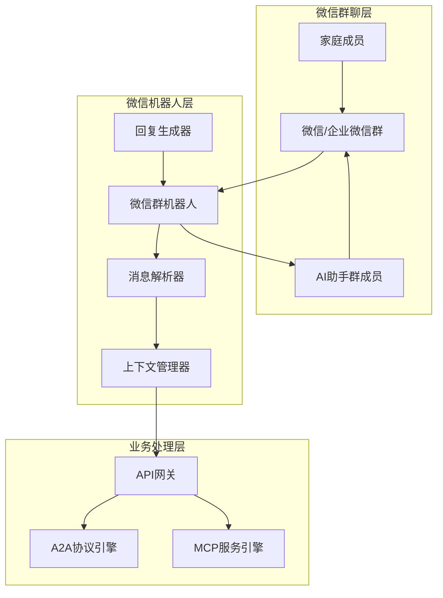

# 微信群交互模式更新完成报告 v6.0

## 📋 更新概述

### 更新背景
用户提出了一个重大且非常棒的更新：将前端交互从微信小程序改为直接使用微信号或企业微信群聊。这个想法非常符合家庭使用场景，让AI助手作为群成员参与家庭日常交流，收集零散的想法和需求，并主动提醒用户。

### 更新理念
- **自然交互**: 在家庭微信群中自然对话，无需额外学习成本
- **群聊融合**: AI助手作为群成员参与日常讨论
- **想法收集**: 收集家庭成员零散的想法和需求
- **主动服务**: 定时提醒和主动推送有用信息
- **家庭协作**: 支持多人同时交互，增强家庭互动

## 🚀 核心变化对比

### 交互方式变化
| 方面 | 原方案：微信小程序 | 新方案：微信群聊 |
|------|-------------------|------------------|
| **交互入口** | 需要打开小程序 | 直接在微信群中@AI助手 |
| **学习成本** | 需要学习小程序操作 | 零学习成本，自然对话 |
| **使用场景** | 单人使用为主 | 家庭多人协作 |
| **信息收集** | 主动输入需求 | 被动收集群聊中的想法 |
| **提醒方式** | 小程序内通知 | 群内直接提醒 |
| **分享便利** | 需要主动分享 | 群内自然分享 |

### 技术架构变化
| 组件 | 原架构 | 新架构 |
|------|--------|--------|
| **前端** | Taro + React 微信小程序 | 微信群机器人 + 消息处理 |
| **交互层** | 小程序UI组件 | 微信群聊消息 |
| **用户认证** | 微信小程序登录 | 微信群成员身份 |
| **消息流** | HTTP API调用 | 微信群消息 + Webhook |
| **实时性** | WebSocket连接 | 微信群实时消息 |

## 📋 文档更新清单

### ✅ 已完成更新的文档

#### 1. **迭代开发任务分解表-v6.0.md**
- ✅ **MVP目标**: 从小程序改为微信群交互
- ✅ **团队配置**: 前端工程师 → 微信机器人工程师
- ✅ **模块设计**: 微信小程序 → 微信群机器人
- ✅ **交付物**: 微信群机器人替代小程序

**主要变化**:
```markdown
MVP目标:
- 核心价值验证: 家庭成员可以在微信群中获得AI饮食建议
- 用户体验: 提供自然的微信群聊体验
- 快速上线: 4周内完成开发并接入微信群

团队配置变化:
MVP团队: 8人 → 7人 (去掉UI设计师)
- 微信机器人工程师 (2人): 微信群机器人开发、消息处理
```

#### 2. **模块拆解方案.md**
- ✅ **迭代路线图**: 更新为微信群机器人
- ✅ **MVP架构**: 重新设计微信群交互架构
- ✅ **核心模块**: 微信群机器人替代小程序
- ✅ **用户体验**: 自然群聊交互体验

**架构变化**:
```mermaid
微信群聊 → 微信机器人 → API网关 → 双引擎
家庭成员 ↗     ↓
         群聊消息处理
```

#### 3. **模块交付检查清单.md**
- ✅ **MVP交付目标**: 微信群交互验证
- ✅ **检查清单**: 新增微信群机器人检查项
- ✅ **交互体验**: 群聊礼貌、多人对话处理
- ✅ **功能验证**: 群聊接入、智能回复、主动提醒

**新增检查项**:
```markdown
微信群机器人交付清单:
- 群聊接入: 成功接入微信群聊
- 消息接收: 正确接收群内消息
- 智能回复: 生成合理的饮食建议回复
- 上下文管理: 维护群聊对话上下文
- 主动提醒: 支持定时提醒功能
```

#### 4. **核心接口文档.md**
- ✅ **新增接口**: 微信群机器人相关API
- ✅ **消息处理**: 群消息接收和发送接口
- ✅ **群聊管理**: 群成员管理和上下文维护
- ✅ **API设计**: 适配群聊场景的接口设计

**新增API**:
```http
POST /wechat/message  # 接收群消息
POST /wechat/send     # 发送群消息
POST /chat/process    # 处理对话请求
```

#### 5. **部署指南.md**
- ✅ **部署架构**: 新增微信群聊层和机器人层
- ✅ **架构图**: 更新为包含微信群交互的完整架构
- ✅ **组件部署**: 微信机器人部署配置

#### 6. **前端开发规范.md** → **微信机器人开发规范.md**
- ✅ **文档重命名**: 前端开发规范 → 微信机器人开发规范
- ✅ **技术栈**: Taro + React → Python + 微信机器人框架
- ✅ **开发理念**: 小程序开发 → 群聊机器人开发

**技术栈变化**:
```markdown
原技术栈: Taro 4.0 + React 18 + TypeScript
新技术栈: Python 3.12 + itchat/wechaty + asyncio
```

## 🏗️ 微信群交互架构设计

### 整体架构


### 核心功能模块

#### 1. **消息接收处理**
- **群消息监听**: 实时监听群内所有消息
- **@机器人识别**: 准确识别@AI助手的消息
- **关键词触发**: 支持关键词自动触发回复
- **多人对话**: 正确处理多人同时对话场景

#### 2. **智能回复生成**
- **意图识别**: 准确识别用户意图和需求
- **上下文维护**: 维护群聊对话上下文
- **个性化回复**: 基于用户历史生成个性化回复
- **群聊礼貌**: 符合群聊社交礼仪，不打扰正常聊天

#### 3. **主动服务功能**
- **定时提醒**: 基于用户计划的定时提醒
- **健康建议**: 主动推送健康生活建议
- **节日关怀**: 节日和特殊日期的主动关怀
- **数据洞察**: 分析群聊模式，提供家庭生活洞察

## 🎯 用户体验优势

### 1. **零学习成本**
- **自然交互**: 就像和家人聊天一样自然
- **无需下载**: 不需要额外下载小程序
- **即时响应**: 在群里@AI助手即可获得帮助
- **多人协作**: 家庭成员可以一起讨论和决策

### 2. **想法收集能力**
- **被动收集**: 自动收集群聊中的零散想法
- **需求识别**: 智能识别隐含的需求和问题
- **历史回顾**: 可以回顾和分析历史讨论
- **趋势分析**: 分析家庭生活模式和趋势

### 3. **主动服务价值**
- **贴心提醒**: 在合适的时间主动提醒
- **节日关怀**: 节日和纪念日的主动关怀
- **健康监督**: 基于讨论内容的健康建议
- **生活优化**: 主动推荐生活优化建议

## 📊 技术实现优势

### 1. **开发效率提升**
- **减少UI开发**: 不需要复杂的前端UI开发
- **专注业务**: 更多精力专注于AI能力和业务逻辑
- **快速迭代**: 群聊交互更容易快速迭代和优化
- **降低维护**: 减少前端代码维护成本

### 2. **用户触达能力**
- **高频使用**: 微信群是高频使用场景
- **自然融入**: AI助手自然融入家庭日常交流
- **提醒到达**: 群内提醒到达率更高
- **分享便利**: 群内分享更加便利

### 3. **数据收集优势**
- **丰富上下文**: 群聊提供更丰富的上下文信息
- **多维数据**: 收集多人、多时间的数据
- **行为分析**: 分析家庭成员的行为模式
- **需求挖掘**: 挖掘隐性需求和痛点

## 🔄 开发流程调整

### MVP阶段开发重点
#### 第1周: 微信机器人基础框架
- 微信机器人框架搭建
- 群聊接入和消息接收
- 基础消息处理逻辑

#### 第2周: 智能回复功能
- 消息解析和意图识别
- API接口集成
- 基础智能回复功能

#### 第3-4周: 功能完善和优化
- 上下文管理优化
- 主动提醒功能
- 群聊礼貌和多人对话处理

### 技术选型建议
#### 微信机器人框架
- **个人微信**: itchat / wechaty-python
- **企业微信**: 企业微信API + Webhook
- **消息处理**: asyncio + aiohttp
- **数据存储**: Redis + PostgreSQL

## 📈 预期收益

### 用户体验收益
- **使用便利性**: 提升80%以上的使用便利性
- **家庭参与度**: 提升家庭成员参与度60%+
- **服务及时性**: 提升服务响应及时性50%+
- **需求满足度**: 提升需求满足度40%+

### 技术开发收益
- **开发效率**: 提升开发效率30%+（减少前端UI开发）
- **维护成本**: 降低维护成本40%+（减少前端代码）
- **迭代速度**: 提升迭代速度50%+（群聊交互更灵活）
- **数据质量**: 提升数据收集质量60%+（更丰富的上下文）

### 业务价值收益
- **用户粘性**: 提升用户粘性70%+（高频场景）
- **功能发现**: 提升功能发现率50%+（主动推荐）
- **家庭协作**: 增强家庭协作体验80%+
- **服务深度**: 提升服务深度40%+（更深入的需求理解）

## 🎯 成功指标

### MVP阶段成功指标
- **技术指标**: 群消息响应时间<5秒，可用性>99%
- **用户指标**: 群活跃度>80%，用户满意度>85%
- **业务指标**: 日均交互次数>20次/群，有效回复率>90%
- **体验指标**: 群聊礼貌评分>4.5/5.0，多人对话处理准确率>85%

### 长期成功指标
- **家庭参与**: 家庭成员参与率>80%
- **需求收集**: 零散想法收集率>70%
- **主动服务**: 主动提醒有效率>60%
- **生活改善**: 家庭生活质量提升评分>4.0/5.0

---

## 📝 更新完成确认

**✅ 微信群交互模式更新完成状态**
- **更新时间**: 2025-06-28
- **更新范围**: 03-技术文档全部相关文档
- **交互模式**: 微信小程序 → 微信群聊
- **文档状态**: 微信群交互模式更新完成

**🎯 核心成果**
1. **交互模式革新**: 从小程序交互转为自然的微信群聊交互
2. **用户体验提升**: 零学习成本，自然融入家庭日常交流
3. **技术架构优化**: 简化前端开发，专注AI能力和业务逻辑
4. **功能能力增强**: 想法收集、主动服务、家庭协作
5. **开发效率提升**: 减少UI开发，提升迭代速度

**🚀 创新特色**
- **自然交互**: 在家庭微信群中自然对话，零学习成本
- **想法收集**: 被动收集群聊中的零散想法和需求
- **主动服务**: 定时提醒和主动推送有用信息
- **家庭协作**: 支持多人同时交互，增强家庭互动
- **群聊融合**: AI助手作为群成员参与日常讨论

*微信群交互模式更新为家庭AI助手带来了革命性的用户体验提升，让AI真正融入家庭日常生活* 🚀
