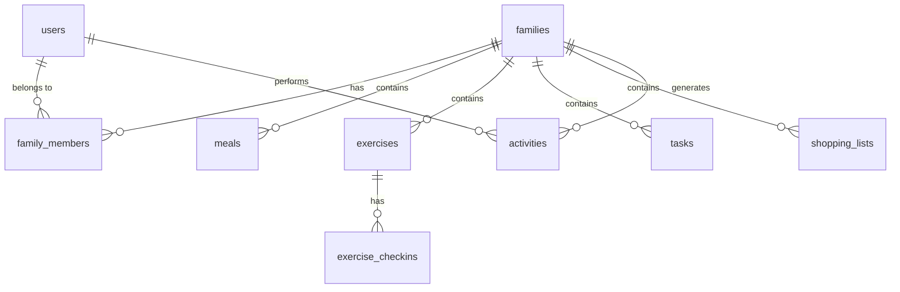

# 家庭生活管家小程序 - 数据库设计文档

## 文档信息
- **文档版本**: V1.0
- **创建日期**: 2025-06-27
- **创建人**: AI Database Architect
- **文档类型**: 数据库设计文档
- **数据库类型**: MongoDB

---

## 1. 数据库设计原则

### 1.1 设计原则
- **文档导向**: 利用MongoDB的文档特性，合理嵌套相关数据
- **查询优化**: 根据查询模式设计数据结构
- **扩展性**: 考虑未来功能扩展的数据结构需求
- **一致性**: 保证数据的一致性和完整性

### 1.2 命名规范
- **集合名称**: 使用复数形式，小写字母，单词间用下划线分隔
- **字段名称**: 使用驼峰命名法
- **索引名称**: 使用描述性名称，包含字段信息

### 1.3 数据类型规范
- **ObjectId**: 主键和外键引用
- **String**: 文本数据，设置合理长度限制
- **Number**: 数值数据，区分整数和浮点数
- **Date**: 时间戳，统一使用UTC时间
- **Boolean**: 布尔值
- **Array**: 数组类型，用于一对多关系
- **Object**: 嵌套文档，用于复杂数据结构

---

## 2. 核心集合设计

### 2.1 用户集合 (users)

```javascript
{
  _id: ObjectId,
  openid: String,           // 微信openid，唯一标识
  unionid: String,          // 微信unionid（可选）
  nickname: String,         // 用户昵称
  avatar: String,           // 头像URL
  gender: Number,           // 性别：0-未知，1-男，2-女
  language: String,         // 语言
  city: String,             // 城市
  province: String,         // 省份
  country: String,          // 国家
  
  // 应用内信息
  profile: {
    realName: String,       // 真实姓名（可选）
    birthday: Date,         // 生日（可选）
    height: Number,         // 身高(cm)
    weight: Number,         // 体重(kg)
    preferences: {
      dietaryRestrictions: [String], // 饮食限制
      favoriteActivities: [String],  // 喜欢的运动
      cuisinePreferences: [String]   // 菜系偏好
    }
  },
  
  // 系统信息
  status: String,           // 用户状态：active/inactive/banned
  lastLoginAt: Date,        // 最后登录时间
  createdAt: Date,          // 创建时间
  updatedAt: Date           // 更新时间
}

// 索引设计
db.users.createIndex({ "openid": 1 }, { unique: true })
db.users.createIndex({ "unionid": 1 }, { sparse: true })
db.users.createIndex({ "createdAt": 1 })
```

### 2.2 家庭集合 (families)

```javascript
{
  _id: ObjectId,
  name: String,             // 家庭名称
  description: String,      // 家庭描述
  inviteCode: String,       // 6位数字邀请码
  inviteCodeExpiry: Date,   // 邀请码过期时间
  
  // 家庭设置
  settings: {
    timezone: String,       // 时区
    language: String,       // 语言
    currency: String,       // 货币
    weekStartDay: Number,   // 一周开始日：0-周日，1-周一
    mealPlanningEnabled: Boolean,
    exerciseTrackingEnabled: Boolean,
    taskManagementEnabled: Boolean
  },
  
  // 统计信息
  stats: {
    memberCount: Number,    // 成员数量
    totalMeals: Number,     // 总餐食数
    totalExercises: Number, // 总运动数
    totalTasks: Number      // 总任务数
  },
  
  // 系统信息
  createdBy: ObjectId,      // 创建者ID
  status: String,           // 状态：active/inactive
  createdAt: Date,
  updatedAt: Date
}

// 索引设计
db.families.createIndex({ "inviteCode": 1 }, { unique: true })
db.families.createIndex({ "createdBy": 1 })
db.families.createIndex({ "createdAt": 1 })
```

### 2.3 家庭成员集合 (family_members)

```javascript
{
  _id: ObjectId,
  familyId: ObjectId,       // 家庭ID
  userId: ObjectId,         // 用户ID
  role: String,             // 角色：admin/member
  nickname: String,         // 在家庭中的昵称
  
  // 权限设置
  permissions: {
    canManageMembers: Boolean,
    canCreateMeals: Boolean,
    canCreateExercises: Boolean,
    canCreateTasks: Boolean,
    canViewStatistics: Boolean
  },
  
  // 状态信息
  status: String,           // 状态：active/inactive
  joinedAt: Date,           // 加入时间
  lastActiveAt: Date,       // 最后活跃时间
  createdAt: Date,
  updatedAt: Date
}

// 索引设计
db.family_members.createIndex({ "familyId": 1, "userId": 1 }, { unique: true })
db.family_members.createIndex({ "familyId": 1 })
db.family_members.createIndex({ "userId": 1 })
```

### 2.4 餐食计划集合 (meals)

```javascript
{
  _id: ObjectId,
  familyId: ObjectId,       // 家庭ID
  date: Date,               // 日期（只保留年月日）
  mealType: String,         // 餐次：breakfast/lunch/dinner/snack
  
  // 菜品信息
  dishes: [
    {
      name: String,         // 菜品名称
      description: String,  // 描述
      cookingTime: Number,  // 制作时间(分钟)
      difficulty: String,   // 难度：easy/medium/hard
      servings: Number,     // 份数
      
      // 食材列表
      ingredients: [
        {
          name: String,     // 食材名称
          amount: String,   // 用量
          unit: String,     // 单位
          category: String  // 分类：蔬菜/肉类/调料等
        }
      ],
      
      // 营养信息
      nutrition: {
        calories: Number,   // 卡路里
        protein: Number,    // 蛋白质(g)
        carbs: Number,      // 碳水化合物(g)
        fat: Number,        // 脂肪(g)
        fiber: Number,      // 纤维(g)
        sodium: Number      // 钠(mg)
      },
      
      // 制作步骤
      steps: [String],
      
      // 图片
      images: [String],
      
      // 标签
      tags: [String]        // 如：素食、低卡、快手菜等
    }
  ],
  
  // 分工信息
  assignedTo: ObjectId,     // 负责人
  participants: [ObjectId], // 参与人员
  
  // 状态信息
  status: String,           // 状态：planned/in_progress/completed/cancelled
  completedAt: Date,        // 完成时间
  rating: Number,           // 评分 1-5
  feedback: String,         // 反馈
  
  // 系统信息
  createdBy: ObjectId,
  createdAt: Date,
  updatedAt: Date
}

// 索引设计
db.meals.createIndex({ "familyId": 1, "date": 1, "mealType": 1 })
db.meals.createIndex({ "familyId": 1, "status": 1 })
db.meals.createIndex({ "assignedTo": 1 })
db.meals.createIndex({ "createdAt": 1 })
```

### 2.5 购物清单集合 (shopping_lists)

```javascript
{
  _id: ObjectId,
  familyId: ObjectId,       // 家庭ID
  name: String,             // 清单名称
  
  // 购物项目
  items: [
    {
      ingredient: String,   // 食材名称
      amount: String,       // 总用量
      unit: String,         // 单位
      category: String,     // 分类
      purchased: Boolean,   // 是否已购买
      price: Number,        // 价格
      purchasedBy: ObjectId, // 购买人
      purchasedAt: Date,    // 购买时间
      fromMeals: [ObjectId], // 来源餐食计划
      notes: String         // 备注
    }
  ],
  
  // 统计信息
  summary: {
    totalItems: Number,     // 总项目数
    purchasedItems: Number, // 已购买数
    totalPrice: Number,     // 总价格
    estimatedPrice: Number  // 预估价格
  },
  
  // 状态信息
  status: String,           // 状态：active/completed/archived
  completedAt: Date,        // 完成时间
  
  // 系统信息
  createdBy: ObjectId,
  createdAt: Date,
  updatedAt: Date
}

// 索引设计
db.shopping_lists.createIndex({ "familyId": 1, "status": 1 })
db.shopping_lists.createIndex({ "createdAt": 1 })
```

### 2.6 运动计划集合 (exercises)

```javascript
{
  _id: ObjectId,
  familyId: ObjectId,       // 家庭ID
  name: String,             // 运动名称
  type: String,             // 运动类型：cardio/strength/flexibility/sports
  activity: String,         // 具体活动：running/swimming/yoga等
  
  // 计划信息
  scheduledAt: Date,        // 计划时间
  duration: Number,         // 持续时间(分钟)
  intensity: String,        // 强度：low/medium/high
  location: String,         // 地点
  
  // 目标设置
  goals: {
    distance: Number,       // 距离(公里)
    calories: Number,       // 目标卡路里
    heartRate: Number,      // 目标心率
    steps: Number           // 目标步数
  },
  
  // 参与人员
  participants: [ObjectId],
  
  // 重复设置
  repeat: {
    enabled: Boolean,
    pattern: String,        // daily/weekly/monthly
    daysOfWeek: [Number],   // 周几重复
    interval: Number,       // 间隔
    endDate: Date           // 结束日期
  },
  
  // 状态信息
  status: String,           // 状态：scheduled/in_progress/completed/cancelled
  
  // 系统信息
  createdBy: ObjectId,
  createdAt: Date,
  updatedAt: Date
}

// 索引设计
db.exercises.createIndex({ "familyId": 1, "scheduledAt": 1 })
db.exercises.createIndex({ "familyId": 1, "status": 1 })
db.exercises.createIndex({ "participants": 1 })
```

### 2.7 运动打卡集合 (exercise_checkins)

```javascript
{
  _id: ObjectId,
  exerciseId: ObjectId,     // 运动计划ID
  userId: ObjectId,         // 用户ID
  familyId: ObjectId,       // 家庭ID
  
  // 完成信息
  completedAt: Date,        // 完成时间
  actualDuration: Number,   // 实际时长(分钟)
  actualDistance: Number,   // 实际距离(公里)
  caloriesBurned: Number,   // 消耗卡路里
  averageHeartRate: Number, // 平均心率
  maxHeartRate: Number,     // 最大心率
  steps: Number,            // 步数
  
  // 主观感受
  feeling: String,          // 感受：terrible/bad/ok/good/great
  effortLevel: Number,      // 努力程度 1-10
  notes: String,            // 备注
  
  // 位置信息
  location: {
    latitude: Number,
    longitude: Number,
    address: String
  },
  
  // 媒体文件
  images: [String],         // 图片
  
  // 成就信息
  achievements: [String],   // 获得的成就
  
  // 系统信息
  createdAt: Date,
  updatedAt: Date
}

// 索引设计
db.exercise_checkins.createIndex({ "exerciseId": 1 })
db.exercise_checkins.createIndex({ "userId": 1, "completedAt": 1 })
db.exercise_checkins.createIndex({ "familyId": 1, "completedAt": 1 })
```

### 2.8 任务集合 (tasks)

```javascript
{
  _id: ObjectId,
  familyId: ObjectId,       // 家庭ID
  title: String,            // 任务标题
  description: String,      // 任务描述
  category: String,         // 任务类别：housework/shopping/childcare/other
  priority: String,         // 优先级：low/medium/high/urgent
  
  // 分配信息
  assignedTo: ObjectId,     // 负责人
  assignedBy: ObjectId,     // 分配人
  
  // 时间信息
  dueDate: Date,            // 截止时间
  estimatedTime: Number,    // 预计时间(分钟)
  actualTime: Number,       // 实际时间(分钟)
  
  // 重复设置
  repeat: {
    enabled: Boolean,
    pattern: String,        // daily/weekly/monthly
    daysOfWeek: [Number],
    interval: Number,
    endDate: Date
  },
  
  // 检查清单
  checklist: [
    {
      item: String,         // 检查项
      completed: Boolean,   // 是否完成
      completedAt: Date     // 完成时间
    }
  ],
  
  // 状态信息
  status: String,           // 状态：pending/in_progress/completed/cancelled
  completedAt: Date,        // 完成时间
  
  // 完成信息
  completion: {
    notes: String,          // 完成备注
    images: [String],       // 完成图片
    rating: Number          // 完成质量评分
  },
  
  // 系统信息
  createdBy: ObjectId,
  createdAt: Date,
  updatedAt: Date
}

// 索引设计
db.tasks.createIndex({ "familyId": 1, "status": 1 })
db.tasks.createIndex({ "assignedTo": 1, "dueDate": 1 })
db.tasks.createIndex({ "familyId": 1, "dueDate": 1 })
```

---

## 3. 辅助集合设计

### 3.1 活动动态集合 (activities)

```javascript
{
  _id: ObjectId,
  familyId: ObjectId,       // 家庭ID
  userId: ObjectId,         // 操作用户ID
  type: String,             // 活动类型：meal_created/exercise_completed/task_assigned等
  content: String,          // 活动内容描述
  
  // 关联信息
  relatedType: String,      // 关联类型：meal/exercise/task
  relatedId: ObjectId,      // 关联ID
  
  // 额外数据
  metadata: Object,         // 额外的元数据
  
  // 系统信息
  createdAt: Date
}

// 索引设计
db.activities.createIndex({ "familyId": 1, "createdAt": -1 })
db.activities.createIndex({ "userId": 1, "createdAt": -1 })
```

### 3.2 系统配置集合 (configs)

```javascript
{
  _id: ObjectId,
  key: String,              // 配置键
  value: Object,            // 配置值
  description: String,      // 描述
  category: String,         // 分类
  
  // 系统信息
  createdAt: Date,
  updatedAt: Date
}

// 索引设计
db.configs.createIndex({ "key": 1 }, { unique: true })
```

---

## 4. 数据关系设计

### 4.1 关系图


### 4.2 引用策略
- **用户-家庭**: 通过family_members集合建立多对多关系
- **家庭-内容**: 直接引用familyId，一对多关系
- **用户-内容**: 直接引用userId，记录创建者和参与者
- **运动-打卡**: 一对多关系，通过exerciseId关联

---

## 5. 索引优化策略

### 5.1 查询模式分析
- **按家庭查询**: 大部分查询都会按familyId过滤
- **按时间查询**: 餐食、运动、任务都有时间维度查询
- **按用户查询**: 个人相关数据查询
- **按状态查询**: 任务状态、运动状态等

### 5.2 复合索引设计
```javascript
// 餐食计划查询优化
db.meals.createIndex({ "familyId": 1, "date": 1, "mealType": 1 })

// 任务查询优化
db.tasks.createIndex({ "familyId": 1, "status": 1, "dueDate": 1 })

// 运动打卡查询优化
db.exercise_checkins.createIndex({ "userId": 1, "completedAt": -1 })

// 活动动态查询优化
db.activities.createIndex({ "familyId": 1, "createdAt": -1 })
```

### 5.3 性能监控
- 定期分析慢查询日志
- 监控索引使用情况
- 根据查询模式调整索引策略

---

## 6. 数据一致性保证

### 6.1 事务处理
- 使用MongoDB事务处理关键操作
- 家庭成员加入/退出操作
- 数据统计更新操作

### 6.2 数据验证
```javascript
// 用户数据验证
const userSchema = {
  openid: { type: String, required: true, unique: true },
  nickname: { type: String, required: true, maxLength: 50 },
  avatar: { type: String, match: /^https?:\/\/.+/ },
  gender: { type: Number, enum: [0, 1, 2] }
}

// 家庭数据验证
const familySchema = {
  name: { type: String, required: true, minLength: 2, maxLength: 20 },
  inviteCode: { type: String, required: true, match: /^\d{6}$/ }
}
```

### 6.3 数据清理策略
- 定期清理过期的邀请码
- 清理无效的活动记录
- 归档历史数据

---

## 7. 备份和恢复策略

### 7.1 备份策略
- **全量备份**: 每日凌晨进行全量备份
- **增量备份**: 每小时进行增量备份
- **异地备份**: 备份数据存储到不同地域

### 7.2 恢复策略
- **时间点恢复**: 支持恢复到任意时间点
- **选择性恢复**: 支持恢复特定集合或文档
- **灾难恢复**: 制定完整的灾难恢复预案

---

## 8. 监控和维护

### 8.1 性能监控
- 监控数据库连接数
- 监控查询响应时间
- 监控磁盘使用情况
- 监控内存使用情况

### 8.2 日常维护
- 定期检查索引效率
- 定期分析查询性能
- 定期清理无用数据
- 定期更新统计信息

---

## 9. 扩展性考虑

### 9.1 水平扩展
- 设计合理的分片键
- 考虑数据分布均匀性
- 预留扩展接口

### 9.2 垂直扩展
- 合理的硬件配置
- 内存和存储优化
- 网络带宽考虑

---

## 10. 总结

### 10.1 设计亮点
1. **文档结构优化**: 合理利用MongoDB的文档特性
2. **索引策略完善**: 根据查询模式设计高效索引
3. **数据一致性**: 保证数据的完整性和一致性
4. **扩展性良好**: 支持未来功能扩展

### 10.2 注意事项
1. **查询优化**: 避免全表扫描，合理使用索引
2. **数据大小**: 控制文档大小，避免过大文档
3. **并发控制**: 处理好并发读写操作
4. **数据安全**: 确保敏感数据的安全性
