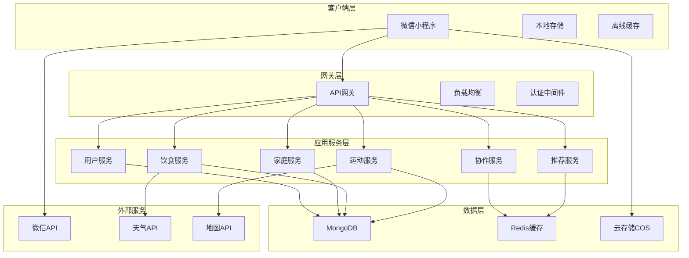
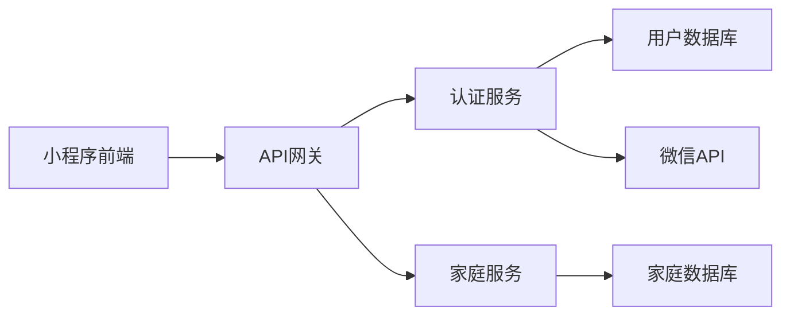
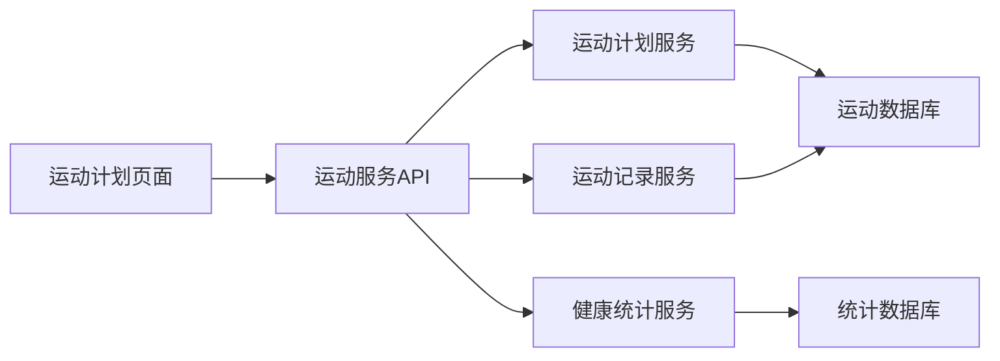
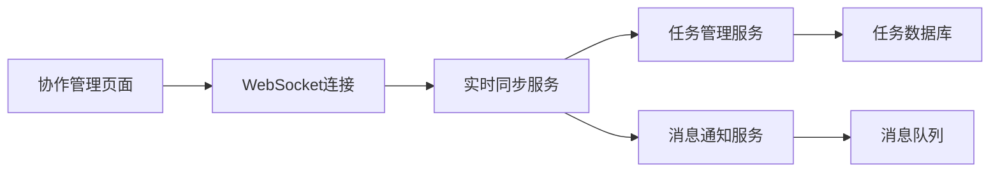

# 家庭生活管家小程序 - 技术架构设计

## 文档信息
- **文档版本**: V1.0
- **创建日期**: 2025-06-27
- **创建人**: AI Technical Architect
- **文档类型**: 技术架构文档

---

## 1. 整体技术架构

### 1.1 架构概览


### 1.2 技术栈选择

#### 前端技术栈
- **开发框架**: 微信小程序原生框架
- **状态管理**: MobX-miniprogram
- **UI组件**: WeUI + 自定义组件
- **网络请求**: 封装的wx.request
- **本地存储**: wx.storage + 数据缓存策略

#### 后端技术栈
- **运行环境**: Node.js 16+ 
- **Web框架**: Express.js + 微信云开发
- **数据库**: MongoDB (云数据库)
- **缓存**: Redis (云缓存)
- **文件存储**: 腾讯云COS
- **实时通信**: Socket.io

#### 开发工具链
- **版本控制**: Git + GitHub
- **CI/CD**: GitHub Actions
- **代码质量**: ESLint + Prettier
- **测试框架**: Jest + Mocha
- **API文档**: Swagger/OpenAPI

---

## 2. 模块技术设计

### 2.1 Module 0: 核心基础模块

#### 技术架构


#### 核心技术组件
**认证服务 (AuthService)**:
```javascript
class AuthService {
  async wxLogin(code) {
    // 微信登录逻辑
    const { openid, session_key } = await wx.code2Session(code);
    const token = jwt.sign({ openid }, JWT_SECRET);
    return { token, userInfo };
  }
  
  async verifyToken(token) {
    // Token验证逻辑
    return jwt.verify(token, JWT_SECRET);
  }
}
```

**家庭服务 (FamilyService)**:
```javascript
class FamilyService {
  async createFamily(userId, familyName) {
    const inviteCode = generateInviteCode();
    const family = await Family.create({
      name: familyName,
      creator_id: userId,
      invite_code: inviteCode
    });
    return family;
  }
  
  async joinFamily(userId, inviteCode) {
    const family = await Family.findOne({ invite_code: inviteCode });
    if (!family) throw new Error('Invalid invite code');
    
    await FamilyMember.create({
      family_id: family._id,
      user_id: userId,
      role: 'member'
    });
    return family;
  }
}
```

#### 数据模型设计
```javascript
// 用户模型
const UserSchema = new mongoose.Schema({
  openid: { type: String, unique: true, required: true },
  nickname: String,
  avatar_url: String,
  gender: { type: Number, default: 0 },
  created_at: { type: Date, default: Date.now }
});

// 家庭模型
const FamilySchema = new mongoose.Schema({
  name: { type: String, required: true },
  invite_code: { type: String, unique: true, required: true },
  creator_id: { type: mongoose.Schema.Types.ObjectId, ref: 'User' },
  created_at: { type: Date, default: Date.now }
});

// 家庭成员模型
const FamilyMemberSchema = new mongoose.Schema({
  family_id: { type: mongoose.Schema.Types.ObjectId, ref: 'Family' },
  user_id: { type: mongoose.Schema.Types.ObjectId, ref: 'User' },
  role: { type: String, enum: ['admin', 'member'], default: 'member' },
  joined_at: { type: Date, default: Date.now }
});
```

### 2.2 Module 1: 饮食规划模块

#### 技术架构


#### 核心技术组件
**餐食计划服务 (MealPlanService)**:
```javascript
class MealPlanService {
  async createMealPlan(familyId, planData) {
    const mealPlan = await MealPlan.create({
      family_id: familyId,
      plan_date: planData.date,
      meal_type: planData.mealType,
      dish_name: planData.dishName,
      ingredients: planData.ingredients,
      assignee_id: planData.assigneeId
    });
    
    // 自动生成购物清单
    await this.generateShoppingList(familyId, planData.ingredients);
    
    return mealPlan;
  }
  
  async generateShoppingList(familyId, ingredients) {
    const shoppingItems = ingredients.map(ingredient => ({
      family_id: familyId,
      item_name: ingredient.name,
      quantity: ingredient.quantity,
      unit: ingredient.unit,
      category: ingredient.category
    }));
    
    await ShoppingList.insertMany(shoppingItems);
  }
}
```

**营养建议服务 (NutritionService)**:
```javascript
class NutritionService {
  async getNutritionAdvice(mealPlans) {
    const nutritionData = await this.calculateNutrition(mealPlans);
    const advice = await this.generateAdvice(nutritionData);
    return advice;
  }
  
  async calculateNutrition(mealPlans) {
    // 营养计算逻辑
    let totalCalories = 0;
    let totalProtein = 0;
    // ... 其他营养素计算
    
    return { totalCalories, totalProtein };
  }
}
```

#### 前端组件设计
```javascript
// 餐食计划组件
Component({
  data: {
    mealPlans: [],
    selectedDate: new Date(),
    mealTypes: ['breakfast', 'lunch', 'dinner']
  },
  
  methods: {
    async loadMealPlans() {
      const plans = await api.getMealPlans(this.data.selectedDate);
      this.setData({ mealPlans: plans });
    },
    
    async addMealPlan(mealData) {
      await api.createMealPlan(mealData);
      this.loadMealPlans();
    }
  }
});
```

### 2.3 Module 2: 运动健身模块

#### 技术架构


#### 核心技术组件
**运动计划服务 (ExerciseService)**:
```javascript
class ExerciseService {
  async createExercisePlan(familyId, planData) {
    const exercisePlan = await ExercisePlan.create({
      family_id: familyId,
      plan_date: planData.date,
      exercise_type: planData.type,
      duration: planData.duration,
      intensity: planData.intensity,
      participants: planData.participants
    });
    
    return exercisePlan;
  }
  
  async recordExercise(planId, recordData) {
    const record = await ExerciseRecord.create({
      plan_id: planId,
      user_id: recordData.userId,
      actual_duration: recordData.duration,
      calories_burned: this.calculateCalories(recordData),
      notes: recordData.notes
    });
    
    // 更新统计数据
    await this.updateStatistics(recordData.userId, record);
    
    return record;
  }
  
  calculateCalories(recordData) {
    // 卡路里计算算法
    const baseRate = this.getBaseCalorieRate(recordData.exerciseType);
    return baseRate * recordData.duration * recordData.intensity;
  }
}
```

### 2.4 Module 3: 协作管理模块

#### 技术架构


#### 实时同步技术实现
**WebSocket服务**:
```javascript
const io = require('socket.io')(server);

io.on('connection', (socket) => {
  socket.on('join-family', (familyId) => {
    socket.join(`family-${familyId}`);
  });
  
  socket.on('data-change', (data) => {
    // 广播数据变更到家庭成员
    socket.to(`family-${data.familyId}`).emit('data-updated', data);
  });
});

class SyncService {
  async broadcastChange(familyId, changeData) {
    io.to(`family-${familyId}`).emit('data-updated', changeData);
    
    // 保存变更记录
    await ChangeLog.create({
      family_id: familyId,
      change_type: changeData.type,
      change_data: changeData.data,
      timestamp: new Date()
    });
  }
}
```

**离线数据缓存**:
```javascript
// 前端离线缓存策略
class OfflineCache {
  constructor() {
    this.pendingChanges = [];
    this.isOnline = true;
  }
  
  async saveChange(changeData) {
    if (this.isOnline) {
      try {
        await api.saveData(changeData);
      } catch (error) {
        this.pendingChanges.push(changeData);
        this.isOnline = false;
      }
    } else {
      this.pendingChanges.push(changeData);
    }
  }
  
  async syncPendingChanges() {
    if (this.pendingChanges.length > 0) {
      for (const change of this.pendingChanges) {
        await api.saveData(change);
      }
      this.pendingChanges = [];
      this.isOnline = true;
    }
  }
}
```

---

## 3. 数据库设计

### 3.1 数据库选择理由
- **MongoDB**: 文档型数据库，适合存储复杂的嵌套数据结构
- **Redis**: 内存数据库，用于缓存和实时数据
- **云存储**: 存储图片、文件等非结构化数据

### 3.2 核心数据模型
```javascript
// 餐食计划模型
const MealPlanSchema = new mongoose.Schema({
  family_id: { type: mongoose.Schema.Types.ObjectId, ref: 'Family', required: true },
  plan_date: { type: Date, required: true },
  meal_type: { type: String, enum: ['breakfast', 'lunch', 'dinner', 'snack'], required: true },
  dish_name: { type: String, required: true },
  description: String,
  cooking_time: Number,
  difficulty: { type: String, enum: ['easy', 'medium', 'hard'], default: 'easy' },
  assignee_id: { type: mongoose.Schema.Types.ObjectId, ref: 'User' },
  ingredients: [{
    name: String,
    quantity: Number,
    unit: String,
    category: String
  }],
  image_url: String,
  created_at: { type: Date, default: Date.now },
  updated_at: { type: Date, default: Date.now }
});

// 运动计划模型
const ExercisePlanSchema = new mongoose.Schema({
  family_id: { type: mongoose.Schema.Types.ObjectId, ref: 'Family', required: true },
  plan_date: { type: Date, required: true },
  start_time: String,
  duration: Number, // 分钟
  exercise_type: { type: String, required: true },
  exercise_name: String,
  intensity: { type: String, enum: ['low', 'medium', 'high'], default: 'medium' },
  location: String,
  participants: [{ type: mongoose.Schema.Types.ObjectId, ref: 'User' }],
  assignee_id: { type: mongoose.Schema.Types.ObjectId, ref: 'User' },
  created_at: { type: Date, default: Date.now }
});

// 任务模型
const TaskSchema = new mongoose.Schema({
  family_id: { type: mongoose.Schema.Types.ObjectId, ref: 'Family', required: true },
  title: { type: String, required: true },
  description: String,
  task_type: { type: String, enum: ['meal', 'exercise', 'outfit', 'other'], required: true },
  status: { type: String, enum: ['pending', 'in_progress', 'completed'], default: 'pending' },
  assignee_id: { type: mongoose.Schema.Types.ObjectId, ref: 'User' },
  due_date: Date,
  priority: { type: Number, min: 1, max: 5, default: 3 },
  metadata: mongoose.Schema.Types.Mixed,
  created_at: { type: Date, default: Date.now },
  updated_at: { type: Date, default: Date.now },
  completed_at: Date
});
```

### 3.3 数据库索引策略
```javascript
// 复合索引优化查询性能
MealPlanSchema.index({ family_id: 1, plan_date: 1 });
ExercisePlanSchema.index({ family_id: 1, plan_date: 1 });
TaskSchema.index({ family_id: 1, status: 1, due_date: 1 });

// 唯一索引保证数据一致性
UserSchema.index({ openid: 1 }, { unique: true });
FamilySchema.index({ invite_code: 1 }, { unique: true });
```

---

## 4. API设计规范

### 4.1 RESTful API设计
```javascript
// 餐食计划API
GET    /api/families/:familyId/meal-plans?date=2025-06-27
POST   /api/families/:familyId/meal-plans
PUT    /api/families/:familyId/meal-plans/:planId
DELETE /api/families/:familyId/meal-plans/:planId

// 运动计划API
GET    /api/families/:familyId/exercise-plans?date=2025-06-27
POST   /api/families/:familyId/exercise-plans
PUT    /api/families/:familyId/exercise-plans/:planId
DELETE /api/families/:familyId/exercise-plans/:planId

// 任务管理API
GET    /api/families/:familyId/tasks?status=pending
POST   /api/families/:familyId/tasks
PUT    /api/families/:familyId/tasks/:taskId
DELETE /api/families/:familyId/tasks/:taskId
```

### 4.2 API响应格式
```javascript
// 成功响应格式
{
  "success": true,
  "data": {
    // 响应数据
  },
  "message": "操作成功",
  "timestamp": "2025-06-27T10:00:00Z"
}

// 错误响应格式
{
  "success": false,
  "error": {
    "code": "INVALID_PARAMS",
    "message": "参数验证失败",
    "details": {
      "field": "meal_type",
      "reason": "必须是有效的餐次类型"
    }
  },
  "timestamp": "2025-06-27T10:00:00Z"
}
```

---

## 5. 性能优化策略

### 5.1 前端性能优化
- **代码分割**: 按模块进行代码分割，减少初始加载时间
- **图片优化**: 图片压缩、懒加载、WebP格式支持
- **缓存策略**: 合理使用本地缓存，减少网络请求
- **虚拟列表**: 长列表使用虚拟滚动优化性能

### 5.2 后端性能优化
- **数据库优化**: 合理的索引设计、查询优化
- **缓存策略**: Redis缓存热点数据
- **连接池**: 数据库连接池管理
- **异步处理**: 非关键操作异步处理

### 5.3 网络优化
- **CDN加速**: 静态资源CDN分发
- **GZIP压缩**: API响应数据压缩
- **HTTP/2**: 支持HTTP/2协议
- **请求合并**: 减少网络请求次数

---

## 6. 安全设计

### 6.1 认证和授权
- **JWT Token**: 无状态的用户认证
- **权限控制**: 基于角色的访问控制
- **Token刷新**: 自动Token刷新机制
- **会话管理**: 安全的会话管理

### 6.2 数据安全
- **数据加密**: 敏感数据加密存储
- **传输加密**: HTTPS加密传输
- **输入验证**: 严格的输入参数验证
- **SQL注入防护**: 使用ORM防止注入攻击

### 6.3 隐私保护
- **数据最小化**: 只收集必要的用户数据
- **数据脱敏**: 日志中的敏感信息脱敏
- **访问日志**: 记录数据访问日志
- **数据删除**: 支持用户数据删除
