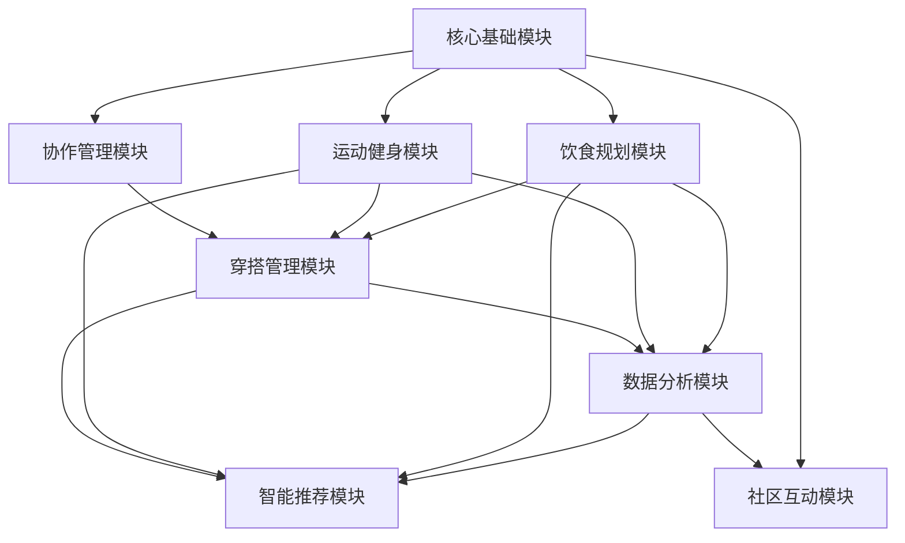
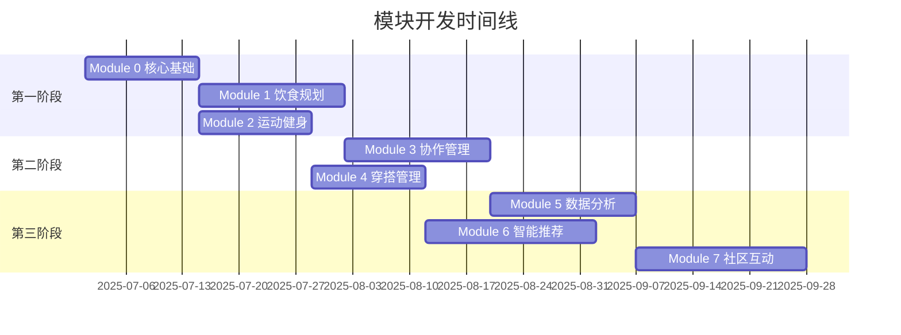

# 家庭生活管家小程序 - 模块拆解方案

## 文档信息
- **文档版本**: V1.0
- **创建日期**: 2025-06-27
- **创建人**: AI Technical Architect
- **文档类型**: 技术架构文档

---

## 1. 模块拆解原则

### 1.1 拆解原则
- **业务独立性**: 每个模块承载完整的业务价值
- **技术独立性**: 模块间低耦合，可独立开发和部署
- **用户价值**: 每个模块交付后用户都能获得实际价值
- **渐进增强**: 模块按优先级递进，形成完整产品
- **风险控制**: 核心功能优先，降低项目风险

### 1.2 模块划分标准
- **功能完整性**: 模块内功能闭环，对外提供完整服务
- **数据独立性**: 模块拥有独立的数据模型和存储
- **接口标准化**: 模块间通过标准API接口通信
- **可测试性**: 每个模块都可以独立进行测试验证

---

## 2. 核心模块架构

### 2.1 整体模块架构图
```
家庭生活管家小程序
├── 核心基础模块 (Module 0)
│   ├── 用户认证服务
│   ├── 家庭管理服务
│   └── 基础数据服务
├── 饮食规划模块 (Module 1)
│   ├── 餐食计划管理
│   ├── 购物清单生成
│   └── 营养建议推荐
├── 运动健身模块 (Module 2)
│   ├── 运动计划制定
│   ├── 运动打卡记录
│   └── 健康数据统计
├── 协作管理模块 (Module 3)
│   ├── 任务分工管理
│   ├── 实时数据同步
│   └── 消息通知服务
├── 穿搭管理模块 (Module 4)
│   ├── 穿搭计划制定
│   ├── 天气关联推荐
│   └── 衣物清单管理
├── 数据分析模块 (Module 5)
│   ├── 数据统计分析
│   ├── 习惯养成跟踪
│   └── 生活质量评估
├── 智能推荐模块 (Module 6)
│   ├── 个性化推荐引擎
│   ├── 智能建议生成
│   └── 用户偏好学习
└── 社区互动模块 (Module 7)
    ├── 内容分享平台
    ├── 用户互动交流
    └── 经验知识库
```

### 2.2 模块依赖关系


---

## 3. 详细模块规格

### Module 0: 核心基础模块 (Foundation Module)
**优先级**: P0 (最高)
**开发周期**: 2周
**团队配置**: 前端1人 + 后端2人 + 测试1人

#### 3.1 功能范围
**用户认证服务**:
- 微信授权登录
- 用户信息管理
- 会话状态管理
- 权限验证服务

**家庭管理服务**:
- 家庭创建和加入
- 成员邀请和管理
- 家庭信息维护
- 成员权限控制

**基础数据服务**:
- 基础数据字典
- 配置参数管理
- 系统设置服务
- 错误处理机制

#### 3.2 技术实现
**前端技术栈**:
- 微信小程序原生框架
- 用户状态管理 (MobX)
- 网络请求封装
- 基础UI组件库

**后端技术栈**:
- Node.js + Express
- 微信云开发
- MongoDB数据库
- JWT认证机制

#### 3.3 数据模型
```sql
-- 用户表
users (id, openid, nickname, avatar_url, gender, created_at)

-- 家庭表  
families (id, name, invite_code, creator_id, created_at)

-- 家庭成员表
family_members (id, family_id, user_id, role, joined_at)
```

#### 3.4 API接口
- POST /auth/login - 用户登录
- GET /auth/profile - 获取用户信息
- POST /family/create - 创建家庭
- POST /family/join - 加入家庭
- GET /family/members - 获取家庭成员

#### 3.5 交付标准
- ✅ 用户可以通过微信授权登录
- ✅ 用户可以创建家庭并邀请成员
- ✅ 家庭成员可以查看家庭信息
- ✅ 基础权限控制正常工作
- ✅ 系统稳定性达到99%以上

#### 3.6 验收测试
- 微信授权登录流程测试
- 家庭创建和加入功能测试
- 成员权限验证测试
- 并发用户登录测试
- 数据安全性测试

---

### Module 1: 饮食规划模块 (Meal Planning Module)
**优先级**: P0 (最高)
**开发周期**: 2.5周
**团队配置**: 前端1人 + 后端1人 + UI设计师0.5人 + 测试1人
**依赖**: Module 0

#### 3.7 功能范围
**餐食计划管理**:
- 每日三餐计划制定
- 菜品信息录入和编辑
- 制作时间和难度设置
- 负责人分配和管理

**购物清单生成**:
- 基于餐食计划自动生成清单
- 手动添加购物项目
- 购买状态标记和管理
- 购物历史记录查看

**营养建议推荐**:
- 基础营养搭配建议
- 季节性食材推荐
- 健康饮食提醒
- 营养知识科普

#### 3.8 技术实现
**前端功能**:
- 餐食计划日历视图
- 菜品录入表单组件
- 购物清单管理界面
- 营养建议展示组件

**后端服务**:
- 餐食计划CRUD API
- 购物清单管理API
- 营养数据服务API
- 食材数据库管理

#### 3.9 数据模型
```sql
-- 餐食计划表
meal_plans (id, family_id, plan_date, meal_type, dish_name, 
           description, cooking_time, difficulty, assignee_id, 
           ingredients, image_url, created_at)

-- 购物清单表
shopping_lists (id, family_id, item_name, category, quantity, 
               unit, price, is_purchased, purchased_by, 
               purchased_at, created_at)

-- 营养数据表
nutrition_data (id, food_name, calories, protein, fat, 
               carbohydrate, fiber, vitamins, minerals)
```

#### 3.10 交付标准
- ✅ 用户可以制定每日三餐计划
- ✅ 系统可以自动生成购物清单
- ✅ 用户可以标记购买状态
- ✅ 提供基础营养建议
- ✅ 家庭成员可以协作管理餐食计划

---

### Module 2: 运动健身模块 (Exercise Module)
**优先级**: P0 (高)
**开发周期**: 2周
**团队配置**: 前端1人 + 后端1人 + 测试1人
**依赖**: Module 0

#### 3.11 功能范围
**运动计划制定**:
- 运动类型和项目选择
- 运动时间和强度设置
- 运动地点和参与人员
- 重复计划设置

**运动打卡记录**:
- 简单打卡功能
- 详细运动记录
- 运动照片上传
- 运动感受记录

**健康数据统计**:
- 运动时长统计
- 卡路里消耗计算
- 运动频次分析
- 健康趋势展示

#### 3.12 数据模型
```sql
-- 运动计划表
exercise_plans (id, family_id, plan_date, start_time, duration,
               exercise_type, exercise_name, intensity, location,
               participants, assignee_id, created_at)

-- 运动记录表
exercise_records (id, plan_id, user_id, actual_duration,
                 actual_intensity, calories_burned, notes,
                 photos, completed_at)

-- 运动类型表
exercise_types (id, name, category, avg_calories_per_hour,
               difficulty_level, equipment_needed)
```

#### 3.13 交付标准
- ✅ 用户可以制定运动计划
- ✅ 用户可以进行运动打卡
- ✅ 系统可以统计运动数据
- ✅ 支持家庭成员共同运动
- ✅ 提供运动建议和指导

---

### Module 3: 协作管理模块 (Collaboration Module)
**优先级**: P0 (高)
**开发周期**: 2.5周
**团队配置**: 前端1人 + 后端2人 + 测试1人
**依赖**: Module 0, Module 1, Module 2

#### 3.14 功能范围
**任务分工管理**:
- 任务创建和分配
- 任务状态跟踪
- 任务完成确认
- 任务提醒通知

**实时数据同步**:
- 家庭数据实时同步
- 离线数据缓存
- 数据冲突解决
- 同步状态显示

**消息通知服务**:
- 任务提醒通知
- 状态变更通知
- 系统消息推送
- 消息历史记录

#### 3.15 技术实现
**实时同步技术**:
- WebSocket长连接
- 数据变更监听
- 冲突检测和解决
- 离线数据队列

**消息推送服务**:
- 微信模板消息
- 小程序订阅消息
- 应用内消息通知
- 消息状态管理

#### 3.16 交付标准
- ✅ 家庭成员数据实时同步
- ✅ 任务分工和状态管理
- ✅ 及时的消息通知
- ✅ 离线数据正常同步
- ✅ 数据冲突正确处理

---

### Module 4: 穿搭管理模块 (Outfit Management Module)
**优先级**: P1 (中)
**开发周期**: 2周
**团队配置**: 前端1人 + 后端1人 + UI设计师0.5人 + 测试0.5人
**依赖**: Module 0, Module 1, Module 2

#### 4.1 功能范围
**穿搭计划制定**:
- 每日穿搭规划
- 服装单品选择组合
- 场合适配推荐
- 穿搭模板保存

**天气关联推荐**:
- 天气API集成
- 基于天气的穿搭建议
- 温度适宜性提醒
- 季节性搭配推荐

**衣物清单管理**:
- 衣物信息录入
- 衣物分类管理
- 穿着频次统计
- 衣物搭配记录

#### 4.2 技术实现
**第三方服务集成**:
- 天气API接入 (和风天气/高德天气)
- 地理位置服务
- 图片存储服务
- 色彩搭配算法

**数据模型**:
```sql
-- 穿搭计划表
outfit_plans (id, family_id, user_id, plan_date, occasion,
             outfit_items, weather_info, image_url, notes, created_at)

-- 衣物清单表
clothing_items (id, user_id, name, category, color, brand,
               season, occasion, image_url, purchase_date, created_at)

-- 穿搭记录表
outfit_records (id, user_id, outfit_plan_id, actual_items,
               rating, feedback, weather_actual, worn_date)
```

#### 4.3 交付标准
- ✅ 用户可以制定每日穿搭计划
- ✅ 系统提供天气关联建议
- ✅ 用户可以管理衣物清单
- ✅ 支持穿搭模板保存和复用
- ✅ 提供基础的搭配建议

---

### Module 5: 数据分析模块 (Analytics Module)
**优先级**: P1 (中)
**开发周期**: 2.5周
**团队配置**: 前端1人 + 后端1人 + 数据分析师1人 + 测试0.5人
**依赖**: Module 1, Module 2, Module 4

#### 5.1 功能范围
**数据统计分析**:
- 计划完成率统计
- 各模块使用频次分析
- 家庭协作效率分析
- 时间分布统计

**习惯养成跟踪**:
- 习惯坚持天数统计
- 习惯养成成功率分析
- 习惯中断原因分析
- 习惯改进建议

**生活质量评估**:
- 综合生活质量评分
- 各维度表现分析
- 改进建议生成
- 趋势变化展示

#### 5.2 技术实现
**数据处理技术**:
- 数据ETL处理流程
- 统计算法实现
- 图表可视化组件
- 报告生成服务

**分析算法**:
- 完成率计算算法
- 趋势分析算法
- 异常检测算法
- 评分模型算法

#### 5.3 数据模型
```sql
-- 统计数据表
statistics_data (id, family_id, user_id, date, metric_type,
                metric_value, category, subcategory, created_at)

-- 习惯跟踪表
habit_tracking (id, user_id, habit_type, target_value,
               actual_value, completion_rate, streak_days,
               last_completed, created_at)

-- 生活质量评估表
quality_assessments (id, family_id, assessment_date, overall_score,
                    health_score, efficiency_score, harmony_score,
                    suggestions, created_at)
```

#### 5.4 交付标准
- ✅ 提供完整的数据统计报告
- ✅ 支持习惯养成跟踪分析
- ✅ 生成生活质量评估报告
- ✅ 数据可视化图表展示
- ✅ 个性化改进建议

---

### Module 6: 智能推荐模块 (AI Recommendation Module)
**优先级**: P2 (低)
**开发周期**: 3周
**团队配置**: 前端0.5人 + 后端1人 + 算法工程师1人 + 测试0.5人
**依赖**: Module 1, Module 2, Module 4, Module 5

#### 6.1 功能范围
**个性化推荐引擎**:
- 基于用户偏好的推荐
- 基于历史行为的推荐
- 基于家庭特征的推荐
- 基于时间场景的推荐

**智能建议生成**:
- 餐食搭配智能建议
- 运动计划智能建议
- 穿搭组合智能建议
- 时间安排智能建议

**用户偏好学习**:
- 用户行为数据收集
- 偏好模型训练
- 推荐效果反馈学习
- 模型持续优化

#### 6.2 技术实现
**推荐算法**:
- 协同过滤算法
- 内容推荐算法
- 混合推荐算法
- 深度学习模型

**机器学习框架**:
- TensorFlow.js (前端推理)
- Python + TensorFlow (模型训练)
- 特征工程处理
- 模型版本管理

#### 6.3 交付标准
- ✅ 提供个性化内容推荐
- ✅ 智能建议准确率>70%
- ✅ 推荐响应时间<2秒
- ✅ 支持推荐效果反馈
- ✅ 推荐模型持续优化

---

### Module 7: 社区互动模块 (Community Module)
**优先级**: P2 (低)
**开发周期**: 3周
**团队配置**: 前端1人 + 后端1人 + 运营专员0.5人 + 测试0.5人
**依赖**: Module 0, Module 5

#### 7.1 功能范围
**内容分享平台**:
- 生活经验分享
- 成功案例展示
- 创意想法交流
- 图文内容发布

**用户互动交流**:
- 点赞评论功能
- 私信交流功能
- 话题讨论区
- 用户关注功能

**经验知识库**:
- 生活技巧收集
- 专家建议整理
- 常见问题解答
- 知识分类检索

#### 7.2 技术实现
**内容管理系统**:
- 内容发布审核流程
- 内容分类标签系统
- 内容搜索引擎
- 内容推荐算法

**社交功能实现**:
- 用户关系管理
- 消息系统实现
- 互动数据统计
- 社区规则引擎

#### 7.3 交付标准
- ✅ 用户可以发布和分享内容
- ✅ 支持用户互动交流
- ✅ 提供知识库检索功能
- ✅ 内容审核机制正常
- ✅ 社区氛围积极健康

---

## 4. 模块交付计划

### 4.1 开发时间线


### 4.2 MVP版本定义
**MVP 1.0** (Module 0 + Module 1 + Module 2):
- 基础用户和家庭管理
- 饮食规划核心功能
- 运动计划核心功能
- 交付时间: 6周
- 用户价值: 基础的家庭生活规划

**MVP 2.0** (+ Module 3 + Module 4):
- 家庭协作功能
- 穿搭管理功能
- 交付时间: 10周
- 用户价值: 完整的生活管理体验

**完整版本** (+ Module 5 + Module 6 + Module 7):
- 数据分析和智能推荐
- 社区互动功能
- 交付时间: 16周
- 用户价值: 智能化的生活管理平台

### 4.3 模块优先级说明
**P0级模块** (核心功能):
- Module 0: 系统基础，必须最先完成
- Module 1: 饮食规划，核心价值功能
- Module 2: 运动健身，核心价值功能
- Module 3: 协作管理，差异化核心功能

**P1级模块** (重要功能):
- Module 4: 穿搭管理，完善用户体验
- Module 5: 数据分析，提升产品价值

**P2级模块** (增强功能):
- Module 6: 智能推荐，提升用户粘性
- Module 7: 社区互动，扩展产品边界

---

## 5. 模块集成策略

### 5.1 技术集成方案
**API网关设计**:
- 统一的API入口
- 服务路由和负载均衡
- 认证和权限控制
- 请求限流和监控

**数据集成策略**:
- 共享数据库设计
- 数据一致性保证
- 跨模块数据查询
- 数据迁移和同步

**前端集成方案**:
- 模块化组件设计
- 统一的状态管理
- 路由和导航集成
- 样式和主题统一

### 5.2 测试集成策略
**单元测试**:
- 每个模块独立的单元测试
- 测试覆盖率要求>80%
- 自动化测试执行
- 测试报告生成

**集成测试**:
- 模块间接口测试
- 数据流测试
- 端到端功能测试
- 性能和压力测试

**用户验收测试**:
- 每个模块的UAT测试
- 用户体验测试
- 兼容性测试
- 安全性测试

### 5.3 部署集成策略
**持续集成/持续部署**:
- 自动化构建流程
- 自动化测试执行
- 自动化部署流程
- 回滚和监控机制

**环境管理**:
- 开发环境隔离
- 测试环境管理
- 预发布环境验证
- 生产环境部署

---

## 6. 风险控制和质量保证

### 6.1 模块开发风险
**技术风险**:
- 模块间接口不兼容
- 数据模型设计冲突
- 性能瓶颈问题
- 第三方服务依赖

**进度风险**:
- 模块开发延期
- 人员变动影响
- 需求变更影响
- 集成测试问题

**质量风险**:
- 模块功能缺陷
- 用户体验问题
- 数据安全问题
- 系统稳定性问题

### 6.2 风险应对措施
**技术风险应对**:
- 详细的接口设计文档
- 统一的数据模型规范
- 性能测试和优化
- 备选技术方案准备

**进度风险应对**:
- 敏捷开发和迭代交付
- 关键人员备份计划
- 需求变更控制流程
- 提前集成测试

**质量风险应对**:
- 严格的代码审查
- 完善的测试策略
- 安全开发规范
- 持续监控和优化

---

## 7. 总结

### 7.1 模块拆解优势
1. **降低开发风险**: 模块化开发降低整体项目风险
2. **提高开发效率**: 并行开发，缩短总体开发周期
3. **便于质量控制**: 每个模块独立测试和验收
4. **支持敏捷迭代**: 快速交付用户价值，持续改进
5. **便于团队协作**: 明确的模块边界和责任分工

### 7.2 成功关键因素
1. **清晰的模块边界**: 明确的功能范围和接口定义
2. **标准化的开发流程**: 统一的开发、测试、部署流程
3. **有效的项目管理**: 严格的进度控制和质量管理
4. **充分的沟通协调**: 模块间的有效沟通和协作
5. **持续的监控优化**: 及时发现和解决问题

### 7.3 预期交付成果
- **6周**: MVP 1.0版本，验证核心价值
- **10周**: MVP 2.0版本，完整用户体验
- **16周**: 完整版本，智能化生活管理平台

通过这种模块化的开发方式，我们可以确保项目的可控性和成功率，同时为用户提供持续的价值交付。
